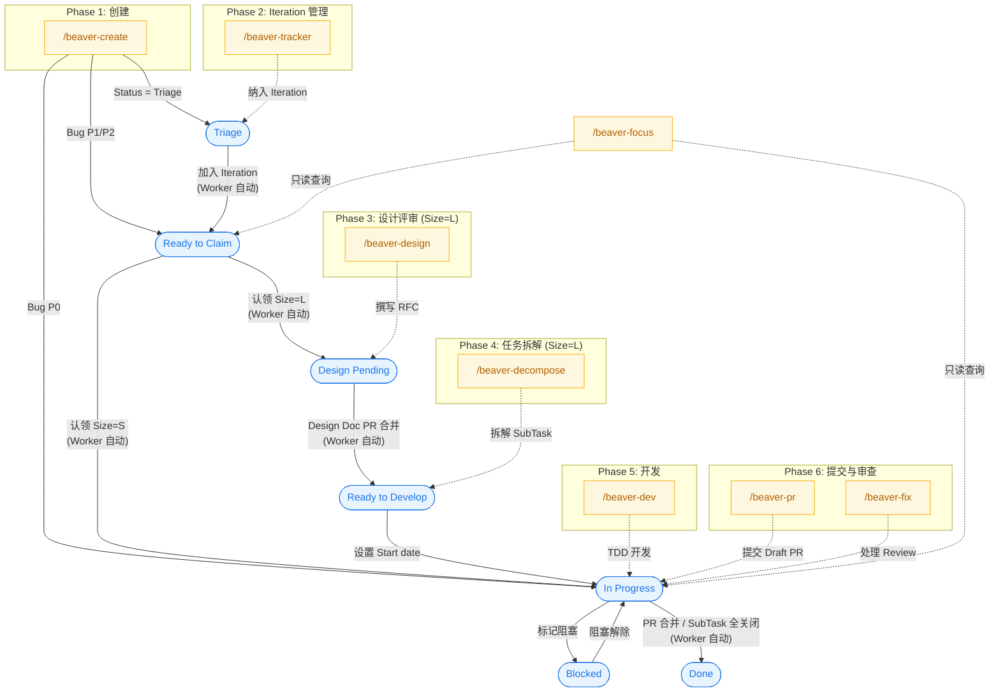

## 概述

Beaver 是团队的项目管理自动化系统，由两部分组成：

- **CLI 技能**（`primatrix/skills` 仓库）：开发者在 Claude Code 中通过斜杠命令（如 `/beaver-create`）与项目管理流程交互
- **GitHub App**（`primatrix/Beaver` 仓库）：Cloudflare Worker 后端，监听 GitHub webhook 事件，自动执行状态流转、发送通知、生成报告

所有项目数据统一管理在 [GitHub Projects V2 #14](https://github.com/orgs/primatrix/projects/14)（组织：`primatrix`）。

### 架构简图

```text
开发者 ──→ Claude Code CLI ──→ /beaver-* 命令 ──→ GitHub API (Projects V2 #14)
                                                         ↑
GitHub Webhook 事件 ──→ Beaver Worker ──→ 自动状态流转 ──┘
                              ├──→ DingTalk 通知
                              └──→ 定时报告 (Cron)
```

### Projects V2 字段一览

| 字段 | 类型 | 取值 |
|------|------|------|
| **Issue Type** | GitHub 原生 | `Bug` / `Task` / `SubTask` |
| **Status** | 单选 | `Triage` → `Ready to Claim` → `Design Pending` → `Ready to Develop` → `In Progress` → `Blocked` → `Done` |
| **Size** | 单选 | `XS` / `S` / `M` / `L` / `XL`（实际流程仅区分 S 和 L 两条路径） |
| **Priority** | 单选 | `P0` / `P1` / `P2`（仅 Bug 使用） |
| **Iteration** | 迭代字段 | 月度周期容器 |
| **Target date** | 日期 | 截止日期 |

---

### Issue 生命周期与命令映射

下图展示 Issue 从创建到完成的完整生命周期，标注每个阶段对应的 Beaver 命令（`/beaver-*`）和 Beaver Worker 自动行为。



---

## 前置条件

1. 安装 [Claude Code](https://claude.ai/code) CLI 并完成登录
2. 安装 [GitHub CLI](https://cli.github.com/)（`gh`）并通过 `gh auth login` 认证
3. 确保 `primatrix/skills` 插件已加载（Claude Code 会自动从 `.claude-plugin` 加载）

---

## 端到端流程

以下按照实际开发顺序，完整覆盖从 Issue 创建到 PR 合并的全流程。

### 1. 查看个人工作状态：`/beaver-focus`

在开始任何工作之前，先了解当前工作状态。

```text
/beaver-focus
```

该命令是**只读**的，展示 6 个面板：

1. **My Open Issues** — 按 Status 分组的个人待办（In Progress、Blocked、Design Pending 等）
2. **P0 Bugs** — 紧急 Bug（超过 24h 未关闭会标记预警）
3. **Awaiting Review** — 需要你 Review 的 PR
4. **Ready to Claim** — 可认领的未分配任务
5. **DDL Warnings** — Iteration 截止 48 小时内的预警
6. **Today's Top 3** — AI 生成的今日优先事项建议

**实现方式：** 通过 `beaver-focus.sh` 脚本执行 GraphQL 分页查询，读取 Projects V2 的 Status、Priority、Type、Iteration 字段，零写入操作。

---

### 2. 创建 Issue：`/beaver-create`

当需要新建任务或报告 Bug 时使用。

```text
/beaver-create
```

命令会进入**交互式 QA 流程**：

1. **类型判断** — 根据描述自动推断 Type（Task / SubTask / Bug）
2. **信息收集** — 逐项询问：父 Issue、标题、描述（目标与验收标准）、Priority
3. **Size 建议** — 系统根据描述复杂度建议 Size（XS/S/M/L/XL），你确认或修改
4. **预览与确认** — 展示完整 Issue 预览，需要明确批准才执行创建

**HARD-GATE 机制：** 只有明确回复 `y`、`yes`、`ok`、`approve`、`lgtm`、`继续`、`通过` 才会执行创建。含糊回答（如"差不多"）会被当作修改请求。

**创建后自动操作：**

- Issue 加入 Projects V2 #14
- 写入 Type、Size、Status（初始为 `Triage`）字段
- SubTask 自动关联父 Issue
- 可选：分配 Iteration 并关联 tracker issue

**Bug 特殊规则：**

| Priority | 初始 Status | 额外行为 |
|----------|------------|---------|
| P0 | `In Progress` | 自动 @mention CODEOWNERS 负责人 |
| P1 / P2 | `Ready to Claim` | 自动纳入当前 Iteration |

Bug 不设 Size 字段，使用专用模板（复现步骤、期望/实际行为、影响范围）。

**实现方式：** `beaver-create.sh` 提供 `create-issue`、`fetch-ids`、`add-to-project`、`link-parent` 四个子命令，通过 `beaver-lib.sh` 写入 Projects V2 字段。创建前执行 Discovery Triad（近期 git 活动、关键词搜索、项目约定读取）以提供上下文。

---

### 3. 月度 Iteration 管理：`/beaver-tracker`

每月初由 Senior 轮值执行，创建当月 tracker issue 并滚动未完成任务。

```text
/beaver-tracker
```

**工作流程：**

1. 解析仓库名和月份（YYYY-MM）
2. 查找上月 tracker，收集未完成的子 Issue
3. **交互式滚动** — 逐项确认哪些任务需要延续到本月（全选 / 全不选 / 逐项选择）
4. 创建本月 tracker issue（带标签 `tracker`、`tracker/<repo>`、`tracker/<YYYY-MM>`）
5. 滚动选中的子 Issue（GitHub Sub-Issues API 自动从旧 tracker 脱离）
6. 从 Projects V2 拉取 backlog（Iteration 为空 + Status=Triage 的 Task/Bug）
7. 同步所有子 Issue 的 Iteration 字段
8. 清理错误挂载的子 Issue（Iteration 不匹配或仓库不匹配）

**实现方式：** `beaver-tracker.sh` 提供 14 个子命令，涵盖标签管理、子 Issue 操作、backlog 查询、Iteration 字段同步。通过 `beaver-lib.sh::set_iteration` 写入 Iteration 字段。

---

### 4. 设计评审（仅 Size=L）：`/beaver-design`

Size=L 的 Task 认领后处于 `Design Pending`，需先完成设计文档。

```text
/beaver-design
```

**前置检查：** Type=Task、Size=L、Status=Design Pending、当前用户是 Assignee。

**五维度结构化 QA：**

1. **Context & Scope** — 技术环境、系统边界
2. **Design Goals** — 目标、非目标、成功指标
3. **The Design** — 架构、接口、数据流（含 Mermaid 图）、trade-offs、测试策略
4. **Implementation Plan** — 实施计划
5. **Alternatives Considered** — 备选方案及否决原因

每个维度严格按序完成，不允许跨维度跳转。

**质量审查：** 生成的 RFC 文档在提交前会经过 `spec-document-reviewer` 子代理审查（最多 5 轮），检查五维度覆盖、验收标准追溯、事实可溯源性（防幻觉）、内部一致性、实施计划可测试性。必须获得 `PASS` 才能继续。

**提交流程：**

1. 在 `primatrix/wiki` 仓库创建分支
2. 以 Draft PR 形式提交设计文档
3. 在原 Issue 评论中关联 PR 链接
4. 作者自审后将 PR 改为 Open
5. Beaver Worker 自动按 CODEOWNERS 与工作量均衡分配 Reviewer

**关键约束：** 此命令**不修改**任何 Projects V2 字段。Design Doc PR 合并后，Beaver Worker 自动将 Status 从 `Design Pending` 流转到 `Ready to Develop`（实现文件：`Beaver/src/acting/transitions/design-doc-merged.ts`）。

---

### 5. 任务拆解（仅 Size=L）：`/beaver-decompose`

Design Doc 合并后，Task 进入 `Ready to Develop`，需拆解为多个 Size=S 的 SubTask。

```text
/beaver-decompose
```

**前置检查：** Type=Task、Status=Ready to Develop。

**拆解流程：**

1. 读取 Design Doc（支持 PR URL、blob URL 或本地路径）
2. 基于设计文档草拟拆解方案，支持 `child#N` 相对引用描述依赖关系
3. 逐个子任务 QA（内容 + 依赖确认），然后审批完整依赖图
4. **DFS 环检测** — 自动检测依赖图中的循环
5. **自动审计** — 对每个子任务检查覆盖度、原子性、测试定义
6. 批量创建子 Issue：
   - 设置 Type=SubTask、Size=S、Status=Triage
   - 继承父 Issue 的 Iteration 和 Target date
   - 通过 GitHub Issue Dependencies API 设置依赖关系
   - 关联为父 Issue 的子 Issue

**实现方式：** `beaver-decompose.sh` 提供 8 个子命令，包括 `add-blocked-by` 用于调用 Issue Dependencies REST API。子 Issue 通过 GitHub Sub-Issues API（`X-GitHub-Api-Version: 2026-03-10`）关联。

---

### 6. TDD 开发：`/beaver-dev`

认领的 Size=S 任务（Status=In Progress）进入开发阶段。

```text
/beaver-dev
```

**前置检查：** Size=S、Status=In Progress、当前用户是 Assignee。

**开发流程：**

1. 创建隔离的 git worktree，分支名格式：`<type>/<n>-<short_desc>`
2. 生成实施计划（文件路径、测试片段、验证命令）
3. 进入 **TDD 循环**（Red-Green-Refactor）：
   - 先写失败测试（Red）
   - 写最小实现使测试通过（Green）
   - 重构（Refactor）
   - **规则：没有失败测试就不写生产代码**
4. 遇到 Bug 时调用 `systematic-debugging` 技能（先根因分析，再修复）
5. 两阶段 Code Review：规格符合性 → 代码质量
6. **验证铁律：** 完成前必须跑完整测试套件
7. 提示是否继续执行 `/beaver-pr`

**关键约束：** 此命令**不写入** Projects V2 字段。Blocked 状态由开发者在 GitHub UI 手动操作。

**实现方式：** `beaver-dev.sh` 提供 `preflight`、`fetch-issue`、`add-worktree` 三个子命令。TDD 纪律由 `superpowers:test-driven-development` 技能强制执行。

---

### 7. 提交 PR：`/beaver-pr`

开发完成后提交 Pull Request。

```text
/beaver-pr
```

**工作流程：**

1. 收集 git 状态（status、diff、branch、log）
2. **Issue 关联** — 从命令参数、分支前缀（`<type>/<number>-<desc>`）或最近 commit 推断 Issue 编号
3. 生成 conventional commit，推送分支
4. **合规检查：**
   - **G004（测试证据）：** 若无测试文件变更，在 PR body 中添加警告
   - **G006（字段完整性）：** 自动补全缺失的 Type（默认 Task）和 Size（默认 S）
5. 创建 Draft PR，body 中包含 `Closes {org}/{repo}#{number}`（完整的 owner/repo 格式，支持跨仓库自动关闭）
6. 提供四个后续选项：保持 Draft / 标记 Ready for Review / 保留分支 / 丢弃

**实现方式：** `beaver-pr.sh` 提供 11 个子命令。`Closes` 链接使用完整的 `org/repo#number` 格式以确保跨仓库场景下的自动关闭生效。

---

### 8. 处理 Review 意见：`/beaver-fix`

PR 收到 Review 意见后，批量处理。

```text
/beaver-fix
```

**前置检查：** 必须是你自己的 PR。

**处理流程：**

1. 列出所有未解决的 Review 线程和 PR 级评论
2. 逐条分析每个评论：
   - 意图分析
   - 合理性评估
   - 推荐操作
3. 对每条评论选择处理方式：
   - **Accept** — 采纳建议并修改代码
   - **Modify** — 基于建议做调整修改
   - **Skip** — 跳过不处理
   - **Resolve-only** — 仅标记为已解决
4. HARD-GATE 确认所有决策和暂存的变更
5. 单次 commit + push + 批量 resolve 线程

**关键约束：** 此命令不修改任何 Projects V2 字段。

---

### 9. PR 合并与自动完成

当 PR 满足以下条件后，由**作者**执行合并：

1. 至少 2 个 Reviewer Approve
2. CI 检查全部通过
3. 项目门控检查通过

**Beaver Worker 自动行为（合并后触发）：**

| 事件 | 自动行为 | 实现文件 |
|------|---------|---------|
| PR 合并（含 `Closes #N`）| GitHub 自动关闭关联 Issue | GitHub 原生 |
| Issue 关闭（SubTask/Bug）| Status → `Done` | `auto-done-status.ts` |
| 所有 SubTask 关闭 | 父 Task Status → `Done` | `subtask-closed.ts` |
| Status 变为 Done | 自动关闭 Issue（若仍 open）| `auto-close-on-done.ts` |

---

## Beaver Worker 自动化能力

除了上述 webhook 触发的状态流转外，Beaver Worker 还提供定时任务：

| 时间 (UTC) | 任务 | 说明 |
|------------|------|------|
| 每工作日 01:00 | `morning_focus` | 个人每日工作简报（DingTalk 推送）|
| 每工作日 10:01 | `person_commit_summary` | 组织级每日 commit 汇总 |
| 每周五 10:00 | `weekly` | 团队周活动摘要 |
| 每日 10:05 | `repo_project_progress` | 各仓库项目进度报告 |
| 每日 03:30 | `sync_project` | 检测 Projects V2 字段与标签不一致 |
| 每日 04:00 | `discover_repos` | 自动发现组织新仓库 |

此外，PR 从 Draft 变为 Open 时，Worker 会基于 CODEOWNERS 与各 Reviewer 当前工作量自动分配 Reviewer（实现文件：`reviewer-assign.ts`）。

---

## 快速参考

### 状态流转路径

**Size=S 快速通道：**

```text
Triage → Ready to Claim → In Progress → Done
```

**Size=L 标准流程：**

```text
Triage → Ready to Claim → Design Pending → Ready to Develop → In Progress → Done
```

**Bug 通道：**

```text
P0: 创建 → In Progress → Done
P1/P2: 创建 → Ready to Claim → In Progress → Done
```

### 命令速查表

| 命令 | 用途 | 读/写 Projects V2 |
|------|------|-------------------|
| `/beaver-focus` | 查看个人工作状态 | 只读 |
| `/beaver-create` | 创建 Issue | 读写 |
| `/beaver-tracker` | 月度 Iteration 管理 | 读写 |
| `/beaver-design` | 撰写设计文档（Size=L）| 只读（验证） |
| `/beaver-decompose` | 拆解为子任务（Size=L）| 读写 |
| `/beaver-dev` | TDD 开发（Size=S）| 只读（验证） |
| `/beaver-pr` | 提交 PR | 读写（自动补全字段）|
| `/beaver-fix` | 处理 Review 意见 | 无 |
| `/beaver-setup` | 初始化项目字段（一次性）| 写 |

### 技术栈

| 组件 | 技术 |
|------|------|
| CLI 技能 | Markdown 命令定义 + Bash 脚本（`beaver-lib.sh`）|
| GitHub App | TypeScript / Cloudflare Workers |
| 数据存储 | Cloudflare D1 (SQLite) + KV |
| 异步任务 | Cloudflare Queues（6 种任务类型）|
| 通知 | DingTalk Webhook |
| LLM 集成 | Anthropic / Gemini / OpenAI（报告生成与分析）|
