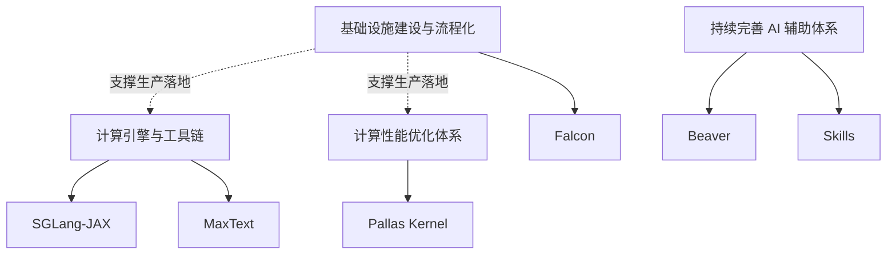

## 概述

Goal 是团队级别的长期工作方向，描述期望达成的状态而非具体实现方式。关于 Goal 在团队管理结构中的位置，参见[项目管理框架](./project-management.md)。

当前团队围绕四个核心目标展开工作：

## Goal 1: 计算引擎与工具链

**方向**：构建面向 TPU 的全栈计算引擎与配套工具链，覆盖训练、推理、强化学习等核心计算范式。

**核心目标**：

- **超大规模复杂计算范式支持**：引擎能够承载训练、推理、强化学习等多种计算范式，在超大规模集群上稳定运行，具备跨范式的统一调度与资源管理能力。
- **快速模型架构适配**：新模型架构（Dense、MoE、多模态等）从设计到引擎落地的周期显著缩短，具备标准化的模型接入流程和验证机制。
- **完善的工具链与监控体系**：从模型转换、精度对齐、性能调优到线上监控，形成端到端的工具链闭环，关键环节具备自动化能力和可观测性。

**归属 Project**：[SGLang-JAX](https://github.com/primatrix/sglang-jax)、[MaxText](https://github.com/primatrix/maxtext)

**关键指标**：

- 支持的计算范围与功能性
- 新模型架构从适配到上线的周期
- 工具链覆盖的关键环节数量与自动化程度

## Goal 2: 计算性能优化体系

**方向**：建立系统化的 TPU 计算性能优化能力，从分析方法论到执行路径到算子库形成完整体系。

**核心目标**：

- **大型混合内核的系统性分析与设计方法**：具备对复杂混合内核进行系统性 profiling、瓶颈定位和优化设计的方法论，能够基于 roofline 分析指导优化方向。
- **明确且高效的执行路径与方式**：从性能问题发现到优化落地，有标准化的工作流程（profiling → 瓶颈分类 → 优化策略选择 → 实现 → 验证），每个环节有清晰的工具和判断标准。
- **完备的算子库支持**：tops 算子库覆盖业务所需的关键算子，每个 kernel 经过 roofline 验证，能被上游项目直接集成使用。

**归属 Project**：[Pallas Kernel](https://github.com/primatrix/pallas-kernel)

**关键指标**：

- 关键 kernel 的 MFU / HBM 利用率（相对硬件理论上限）
- 算子库覆盖的关键算子数量
- 被上游项目（MaxText、SGLang-JAX）采用的 kernel 数量

## Goal 3: 基础设施建设与流程化

**方向**：打造标准化的实验执行与验证平台，支撑计算引擎与性能优化体系的超大规模生产落地，覆盖性能分析、精度对齐、功能性验证等核心场景。

**核心目标**：

- **支撑超大规模生产落地**：为 Goal 1（计算引擎）和 Goal 2（性能优化）的成果提供生产级部署、验证与运行的基础设施支持，确保引擎和算子库能在超大规模集群上可靠落地。
- **性能分析场景**：支持 benchmark、profiling、性能对比等实验的标准化执行，实验结果可追溯、可复现。
- **精度对齐场景**：支持跨框架的数值一致性验证，提供自动化的精度对比与回归检测能力。
- **复杂系统功能性验证场景**：支持多组件协同的端到端功能验证，能够在集群环境中自动化执行复杂系统的集成测试与回归测试。

**归属 Project**：[Falcon](https://github.com/primatrix/falcon)

**关键指标**：

- 覆盖的实验场景数量（性能 / 精度 / 功能）
- 实验结果的可复现率
- 团队成员从手动实验迁移到平台的比例

## Goal 4: 持续完善 AI 辅助体系

**方向**：将 AI agent 能力系统性地嵌入研发全流程，通过不同 AI 辅助角色提升团队在项目管理、代码审查、质量保障、运维和研究等环节的效率。

**核心目标**：

- **AI PM（Beaver）**：自动过滤 GitHub 活动中的高价值信息，生成项目洞察和日报，追踪项目状态与风险。
- **AI Reviewer**：辅助代码审查，提供自动化的代码质量检查、风格一致性验证和潜在问题识别。
- **AI QA**：辅助测试用例生成、回归测试执行、测试覆盖率分析。
- **AI SRE**：辅助集群运维、异常检测、故障诊断与恢复。
- **AI Research**：辅助技术调研、论文分析、方案评估，加速技术决策。

**归属 Project**：[Beaver](https://github.com/primatrix/Beaver)、[Skills](https://github.com/primatrix/skills)

**关键指标**：

- AI 辅助角色覆盖的研发环节数量
- 各角色在对应环节节省的人工时间
- 团队对 AI 辅助产出质量的满意度
