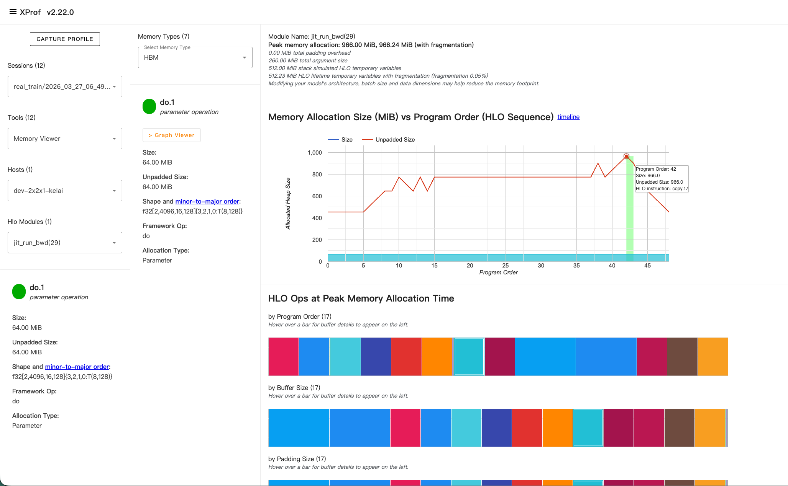

# JAX TPU 显存分析指南

基于实际 profiling 踩坑经验总结，适用于包含 Pallas kernel 的 JAX 程序。

## 1. 背景：显存分析应该看哪一层

JAX 程序的编译链路中，不同阶段提供不同粒度的内存信息：

| 阶段            | 看什么                                   | 怎么拿                                   |
| --------------- | ---------------------------------------- | ---------------------------------------- |
| **HLO（推荐）** | 全局 HBM 占用、buffer 生命周期、峰值内存 | `compiled.as_text()` 或 `XLA_FLAGS` dump |
| **LLO**         | 片上 VMEM 占用、DMA 搬运量               | Mosaic 编译日志                          |
| **Runtime**     | 实际运行时内存 timeline                  | `jax.profiler` + xprof                   |

**Buffer assignment 发生在 HLO 阶段**，因此 HLO 是定位 HBM 占用最准确的数据源。

## 2. 获取 HLO 的两种方式

### 方式 A：代码内直接获取（适合快速查看）

```python
lowered = jax.jit(fn).lower(*args)
compiled = lowered.compile()

# HLO text（包含优化后的完整 HLO，但不含 buffer assignment 汇总）
with open("/tmp/fn.hlo.txt", "w") as f:
    f.write(compiled.as_text())

# HLO proto（可喂给 xprof 的 graph viewer）
with open("/tmp/fn.hlo_proto.pb", "wb") as f:
    f.write(compiled.compiler_ir(dialect="hlo_serialized"))
```

> **注意**：`as_text()` 输出的是最终优化后、已调度的 HLO（`is_scheduled=true`），但**不包含 buffer assignment 的汇总表**，需要手动从 tensor shape 计算各 buffer 大小。

### 方式 B：XLA_FLAGS dump（适合深入分析）

```python
os.environ["XLA_FLAGS"] = (
    "--xla_dump_hlo_as_text "
    "--xla_dump_hlo_as_proto "
    "--xla_dump_to=/tmp/xla_dump "
    "--xla_dump_hlo_pass_re=.* "
)
```

dump 目录会生成：

- `*-buffer-assignment.txt` — **包含精确的 buffer 大小、偏移、峰值 HBM、buffer 复用信息**
- 各优化 pass 前后的 HLO text/proto

> 方式 B 比方式 A 多出 `buffer-assignment.txt`，这是做显存分析最有价值的文件。

## 3. xprof 使用注意事项

### 3.1 HLO Graph Viewer 找不到 `main.hlo_proto.pb`

**现象**：打开 xprof 的 Graph Viewer 报 `main.hlo_proto.pb; No such file or directory`。

**原因**：JAX profiler 按 JIT 编译单元分别 dump HLO proto，文件名为 `jit_xxx(N).hlo_proto.pb`，不会生成名为 `main` 的聚合文件。Graph Viewer 默认以 `main` 为入口。

**解决方案**（三选一）：

1. **UI 下拉菜单**：在 Graph Viewer 页面的 "XLA Modules" 下拉菜单中选择目标模块

2. **符号链接**：找到最大的 `.hlo_proto.pb` 文件（通常是顶层模块），创建符号链接

   ```bash
   cd <profile_timestamp_dir>
   ls -lS *.hlo_proto.pb | head -1
   ln -s 'jit_xxx(N).hlo_proto.pb' main.hlo_proto.pb
   ```

3. **代码注入**：用方式 A 生成 proto 后复制到 profile 目录

   ```python
   compiled = jax.jit(fn).lower(*args).compile()
   proto_path = f"{trace_dir}/plugins/profile/<timestamp>/main.hlo_proto.pb"
   with open(proto_path, "wb") as f:
       f.write(compiled.compiler_ir(dialect="hlo_serialized"))
   ```

### 3.2 Memory Viewer 的局限

xprof 的 Memory Viewer 可以分析单个 HLO module 按程序执行顺序的 HBM/VMEM 占用，但：

- 缺乏跨 module 的全局视角
- 需要先找到正确的 top module 才有意义
- 对 Pallas kernel 内部（`tpu_custom_call`）不透明

### 3.3 Trace Viewer 辅助定位

打开 Trace Viewer 找耗时最长的 HLO module 名字，可以反推哪个 `.hlo_proto.pb` 是你的 top module。

## 4. 关键坑：没有顶层 `jax.jit` 导致 profile 碎片化

### 问题

如果被 profile 的函数没有被 `jax.jit` 包裹，JAX 会把内部的每个 `pallas_call`、`lax.scan` 等独立编译。Profiler 会生成一堆分散的 HLO module，**没有一个统一的 top module**，导致：

- xprof 找不到入口
- 无法做全局 buffer assignment 分析
- 看不到中间 tensor 在 module 之间的 HBM 流动

### 解决

在 profile 入口加顶层 `jax.jit`：

```python
@functools.partial(jax.jit, static_argnums=(7, 8))  # scale, chunk_size
def run_bwd(q, k, v, do, g_gamma, h0, dht, scale, chunk_size):
    return chunk_simple_gla_bwd(
        q, k, v, do,
        g_gamma=g_gamma, scale=scale,
        h0=h0, dht=dht, chunk_size=chunk_size,
    )
```

## 5. 如何看懂 xprof Memory Viewer



成功拿到带顶层 `jax.jit` 的 profile 后，在 xprof 左侧选择 **Tools → Memory Viewer**，**Hlo Modules** 下拉选择你的 top module（如 `jit_run_bwd(29)`），即可看到完整的显存分析视图。

### 5.1 顶部摘要栏

页面顶部会显示全局统计：

```text
Module Name: jit_run_bwd(29)
Peak memory allocation: 966.00 MiB, 966.24 MiB (with fragmentation)
  0.00 MiB total padding overhead
  260.00 MiB total argument size
  512.00 MiB stack simulated HLO temporary variables
  512.23 MiB HLO lifetime temporary variables with fragmentation (fragmentation 0.05%)
```

各字段含义：

| 字段                                        | 含义                                                       |
| ------------------------------------------- | ---------------------------------------------------------- |
| **Peak memory allocation**                  | HBM 峰值占用，即程序运行中同时存活的 buffer 总大小的最大值 |
| **total argument size**                     | 函数入参占用的 HBM（如 q, k, v, do 等输入 tensor）         |
| **stack simulated HLO temporary variables** | XLA 用栈式分配模拟的临时 buffer 总量                       |
| **HLO lifetime temporary variables**        | 基于 buffer 实际生命周期计算的临时变量占用（含碎片）       |
| **fragmentation**                           | 因 buffer 生命周期交错导致的内存碎片率，越低越好           |
| **total padding overhead**                  | 为满足对齐要求额外 pad 的字节数                            |

**峰值 = 入参 + 临时变量**。优化目标是降低临时变量占用。

### 5.2 主图：Memory Allocation Size vs Program Order

这是 Memory Viewer 的核心图表。

**X 轴 — Program Order（HLO Sequence）**：XLA 调度后的 HLO 指令执行顺序。每个整数对应一条 HLO 指令（如 `copy.17`, `custom-call.1` 等）。这不是时间轴，而是**静态的指令序号**。

**Y 轴 — Allocated Heap Size（MiB）**：在该 Program Order 时刻，所有存活 buffer 的总 HBM 占用。

**两条线**：

- **蓝线（Size）**：含 padding 的实际分配大小
- **红线（Unpadded Size）**：不含 padding 的逻辑大小。两线差距大说明 padding 浪费严重

**图的形状解读**：

- **上升段**：新 buffer 被分配（如 layout copy 产生新 tensor、Pallas kernel 分配输出）
- **平台段**：多个 buffer 同时存活，内存稳定
- **下降段**：旧 buffer 生命周期结束，被释放
- **最高点**：即峰值内存，是优化的重点关注位置

**悬停交互**：鼠标悬停在图上任意一点，会显示该 Program Order 对应的 HLO 指令名。例如 `Program Order: 42, Size: 966.0, HLO instruction: copy.17` 表示执行到第 42 条指令 `copy.17` 时达到峰值。

### 5.3 左侧面板：Buffer 详情

点击图上的某个点（或下方色块），左侧面板显示该 buffer 的详细信息：

- **Size / Unpadded Size**：该 buffer 的大小（如 64.00 MiB）
- **Shape and minor-to-major order**：tensor 形状和内存布局（如 `f32[16,128,64,128]{3,2,1,0:T(8,128)}`）
- **Framework Op**：对应的 JAX 层操作（如 `jit(run_bwd)/pallas_call`）
- **Allocation Type**：
  - `Parameter`：函数入参，生命周期覆盖整个程序
  - `Temporary`：中间结果，仅在被使用期间存活
  - `Output`：函数输出
- **Source**：分配该 buffer 的源码位置（如 `chunk_o.py:156`）
- **Source Stack**：完整的 Python 调用栈，可追溯到 profile 脚本的哪一行触发了这个分配

> Source Stack 是定位"这块内存是谁分配的"最直接的手段。

### 5.4 底部：Peak 时刻的 Buffer 分解

"HLO Ops at Peak Memory Allocation Time" 展示峰值时刻所有存活 buffer 的组成，提供三种排序视图：

- **by Program Order**：按 buffer 被分配的指令顺序排列。从左到右对应 Program Order 从早到晚，可以看出哪些"早期分配的 buffer 到峰值时仍未释放"——这些是优化目标
- **by Buffer Size**：按 buffer 大小从大到小排列。**最左边的色块就是最大的 buffer**，通常是优化收益最高的目标
- **by Padding Size**：按 padding 开销排列，用于发现对齐浪费

每个色块对应一个 buffer，颜色在三个视图中保持一致。**悬停色块会在左侧面板显示该 buffer 的详情**（Shape、Source、Allocation Type 等）。

### 5.5 典型分析流程

1. 看顶部摘要，确认 **Peak memory** 和 **argument size** 的比例 — 如果临时变量远大于入参，说明有优化空间
2. 在主图中找到**峰值点**，悬停查看是哪条 HLO 指令触发的
3. 在底部 **by Buffer Size** 视图中，从左到右逐个检查最大的 buffer：
   - 它是 `Parameter`（入参，不可避免）还是 `Temporary`（可能可以优化）？
   - Source 指向哪里？是 layout copy？是 Pallas kernel 的输出？还是中间计算？
4. 对于大的 `Temporary` buffer，回到源码思考：
   - 能否避免 layout copy（调整 Pallas kernel 接受原始 layout）？
   - 能否减小中间 tensor 的精度（f32 → bf16）？
   - 能否通过 recomputation 替代 materialization？
5. 如需查看峰值前后 buffer 的分配/释放细节，点击主图上峰值附近的不同 Program Order 点，观察哪些 buffer 出现/消失

### 5.6 Memory Type 切换

左上角的 **Select Memory Type** 下拉可切换分析目标：

- **HBM**：设备主存（默认，最常用）
- **VMEM**：片上 SRAM（对 Pallas kernel 的 tile 大小调优有用，但只能看到 XLA 管理的部分，Pallas kernel 内部的 VMEM 对此不透明）

## 6. 从 HLO 手动分析显存占用

当拿到 top module 的 HLO text 后，关注以下内容：

### 6.1 识别大 buffer

从 ENTRY 函数的参数和中间操作的 shape 计算：

```hlo
# 例：f32[2,4096,16,128] = 2 * 4096 * 16 * 128 * 4 bytes = 64MB
%flat_args_0 = f32[2,4096,16,128]{3,2,1,0:T(8,128)} parameter(0)
```

### 6.2 关注 layout copy

```hlo
%copy = f32[8192,16,128]{2,0,1:T(8,128)} copy(%bitcast.16)
```

Layout 转换（`{3,2,1,0}` → `{2,0,1}`）会创建额外的 HBM buffer。如果 Pallas kernel 能直接接受原始 layout，可以省掉这些 copy。

### 6.3 识别 Pallas kernel

```hlo
%trace_fn.1 = (...) custom-call(...), custom_call_target="tpu_custom_call"
```

Pallas kernel 在 HLO 中是 opaque 的 `tpu_custom_call`。XLA 无法优化其内部，但能看到它的输入输出 buffer 大小。

### 6.4 粗算峰值公式

```text
峰值 HBM ≈ 所有输入 + layout copy 中间结果 + 输出 + Pallas scratch
```

精确值看 `buffer-assignment.txt`（方式 B dump 出的）。

## 7. 完整 profile 脚本模板

```python
import functools
import os

os.environ["XLA_FLAGS"] = (
    "--xla_dump_hlo_as_text "
    "--xla_dump_hlo_as_proto "
    "--xla_dump_to=/tmp/xla_dump "
)
os.environ["LIBTPU_INIT_ARGS"] = (
    "--xla_xprof_register_llo_debug_info=true "
    "--xla_enable_custom_call_region_trace=true"
)

import jax
import jax.numpy as jnp

@functools.partial(jax.jit, static_argnums=(...))
def target_fn(...):
    ...

# 1. 生成输入
inputs = make_inputs(...)

# 2. Warmup（触发编译）
out = target_fn(*inputs)
out[0].block_until_ready()

# 3. Profile
trace_dir = "/tmp/xprof_trace"
jax.profiler.start_trace(trace_dir)
for _ in range(3):
    out = target_fn(*inputs)
    out[0].block_until_ready()
jax.profiler.stop_trace()

# 4.（可选）注入 top module proto 到 profile 目录
compiled = target_fn.lower(*inputs).compile()
# 找到 trace_dir 下的 timestamp 目录，写入 main.hlo_proto.pb
```

## 8. 两条编译路径对显存分析的影响

```text
标准 JAX:  JAX → HLO → XLA 优化 → buffer assignment → LLO → VLIW
Pallas:   Pallas → HLO (opaque custom-call) → Mosaic → LLO → VLIW
```

- **标准 JAX 路径**：XLA 能看到所有操作，buffer assignment 完整反映所有中间 tensor
- **Pallas 路径**：XLA 只看到 `tpu_custom_call` 的输入输出，kernel 内部的 VMEM 使用对 HLO 不可见
- **两者混合时**：顶层 HLO 的 buffer assignment 反映 HBM 占用（包括 Pallas kernel 的 I/O buffer），但 Pallas kernel 内部的 VMEM 占用需要看 LLO
