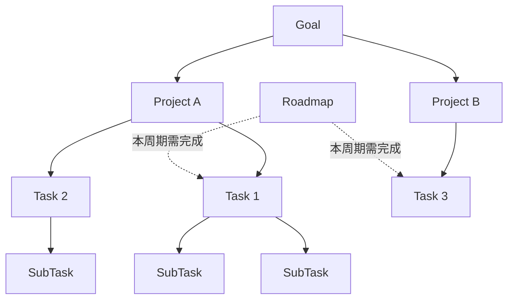
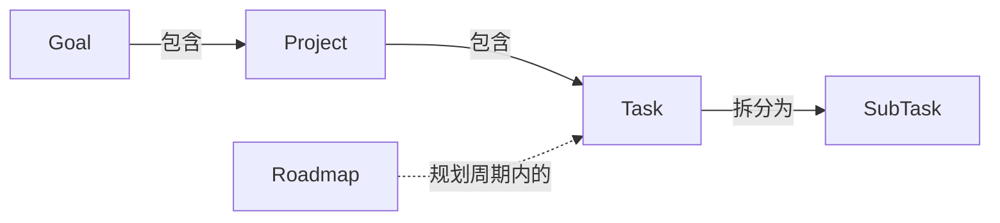

## 概述

团队采用五层结构组织工作：Goal、Project、Roadmap、Task、SubTask。Goal 定义方向，Project 承载实现，Task 描述具体开发工作，SubTask 是最小交付单元，Roadmap 则以时间周期横切 Task 层，划定阶段性交付范围。

## Goal（目标）

Goal 是团队级别的长期工作方向，通常跨越多个项目、持续数月甚至更久。它的核心作用是对齐共识——让所有人理解团队在朝什么方向努力。Goal 不指定具体实现方式，而是描述期望达成的状态。团队中任何人都可以分析哪些工作有助于推进某个 Goal，多个 Project 共同服务于同一个 Goal。

- **工具映射**：存在于 wiki 页面中。

## Project（项目）

Project 是代码开发和项目管理的基本单元，通常与一个代码仓库对应。每个 Project 有独立的定位说明和技术文档。多个 Project 可以服务于同一个 Goal，而 Task 在 Project 下创建和管理。Project 是日常开发工作的组织边界，也是权限管理和持续集成的配置单元，团队成员在 Project 范围内协作完成开发与交付。

- **工具映射**：存在于 wiki 页面并与 Github 联动。

## Roadmap（路线图）

Roadmap 是按时间周期进行的规划，通常以月或双月为单位。在每个周期开始时，将处于草案状态的 Task 纳入 Roadmap，并约定完成日期。Roadmap 横切 Task 层，定义当前周期内需要完成哪些 Task，是连接长期目标与短期执行的桥梁。周期结束时团队回顾完成情况，未完成的 Task 会顺延至下一周期重新评估优先级。

- **工具映射**：存在于 Github 中，使用 Milestones。
- **角色与责任**：由团队内 Senior 的人轮值制定，由其他团队成员 Review。

## Task（任务）

Task 是具体的开发任务。判断粒度是否合适的标准：如果一个 Task 对应的是模块级别的工作量，就需要进一步拆分。粒度过粗的 Task 应拆解为多个 SubTask，确保每个子任务都可以独立推进和验证。每个 Task 都应有清晰的完成标准，使负责人和审查者对交付物达成一致的预期。

- **工具映射**：对应代码仓库内的 Github Issue。

## SubTask（子任务）

SubTask 是最小的可独立交付工作单元。一个合格的 SubTask 应当包含测试、部署等完整环节，构成独立可审查的功能单元。SubTask 是执行和审查的基本粒度，团队成员领取并完成 SubTask 来推进 Task 的整体进展。合理的 SubTask 拆分能让代码审查更加高效，也降低了集成时出现冲突的风险。

- **工具映射**：对应代码仓库内的 Github Issue。
- **角色与责任**：Task 拆解为 SubTask 的过程由每个开发同学自行负责拆解。

*注：状态流转和联动开发规范会在其他页面补充说明。*

## 层级关系总览

