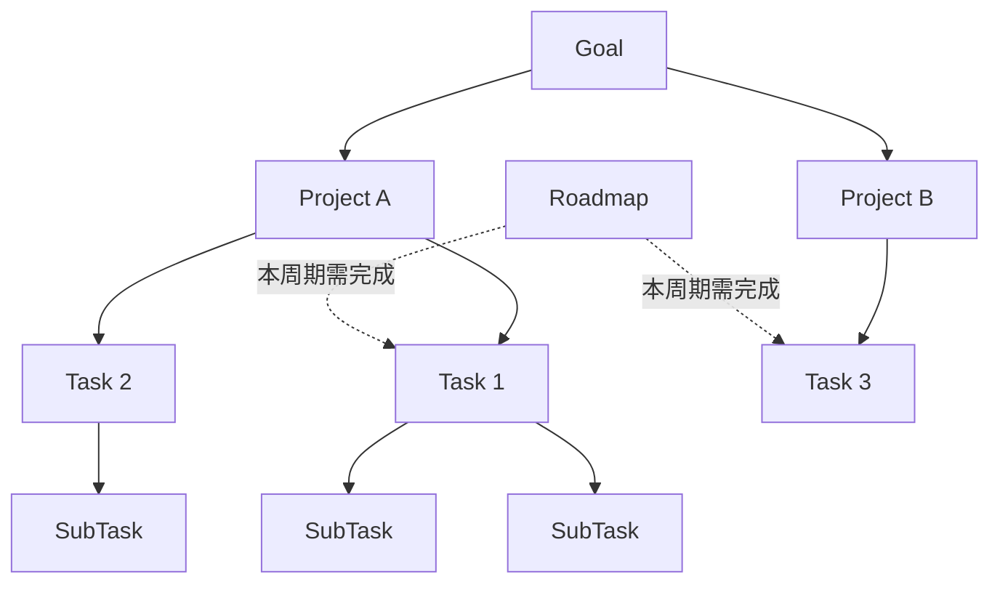
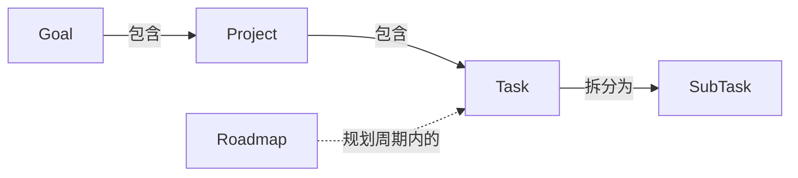
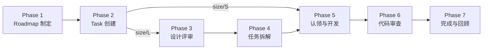

## 概述

团队采用五层结构组织工作：Goal、Project、Roadmap、Task、SubTask。Goal 定义方向，Project 承载实现，Task 描述具体开发工作，SubTask 是最小交付单元，Roadmap 则以时间周期横切 Task 层，划定阶段性交付范围。

## Goal（目标）

Goal 是团队级别的长期工作方向，通常跨越多个项目、持续数月甚至更久。它的核心作用是对齐共识——让所有人理解团队在朝什么方向努力。Goal 不指定具体实现方式，而是描述期望达成的状态。团队中任何人都可以分析哪些工作有助于推进某个 Goal，多个 Project 共同服务于同一个 Goal。

- **工具映射**：存在于 wiki 页面中，参见[团队目标](./goals.md)。

## Project（项目）

Project 是代码开发和项目管理的基本单元，通常与一个代码仓库对应。每个 Project 有独立的定位说明和技术文档。多个 Project 可以服务于同一个 Goal，而 Task 在 Project 下创建和管理。Project 是日常开发工作的组织边界，也是权限管理和持续集成的配置单元，团队成员在 Project 范围内协作完成开发与交付。

Roadmap 与 Project 统一体现在同一个 [GitHub Project](https://github.com/orgs/primatrix/projects/13) 中，便于集中管理项目规划与任务跟踪。Roadmap 通过 GitHub Project 的迭代（Iteration）或 Milestone 视图呈现，按时间周期划定阶段性交付范围。

- **工具映射**：[GitHub Project V2](https://github.com/orgs/primatrix/projects/13)。

## Roadmap（路线图）

Roadmap 是按时间周期进行的规划，通常以月或双月为单位。在每个周期开始时，将处于草案状态的 Task 纳入 Roadmap，并约定完成日期。Roadmap 横切 Task 层，定义当前周期内需要完成哪些 Task，是连接长期目标与短期执行的桥梁。周期结束时团队回顾完成情况，未完成的 Task 会顺延至下一周期重新评估优先级。

- **工具映射**：与 Project 共用同一个 [GitHub Project](https://github.com/orgs/primatrix/projects/13)，使用 Milestones 划分周期。
- **角色与责任**：由团队内 Senior 的人轮值制定，由其他团队成员 Review。

## Task（任务）

Task 是具体的开发任务。判断粒度是否合适的标准：如果一个 Task 对应的是模块级别的工作量，就需要进一步拆分。粒度过粗的 Task 应拆解为多个 SubTask，确保每个子任务都可以独立推进和验证。每个 Task 都应有清晰的完成标准，使负责人和审查者对交付物达成一致的预期。

- **工具映射**：对应代码仓库内的 Github Issue。

## SubTask（子任务）

SubTask 是最小的可独立交付工作单元。一个合格的 SubTask 应当包含测试、部署等完整环节，构成独立可审查的功能单元。SubTask 是执行和审查的基本粒度，团队成员领取并完成 SubTask 来推进 Task 的整体进展。合理的 SubTask 拆分能让代码审查更加高效，也降低了集成时出现冲突的风险。

- **工具映射**：对应代码仓库内的 Github Issue。
- **角色与责任**：Task 拆解为 SubTask 的过程由每个开发同学自行负责拆解。

## 层级关系总览

## 工作流程

以下描述从 Roadmap 制定到任务完成的端到端流程。每个阶段说明人需要做什么，以及 Beaver（Skills 与 Worker）的预期行为。

- **Beaver Skill**：用户在 CLI 中触发的项目管理与开发辅助命令（如 `beaver-issue`、`beaver-pr`、`beaver-design-doc`、`beaver-decompose`）。其中 TDD 驱动开发与 Review 能力从 Superpowers 迁移而来
- **Beaver Worker**：基于 Webhook 自动执行的后台服务（如状态流转、标签标记）

### Phase 1: Roadmap 制定

**人的操作：**

- Senior 轮值负责，通过 `beaver-roadmap` 创建 GitHub Milestone，设定起止日期，从 backlog 中筛选 Task 纳入本周期 Milestone 并确定优先级
- 其他团队成员 Review Roadmap 并发起讨论

**Beaver 预期行为：**

- `beaver-roadmap`（Skill，用户触发）：创建 Milestone、从 backlog 筛选 Task 纳入并设定优先级
- `beaver-report`（Skill，用户触发）：生成项目健康报告，展示 Milestone 进度、逾期/停滞检测、阻塞链分析，辅助判断纳入与风险
- Worker（自动）：为超过 3 天无更新的 Issue 标记 `beaver/stale`，超过 DDL 的标记 `beaver/overdue`

### Phase 2: Task 创建

**人的操作：**

- 开发者创建 Task Issue，描述目标和验收标准
- 创建时指定 size 标签：size/S 或 size/L
- size/S 的 Task 直接进入开发（跳到 Phase 5）
- size/L 的 Task 进入设计评审流程（Phase 3）

**Beaver 预期行为：**

- `beaver-issue`（Skill，用户触发）：创建 Issue 时自动填充标准模板（目标/验收标准）、添加到 Project V2、设置 type/size/priority 标签、关联父 Issue。创建时 Issue 初始为 `status/triage`，Beaver 根据 size 自动路由：size/S → `status/in-progress`；size/L 保持 `status/triage`（可能不在当前 Roadmap 中实现）
- Worker（自动）：size/L 的 Task 被加入 Milestone 后，自动流转到 `status/design-pending`

### Phase 3: 设计评审（size/L）

**人的操作：**

- 负责人在 wiki 仓库撰写 Design Doc，提交 PR 进行评审
- 团队成员 Review Design Doc PR

**Beaver 预期行为：**

- `beaver-design-doc`（Skill，用户触发）：辅助撰写 Design Doc 并提交 wiki PR，要求开发者关联 Task Issue
- Worker（自动）：观测到 Design Doc PR 合并后，自动将关联 Issue 从 `status/design-pending` → `status/ready-to-develop`

### Phase 4: 任务拆解（size/L）

**人的操作：**

- 使用工具辅助拆解 size/L Task 为多个 SubTask
- 拆分后组织同步与任务讨论，确认拆解方案

**Beaver 预期行为：**

- `beaver-decompose`（Skill，用户触发）：要求输入 Task Issue 与 Design Doc，LLM 辅助分析拆解方案，用户确认后批量创建子 Issue 并关联父 Issue

### Phase 5: 认领与开发

**人的操作：**

- 团队成员认领 SubTask（或 size/S Task）
- 开发者编码、编写测试
- 开发过程中如遇阻塞，标记 blocked 状态

**Beaver 预期行为：**

- `beaver-issue` 认领模式（Skill，用户触发）：认领任务，自动分配 assignee 并流转到 `status/in-progress`
- Beaver Skills（开发辅助，从 Superpowers 迁移）：TDD 驱动开发、systematic-debugging 等辅助测试驱动开发和系统化调试
- `beaver-focus`（Skill，用户触发）：查看个人工作看板——当前任务、待 Review PR、阻塞项、DDL 预警，获得优先级建议
- Worker（自动）：支持 `status/blocked` 状态流转，阻塞解除后恢复到 `status/in-progress`
- 开发完毕后，`beaver-pr`（Skill，用户触发）：执行合规检查（G006 标签完整性、G004 测试证据），创建 Draft PR

### Phase 6: 代码审查

**人的操作：**

- 开发者自行 Review Draft PR
- 自审完成后将 PR 状态改为 Open
- Reviewer 审查 PR 代码
- 作者根据反馈修改，通过后合并

**Beaver 预期行为：**

- Worker（自动）：PR 状态从 Draft 变为 Open 时，自动将关联 Issue 流转到 `status/review-needed`，并指派 Reviewer（基于 CODEOWNERS + 工作量均衡）
- Worker（自动）：PR 合并后，自动将关联 Issue 从 `status/review-needed` → `status/done`

### Phase 7: 完成与回顾

**人的操作：**

- 周期结束时团队回顾完成情况

**Beaver 预期行为：**

- Worker（自动）：所有 SubTask Issue 关闭后，自动将父 Task Issue 流转到 `status/done`
- `beaver-report`（Skill，用户触发）：生成周期回顾报告，展示完成率、风险项

## Beaver 与 Skills 速查表

| 阶段 | 工具 | 触发方式 | 预期行为 |
|------|------|---------|---------|
| Roadmap 制定 | `beaver-roadmap` | 用户触发 | 创建 Milestone，筛选 Task 纳入并设定优先级 |
| Roadmap 制定 | `beaver-report` | 用户触发 | 生成健康报告，辅助 Roadmap 决策 |
| Roadmap 制定 | Worker | 自动 | 标记 stale/overdue Issue |
| Task 创建 | `beaver-issue` | 用户触发 | 创建标准 Issue，设置标签，size/S → in-progress，size/L 保持 triage |
| Task 创建 | Worker | 自动 | size/L 加入 Milestone → design-pending |
| 设计评审 | `beaver-design-doc` | 用户触发 | 辅助撰写 Design Doc，要求关联 Task Issue |
| 设计评审 | Worker | 自动 | 观测到 Doc PR 合并 → Issue 流转到 ready-to-develop |
| 任务拆解 | `beaver-decompose` | 用户触发 | 输入 Issue + Design Doc，LLM 辅助拆解，批量创建子 Issue |
| 认领 | `beaver-issue` | 用户触发 | 认领任务，流转到 in-progress |
| 开发 | Beaver Skills（从 Superpowers 迁移） | 用户触发 | TDD、调试辅助 |
| 开发 | `beaver-focus` | 用户触发 | 个人看板与优先级建议 |
| 开发 | Worker | 自动 | blocked 状态流转与恢复 |
| 开发 | `beaver-pr` | 用户触发 | 合规检查（标签完整性、测试证据） + 创建 Draft PR |
| 代码审查 | Worker | 自动 | PR 从 Draft → Open 时，Issue 流转到 review-needed + 指派 Reviewer |
| 代码审查 | Worker | 自动 | PR 合并 → Issue 流转到 done |
| 完成 | Worker | 自动 | SubTask 全关闭 → 父 Task done |
| 回顾 | `beaver-report` | 用户触发 | 生成周期回顾报告 |
