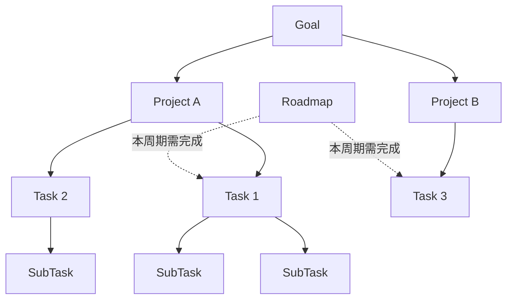
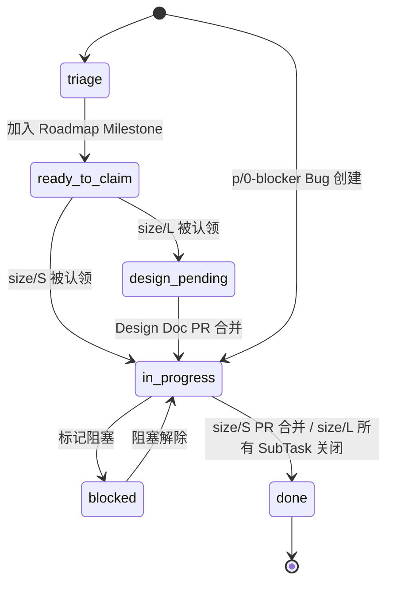
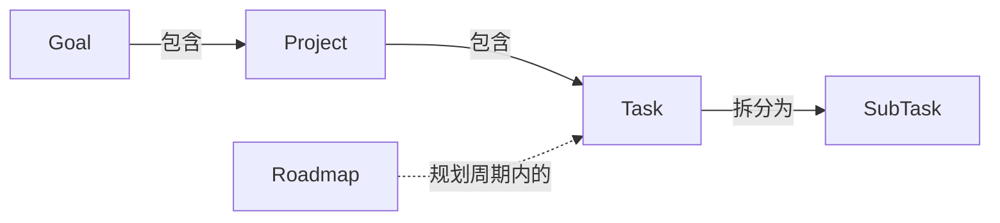
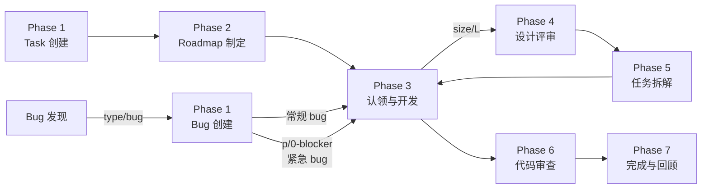

## 概述

团队采用五层结构组织工作：Goal、Project、Roadmap、Task、SubTask。Goal 定义方向，Project 承载实现，Task 描述具体开发工作，SubTask 是最小交付单元，Roadmap 则以时间周期横切 Task 层，划定阶段性交付范围。

## Goal（目标）

Goal 是团队级别的长期工作方向，通常跨越多个项目、持续数月甚至更久。它的核心作用是对齐共识——让所有人理解团队在朝什么方向努力。Goal 不指定具体实现方式，而是描述期望达成的状态。团队中任何人都可以分析哪些工作有助于推进某个 Goal，多个 Project 共同服务于同一个 Goal。

- **工具映射**：存在于 wiki 页面中，参见[团队目标](./goals.md)。

## Project（项目）

Project 是代码开发和项目管理的基本单元，通常与一个代码仓库对应。每个 Project 有独立的定位说明和技术文档。多个 Project 可以服务于同一个 Goal，而 Task 在 Project 下创建和管理。Project 是日常开发工作的组织边界，也是权限管理和持续集成的配置单元，团队成员在 Project 范围内协作完成开发与交付。

Roadmap 与 Project 统一体现在同一个 [GitHub Project](https://github.com/orgs/primatrix/projects/13) 中，便于集中管理项目规划与任务跟踪。Roadmap 通过 GitHub Project 的迭代（Iteration）或 Milestone 视图呈现，按时间周期划定阶段性交付范围。

- **工具映射**：[GitHub Project V2](https://github.com/orgs/primatrix/projects/13)。

## Roadmap（路线图）

Roadmap 是按时间周期进行的规划，通常以月或双月为单位。在每个周期开始时，将处于草案状态的 Task 纳入 Roadmap，并约定完成日期。Roadmap 横切 Task 层，定义当前周期内需要完成哪些 Task，是连接长期目标与短期执行的桥梁。周期结束时团队回顾完成情况，未完成的 Task 会顺延至下一周期重新评估优先级。

- **工具映射**：与 Project 共用同一个 [GitHub Project](https://github.com/orgs/primatrix/projects/13)，使用 Milestones 划分周期。
- **角色与责任**：由团队内 Senior 的人轮值制定，由其他团队成员 Review。

## Task（任务）

Task 是具体的开发任务。判断粒度是否合适的标准：如果一个 Task 对应的是模块级别的工作量，就需要进一步拆分。粒度过粗的 Task 应拆解为多个 SubTask，确保每个子任务都可以独立推进和验证。每个 Task 都应有清晰的完成标准，使负责人和审查者对交付物达成一致的预期。

- **工具映射**：对应代码仓库内的 Github Issue。

## Task 状态机

Task 在生命周期中流转于一组明确的状态。状态之间的迁移由用户操作或系统行为触发。

**状态清单：**

- `status/triage`：初始状态。Task 创建后所处的状态，等待被纳入 Roadmap。
- `status/ready-to-claim`：Task 已被纳入 Roadmap Milestone，等待团队成员认领。
- `status/design-pending`（仅 size/L）：Task 已被某成员认领，需先撰写并合并 Design Doc。size/S 跳过此状态。
- `status/in-progress`：Task 进入实质开发。size/S 在认领后直接进入；size/L 在 Design Doc PR 合并后进入，期间认领人按 Design Doc 拆出 SubTask 并推进各 SubTask。`p/0-blocker` 的 Bug 创建时直接进入此状态。
- `status/blocked`：开发被外部依赖阻塞，暂停推进。阻塞解除后回到 `status/in-progress`。
- `status/done`：完成。size/S 在自身 PR 合并后到达；size/L 在所有 SubTask Issue 关闭后由系统自动汇总到达。

**触发方：**

- 用户触发：创建 Task、纳入 Milestone、认领、标记/解除阻塞、提交并合并 PR。
- 系统触发：纳入 Milestone 后置为待认领、Design Doc PR 合并后进入开发、SubTask 全部关闭后将父 size/L Task 标为 done。

**合法迁移：**

## SubTask（子任务）

SubTask 是最小的可独立交付工作单元。一个合格的 SubTask 应当包含测试、部署等完整环节，构成独立可审查的功能单元。SubTask 是执行和审查的基本粒度，团队成员领取并完成 SubTask 来推进 Task 的整体进展。合理的 SubTask 拆分能让代码审查更加高效，也降低了集成时出现冲突的风险。

- **工具映射**：对应代码仓库内的 Github Issue。
- **角色与责任**：Task 拆解为 SubTask 的过程由每个开发同学自行负责拆解。

## 层级关系总览

## 工作流程

以下描述从 Task 创建到任务完成的端到端流程。Task 必须先存在于 backlog 中，才能在 Roadmap 制定时被筛选纳入；size/L 的设计评审与拆解发生在认领之后，由认领人负责。每个阶段说明用户与系统如何配合推进。

### Bugfix 通道

Bug 类型的 Issue（`type/bug`）走独立于 Feature 的并行通道，根据优先级分为紧急和常规两种路由：

| 条件 | 路由 | 说明 |
|------|------|------|
| `type/bug` + `p/0-blocker` | 紧急通道 | 跳过 Roadmap 与设计评审，创建后直接进入开发，自动 `status/in-progress` |
| `type/bug` + 其他优先级 | 常规 Bug | 跳过 Roadmap 与设计评审，创建 Issue（强制 `size/S`）后直接进入开发 |

紧急 bug 的关键差异在于自动化行为：

- 自动跳过 `status/triage`，直接流转到 `status/in-progress`
- 自动 @mention CODEOWNERS 中对应模块的负责人
- 无需提前纳入 Roadmap Milestone（可事后回溯关联）

所有 Bug 强制 `size/S`（不允许设置 `size/L`），使用 Bug 专用 Issue 模板（复现步骤、期望/实际行为、影响范围、环境信息）。

### Phase 1: Task 创建

Task 通过用户与系统的交互式对话创建。用户提供意图，系统逐步收集结构化信息并完成落库。

1. 用户发起创建请求；系统加载项目配置与历史默认值。
2. 系统逐项询问以下信息，用户依次回答：层级（Goal/Task/SubTask）、父 Issue、标题、描述（目标与验收标准）、type 标签、priority 标签。
3. 系统根据描述复杂度自动建议 size（S/L）并展示推理依据；用户确认或修改。
4. 系统给出完整 Issue 预览；用户明确批准后系统才执行创建。
5. 系统创建 Issue、加入 Project，设置 Level/Status/Progress 字段，关联父 Issue，并按 size 设置初始状态：size/S → `status/triage`（待 Roadmap 纳入或直接认领）；size/L → `status/triage`。
6. **Bug 模式**：当 type 为 `type/bug` 时，系统自动填充 Bug 报告模板、强制 `size/S`、要求设置优先级标签（`p/0` ~ `p/3`）。若为 `p/0-blocker`，系统跳过 `status/triage` 直接置为 `status/in-progress`，并 @mention CODEOWNERS 中对应模块负责人。

### Phase 2: Roadmap 制定

**用户行为：**

- Senior 轮值负责，创建本周期的 Milestone 并设定起止日期，从 backlog 已有 Task 中筛选纳入 Milestone 并确定优先级
- 其他团队成员 Review Roadmap 并发起讨论

**系统行为：**

- 提供项目健康报告，展示 Milestone 进度、逾期/停滞检测、阻塞链分析，辅助纳入决策与风险判断
- 自动为超过 3 天无更新的 Issue 标记 `status/stale`，超过 DDL 的标记 `status/overdue`
- size/L 的 Task 被加入 Milestone 后，自动流转到 `status/design-pending`

### Phase 3: 认领与开发

**用户行为：**

- 团队成员从 Roadmap 中认领 Task 或 SubTask
- size/S 直接进入开发；size/L 由认领人进入设计评审（Phase 4）与任务拆解（Phase 5），完成后回到本阶段进入子任务开发
- 开发者编码、编写测试
- 开发过程中如遇阻塞，标记 blocked 状态
- 开发完毕，发起 PR

**系统行为：**

- 认领任务时自动分配 assignee。size/S 流转到 `status/in-progress`；size/L 若处于 `status/ready-to-develop` 才允许进入开发
- 提供个人工作看板：当前任务、待 Review PR、阻塞项、DDL 预警与优先级建议
- Bug 优先级处理：`p/0-blocker` 的 Bug 始终置顶显示，`type/bug` 的 Issue 独立分组展示，`p/0-blocker` Bug 创建后 24 小时未关闭即预警
- 支持 `status/blocked` 状态流转，阻塞解除后恢复到 `status/in-progress`
- 提交 PR 时执行合规检查（标签完整性、测试证据），创建 Draft PR；PR 描述中自动添加 `Closes #issue` 以在合并时关闭关联 Issue

### Phase 4: 设计评审（size/L）

设计评审通过用户与系统的迭代式对话完成，最终交付一份可评审的 Design Doc PR。

1. 用户对认领的 size/L Task 发起设计评审；系统校验 Issue 必须为 `size/L` + `status/design-pending`，并提取目标与验收标准作为撰写起点。
2. 系统按四个维度逐一向用户发问（每次只问一个问题），并主动搜索代码库获取背景信息，用户依次作答：
   - **Context & Scope**：技术环境、系统边界、客观背景事实
   - **Design Goals**：目标、非目标（明确不做的事）、可量化的成功指标
   - **The Design**：架构、组件、接口、数据流、技术选型理由、关键 trade-offs、测试策略、部署依赖
   - **Alternatives Considered**：其他可行方案及其被否决的原因
3. 系统基于收集到的信息生成完整设计文档，逐段展示；用户审批每一段，可要求修改直到满意。
4. 用户最终确认后，系统在 wiki 仓库创建分支、提交 Design Doc PR，并在原 Issue 中评论关联 PR 链接。
5. 团队成员 Review Design Doc PR；PR 合并后系统自动将 Issue 从 `status/design-pending` 流转到 `status/ready-to-develop`。

### Phase 5: 任务拆解（size/L）

**用户行为：**

- 认领人基于 Design Doc 拆解 size/L Task 为多个 SubTask
- 拆分后组织同步与任务讨论，确认拆解方案

**系统行为：**

- 基于 Task Issue 与 Design Doc 辅助分析拆解方案，由用户确认后批量创建子 Issue 并关联父 Issue

### Phase 6: 代码审查

**用户行为：**

- 开发者自行 Review Draft PR
- 自审完成后将 PR 状态改为 Open
- Reviewer 审查 PR 代码
- 作者根据反馈修改
- 满足以下全部条件后，由**作者**执行合并：
  1. 至少 2 个 Reviewer Approve
  2. CI 检查全部通过
  3. 项目门控检查通过

**系统行为：**

- PR 状态从 Draft 变为 Open 时，自动基于 CODEOWNERS 与工作量均衡指派 Reviewer
- PR 合并后，GitHub 根据 `Closes #issue` 自动关闭关联 Issue；系统监听 Issue 关闭事件，将其流转到 `status/done`。size/L 的 Task 在所有 SubTask Issue 关闭后由系统自动汇总流转到 `status/done`

### Phase 7: 完成与回顾

**用户行为：**

- 周期结束时团队回顾完成情况

**系统行为：**

- 所有 SubTask Issue 关闭后，自动将父 Task Issue 流转到 `status/done`
- 生成周期回顾报告，展示完成率、风险项、Bug 统计（数量、修复时间、趋势）
