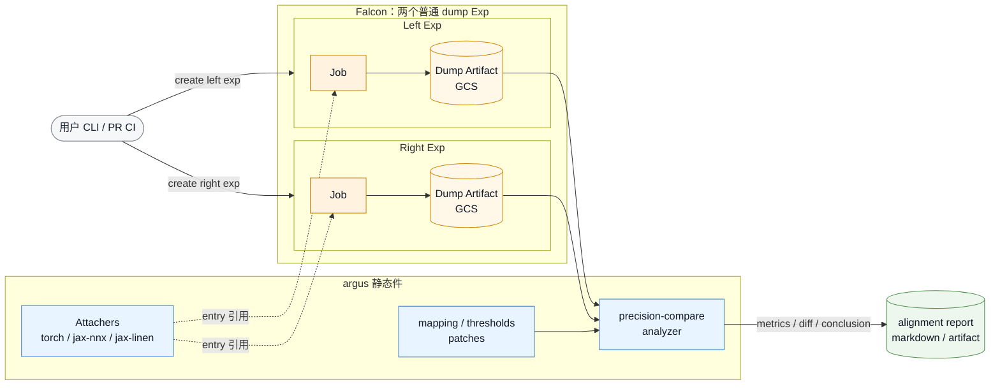
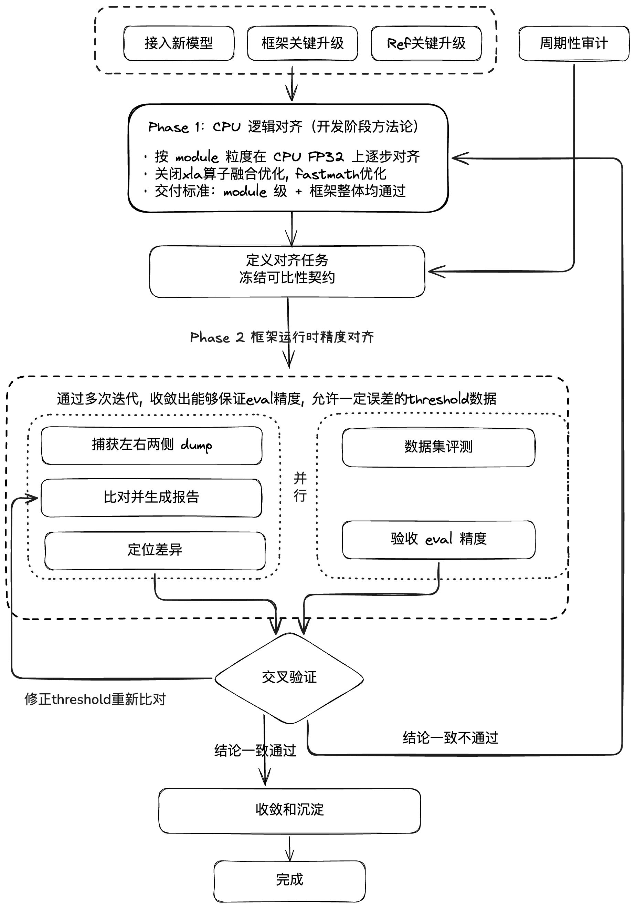
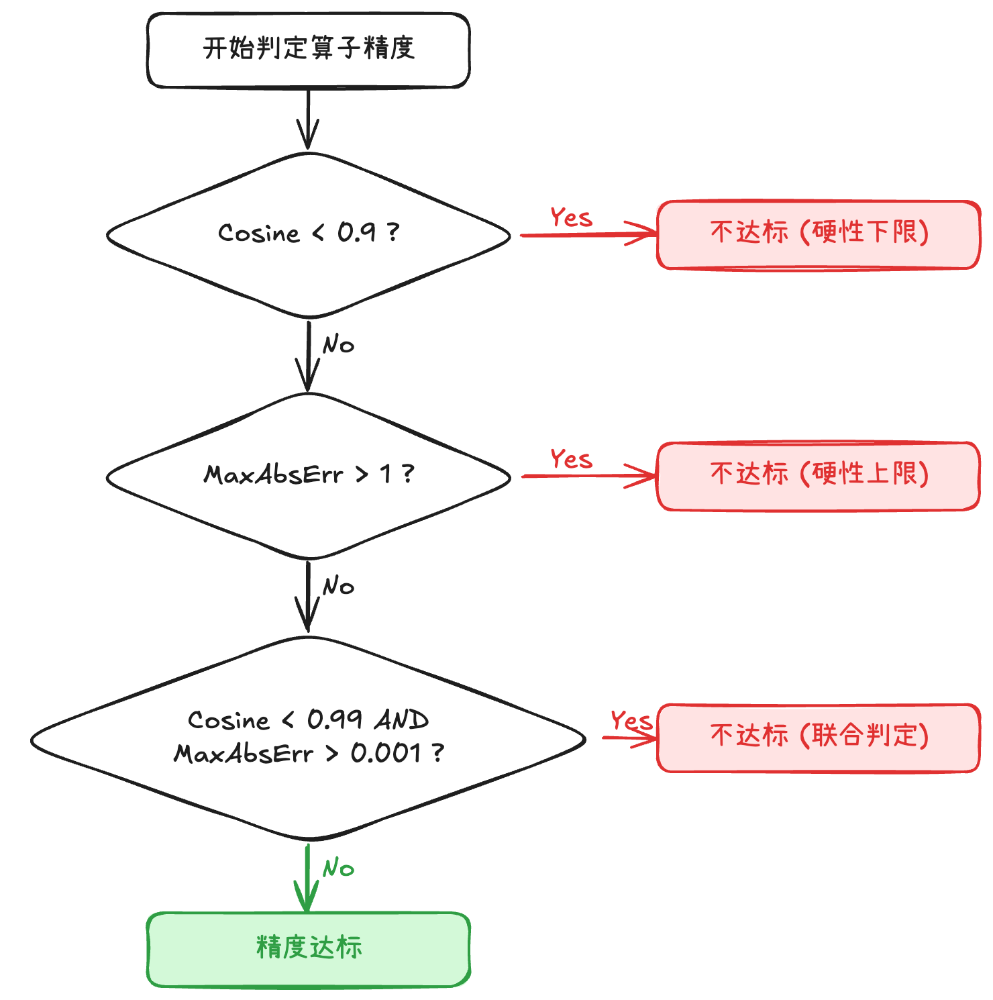

# 跨框架精度对齐 workflow

## Summary

本文定义一条轻量的跨框架精度对齐流程：用 Falcon 分别跑左右两侧 dump Exp，argus 负责捕获、mapping、阈值和 analyzer，比对结论沉淀到 alignment report 中。当前阶段**不把 alignment 做成 Falcon 的一等对象**，也不要求 Falcon 支持一个 Exp 多 Job。

目标是先把“捕获 → 比对 → 定位 → 收敛”的流程标准化，减少临时 dump 和一次性脚本，同时避免为了对齐场景过早改复杂 Falcon 架构。

## 背景

当前精度对齐主要有三类问题：

- **定位慢**：从发现 logits / loss 不一致，到定位到具体层，通常需要几天到一周。中间大量时间花在临时插 dump、改脚本、传文件、重新跑。
- **reference 不稳定**：每次临时选择 reference，导致结论之间不可直接横向比较。一次说“对齐 HF”，下一次可能实际对齐的是某个 fork 或历史版本。
- **沉淀少**：dump 脚本、层名 mapping、阈值和最终解释经常是一次性的。下一个同族模型或下一次框架升级，仍然要从头组织。

## Goals

- 把单层 diff 定位时间从几天到一周降到数小时。
- 同族新模型接入时复用历史 mapping / 阈值 / 结论，把对齐准备工作从天级降到小时级。
- 关键路径升级引入的明显精度退化能在 PR / CI 阶段被发现。
- 每次对齐都显式记录 reference、输入、权重、框架版本、argus 版本和阈值版本，避免结论漂移。
- 在不改 Falcon 核心对象模型的前提下，先打通可执行、可复跑、可沉淀的流程。

## Non-Goals

- 不替代生产 monitoring、profiling 或线上回归系统。
- 不证明 reference 一定正确，只证明目标框架与选定 reference 在指定输入、权重、配置和阈值下是否一致。
- 不把所有框架强行改造成统一入口。框架侧仍然保留自己的 loader / runner / train loop。
- 当前阶段不新增 Falcon alignment 对象、不新增 alignment 表、不要求一个 Exp 管理多个 Job。
- 不在第一阶段实现完整 replay debugger。replay 是定位增强能力，不是最小可用链路的前置条件。

## 设计原则

1. **不扩大 Falcon 架构面**：Falcon 继续只负责普通 Exp / Job / Artifact 生命周期；一次对齐的左右配对和结论写入 alignment report。
2. **对齐配置必须可复现**：任何一次对齐都要能回答“跑了什么、用的什么版本、为什么可比”。
3. **捕获和分析解耦**：dump runtime 只负责产出稳定 schema 的 artifact；analyzer 只消费 artifact、mapping 和阈值。
4. **平台记录执行事实，argus 维护对齐规则**：Falcon 记录左右 dump Exp；argus 维护 attacher、schema、mapping、thresholds 和 analyzer。
5. **优先沉淀可复用件**：mapping、阈值、已知偏差解释和报告必须能被下一次同族模型直接引用。

## 整体架构

整套精度对齐由两块共同支撑：**argus 仓**（静态件：dump runtime、mapping、analyzer）与 **Falcon 平台**（运行时：调度、artifact 存储、实验状态）。

当前落地形态是：一次对齐由两个普通 Falcon Exp 加一份 alignment report 组成。



### 当前落地策略

不新增 Falcon 对象：

- 左侧框架跑一个普通 Falcon Exp，产出 left dump artifact。
- 右侧 reference 跑一个普通 Falcon Exp，产出 right dump artifact。
- analyzer 接收左右 exp id、mapping、thresholds，解析对应 dump artifact 后产出结构化指标和 markdown report。
- 一次对齐的配对关系、指标、结论和已知偏差解释，由 analyzer 汇总到 alignment report。

这意味着 Falcon 暂时不需要理解“一次对齐”这个业务概念。Falcon 只需要稳定保存“这两次 dump 分别跑了什么、产物在哪里、状态是什么”。

### Alignment Report

alignment report 是当前阶段承载一次对齐结论的产物。analyzer 根据输入参数、左右 artifact metadata 和比对结果生成报告，至少包含：

```yaml
model_family: llama
model_name: ...
framework_pair: sgl-jax__hf-torch
reference:
  name: hf-transformers
  version: <commit-or-tag>
argus_ref: <commit-or-tag>
mapping: mappings/llama/sgl-jax__hf-torch.yaml
thresholds: thresholds/bf16.yaml
left:
  exp_id: <falcon-exp-id>
  artifact_path: <gcs-path>
  framework_commit: <commit>
right:
  exp_id: <falcon-exp-id>
  artifact_path: <gcs-path>
  framework_commit: <commit>
result:
  status: passed | failed | investigating
  max_abs: ...
  max_rel: ...
  min_cos: ...
  first_failed_layer: ...
  report_path: <markdown-or-gcs-path>
notes:
  - known difference / accepted deviation / follow-up issue
```

## 模块职责

| 模块 | 负责什么 | 不负责什么 |
|---|---|---|
| argus attacher | 在框架进程内按 scope 捕获 forward / backward / loss / optimizer 等数据，并写成统一 dump schema | 不调度任务，不记录 Falcon 状态 |
| argus mapping / thresholds | 维护模型族和框架对的层名对应、融合拆分规则、transform 和阈值 | 不保存单次实验结果 |
| argus analyzer | 消费左右 artifact，按 mapping 和 thresholds 输出结构化指标与 markdown 报告 | 不启动模型，不修改框架运行逻辑 |
| 被测框架仓 | 提供 alignment entry / mode，负责加载模型、权重、输入，并在正确位置调用 attacher | 不维护跨框架 mapping |
| Falcon | 调度普通 dump Exp，保存 artifact，记录每次 dump 的状态和产物路径 | 不理解 alignment 业务语义，不维护左右配对关系 |
| alignment report | 记录 left/right exp 配对、版本、指标、结论和 follow-up | 不存 tensor，不替代 Falcon artifact |

## 仓库组织

argus 仓维护对齐静态件：

```text
argus/
  src/attachers/                     torch / jax-nnx / jax-linen Attacher
  src/analyzer/                      precision-compare analyzer
  mappings/<family>/<a>__<b>.yaml    模型族 × 框架对的 mapping
  thresholds/                        dtype × 算子类别的默认阈值
  patches/<framework>/<tag>.patch    短期无法合入上游时的兜底 hook patch
```

Falcon scenario manifest 不放在 argus 里。当前阶段也不需要为 alignment 设计新的 Falcon scenario schema；左右两侧按普通 dump Exp 的方式提交即可。

## 核心对象

| 对象 | 含义 |
|---|---|
| Dump Exp | Falcon 中一次普通 dump 运行。一次对齐通常包含 left / right 两个 Dump Exp |
| Dump Artifact | 结构化张量产物。按 rank 和 tensor category 组织，包含 tensor chunk、index、metadata、schema version、框架版本和运行配置摘要 |
| Mapping | 左右两侧 tensor 的对应关系。处理命名差异、融合 / 拆分、transform 和 skip |
| Thresholds | 判定通过 / 失败的数值规则。按 dtype、张量类别和算子类别维护 |
| Alignment Report | analyzer 产出的结构化指标和 markdown 结论。记录左右 exp 配对和最终判断 |

## 一次对齐的流程



以”sgl-jax 接入新模型 X，对齐 HF transformers”为例，完整流程分为两个阶段、七步。先在 CPU 上以最高精度排除逻辑错误（Phase 1），再在 TPU 上按实际配置对齐精度（Phase 2）。

Phase 2 中，**数据集评测（eval）和层级 dump 对齐应并行开展**，而非串行等待一方完成。两条线的结果交叉验证：

- **eval 和 dump 都通过**：进入收敛和沉淀。
- **eval 和 dump 结果不一致**（例如 dump 通过但 eval 不通过，或反之）：说明当前 threshold 值或规则不准确，需要修正 threshold 后重新验证。threshold 只影响分析阶段，修正后无需重新跑 dump，只需重新运行 analyzer。
- **eval 和 dump 都不通过**：说明实现本身存在问题，需要定位并修复实现错误。

### 0. 触发

以下任一事件触发一次对齐：

- 新模型族或同族新模型接入。
- 框架关键路径升级，例如 attention、MoE、RMSNorm、checkpoint 转换、dtype 策略、parallelism 策略变化。
- reference 升级，例如 HF transformers modeling 代码或 Megatron-LM 训练逻辑变化。
- 周期性审计或 nightly regression。

### 1. 定义对齐任务

提交任务前先冻结可比性契约：

- **reference**：推理默认 HF transformers torch eager；训练默认 Megatron-LM。HF 未合入的新模型使用明确 fork 和 commit。
- **framework pair**：例如 `sgl-jax__hf-torch`、`maxtext__megatron`。
- **model / family**：用于选择 mapping 模板和历史阈值。
- **weights**：checkpoint 路径、转换脚本版本、转换输出 hash。
- **inputs**：prompt / batch / token ids / labels / position ids / attention mask。
- **runtime config**：dtype、matmul precision、parallelism、sharding、decode 参数、seed、eval/train mode、XLA / torch 关键 flags。
- **scope**：需要捕获的层范围和张量类别。
- **argus ref**：锁定 attacher、schema、mapping、thresholds 和 analyzer 版本。

产出是一次对齐的可比性契约，供左右 dump Exp 和后续分析复用。

### 2. 对齐分阶段执行

对齐分两个阶段，先排除逻辑错误，再处理硬件精度差异。

#### Phase 1：CPU 逻辑对齐（开发阶段方法论）

Phase 1 是**开发阶段的方法论指导**：在模型实现过程中，开发者应按 module 粒度逐步在 CPU 上进行逻辑对齐，确保每个 module 的实现与 reference 在数值上一致。这一方法论需要在团队中普及，成为开发阶段的标准实践。

Phase 1 的交付标准不仅要求单个 module 级别对齐，还需要确保 module 组合到框架整体后仍然对齐，避免"module 级通过但框架级对不齐"的情况。

> **局限性**：Phase 1 在 CPU 上对比可能无法发现所有问题。例如 MIMO 等依赖特定硬件行为的模型，如果 transformer 实现本身存在 bug，CPU 对比可能漏检。Phase 1 通过不等于实现一定正确，Phase 2 的硬件级验证仍然不可跳过。

在 CPU 上以最高精度运行左右两侧，目的是确保实现无逻辑错误，排除 TPU 硬件带来的数值差异干扰：

- **精度**：FP32，不使用 BF16 / mixed precision。
- **XLA 算子融合**：关闭。避免融合改变计算序引入的数值差异。
- **fast math 优化**：关闭。禁止 XLA 的 algebraic simplification 和 reassociation。
- **Pallas kernel**：`interpret_mode=True`，在 CPU 上以纯 Python 语义执行，绕过硬件 kernel 实现差异。
- **parallelism**：单机单卡，不引入 sharding / gather 的复杂性。
- **reference**：同样在 CPU FP32 上运行（HF transformers torch eager CPU）。

Phase 1 的判定标准远严格于 Phase 2：在 FP32 + 无优化条件下，左右两侧的 logits / loss 应该**数值完全一致或仅有浮点舍入级别差异**（abs < 1e-6）。任何超出浮点舍入的 diff 都应视为逻辑 bug 而非精度容忍范围。

Phase 1 通过后，才进入 Phase 2。

#### Phase 2：TPU 精度对齐

在 TPU 上按实际生产配置运行，处理硬件、dtype、算子融合等因素引入的数值差异：

- **精度**：实际 dtype（BF16 / FP8 / mixed precision）。
- **XLA 优化**：正常开启（算子融合、fast math 等按生产配置）。
- **Pallas kernel**：正常编译执行。
- **parallelism**：按实际 sharding / parallelism 配置。
- **reference**：按 Reference Policy 选择。

Phase 2 使用本文定义的阈值体系（Thresholds）和多指标联合判定规则。以下步骤 3–7 描述的均为 Phase 2 的具体流程，其中步骤 3-5（dump 对齐）与步骤 6（数据集评测）并行开展。

### 3. 捕获左右两侧 dump

左右两侧各提交一个普通 Falcon Exp，使用 Falcon 现有 Exp 创建入口。`role-to-task-spec` 描述 Job 如何运行，`config` 描述 dump 运行配置：

```bash
falcon exp create \
  --name <left-exp-name> \
  --cluster <cluster-name> \
  --type accuracy-dump \
  --role-to-task-spec ./left-task.yaml \
  --config ./left-dump.yaml

falcon exp create \
  --name <right-exp-name> \
  --cluster <cluster-name> \
  --type accuracy-dump \
  --role-to-task-spec ./right-task.yaml \
  --config ./right-dump.yaml
```

`left-dump.yaml` / `right-dump.yaml` 承载“定义对齐任务”中与单侧 dump 运行相关的字段，例如 framework、model、argus ref、weights、inputs、runtime config 和 scope。

每个 Exp 跑被测框架仓维护的 alignment entry / mode：

```python
from argus import init_pattern_attacher

model = ...  # 框架自己的 loader / runner / train loop 初始化
attacher = init_pattern_attacher(
    framework="jax-nnx",             # torch / jax-nnx / jax-linen
    pattern=os.environ["SCOPE"],
    out_dir=os.environ["FALCON_ARTIFACT_DIR"],
)

attacher.attach(model)
try:
    for i, prompt in enumerate(prompts):
        run_one_request(model, prompt)
        attacher.dump(label=f"prompt_{i}")
finally:
    attacher.close()
```

关键约定：

- `label` / scenario context 是左右 artifact 的配对键，例如左 `prompt_0` 对右 `prompt_0`。
- 采样节奏由 entry 控制，attacher 不内置策略。
- 推理场景优先捕获 forward 输出、logits、必要的 KV cache 相关张量。
- 训练场景可捕获 forward、backward grads、loss、optimizer state 和关键 metrics。
- 分布式场景需要明确 `gather_at_dump` 或 `per_shard + offline gather`，不能让 analyzer 猜测 tensor 的全局语义。

### 4. 比对并生成报告

左右 dump Exp 成功后，运行 analyzer：

```bash
falcon analyze precision-compare \
  --left-exp <left-exp-id> \
  --right-exp <right-exp-id> \
  --map mappings/llama/sgl-jax__hf-torch.yaml \
  --thresholds thresholds/bf16.yaml
```

analyzer 做四件事：

1. 校验左右 metadata、index、schema version、label / scenario context、shape、dtype、framework version 和 argus ref 是否可比。
2. 按 mapping 配对左右 tensor，处理融合 / 拆分、transform 和 skip。
3. 计算比对指标（见下方指标体系）。
4. 输出结构化结果和 markdown 报告，写入 alignment report。

#### 精度比对指标体系

指标分为两类：硬判定指标参与达标判定，软参考指标辅助分析定位但不参与判定。

**硬判定指标**（参与达标判定）：

| 指标 | 衡量什么 | 推荐阈值 (BF16) |
|---|---|---|
| Cosine (余弦相似度) | 两个 tensor 的方向一致性，反映整体趋势 | > 0.99（软），> 0.9（硬性下限） |
| MaxAbsErr (最大绝对误差) | 单点最大偏差的绝对值 | < 0.001（软），< 1.0（硬性上限） |

**软参考指标**（不参与达标判定，用于辅助分析）：

| 指标 | 衡量什么 | 为什么不做硬判定 |
|---|---|---|
| MaxRelativeErr (最大相对误差) | 单点最大偏差的相对比例 | ground truth 含 0 或极小值时爆 inf，做硬门槛会大量误报 |
| Mean Absolute Error | 所有元素的平均绝对误差 | 辅助判断误差是集中在少数 outlier 还是普遍偏移 |
| Accumulated Relative Error | 累积相对误差 | 观察误差是否沿拓扑顺序逐层放大，定位放大器结构 |
| Euclidean Relative Distance | 欧氏距离维度的相对偏差 | 对 tensor 整体偏移程度的补充度量 |
| KL Divergence | 两个 tensor 的分布差异 | 适用于 logits / probability 类输出，分布维度的补充 |
| ULP Distance | 以最小精度单位衡量的距离 | 区分"浮点表示本身的精度极限"与"实现差异" |
| Percentile Error (P99/P95) | 高分位误差值 | 排除极端 outlier 后看整体误差水平 |
| Max Error Index | 最大误差发生的位置 | 帮助判断误差是否集中在特定 channel / head / layer |

analyzer 在报告中同时输出所有指标，但只用硬判定指标决定 pass / fail。软参考指标在定位差异（步骤 5）时用于辅助分析。

报告需要同时支持两种视角：

- **拓扑顺序视角**：按模型执行顺序展示每一层是否通过，用于定位首个引入差异的位置。
- **误差排序视角**：按 abs / rel / cos 等指标排序，用于快速发现最大偏差和下游放大点。

### 5. 定位差异

定位默认从拓扑顺序开始，而不是只看最大 `abs_err`：

1. 找到第一个“输入通过、输出失败”的候选层。
2. 查看该层邻近上游的 rel / cos / ulp 是否已经恶化。
3. 结合 mapping transform、dtype、fusion、parallelism 和 known differences 判断是否为真实实现差异。
4. 必要时追加更小 scope 或更高精度 dump 复跑。

replay 是增强能力：把 reference 某层输出注入目标框架对应输入，判断下游是否恢复一致。第一阶段只要求支持单机、forward、已 gather 的 dense tensor；分布式训练 replay 后续单独设计。

### 6. 数据集评测（与步骤 3-5 并行）

数据集评测与层级 dump 对齐**并行开展**，不需要等待 dump 对齐完成后才启动。两条线独立推进，结果在收敛阶段交叉验证：

- 在标准评测数据集上跑目标框架和 reference 框架，比较 eval 指标（如 accuracy、perplexity、BLEU 等）。
- **eval 和 dump 都通过**：进入收敛和沉淀。
- **eval 和 dump 结果不一致**：说明 threshold 值或规则不准确，需要修正 threshold。由于 threshold 只影响分析阶段，修正后只需重新运行 analyzer，无需重新跑 dump。
- **eval 和 dump 都不通过**：说明实现存在问题，需要定位并修复后重新验证。

这一步的目的是：eval 精度验收是最终目标，层级 dump 对齐是定位手段。两者并行开展可以更早发现 threshold 失真和实现问题。

### 7. 收敛和沉淀

修复后重跑左右 dump Exp。所有必须对齐的层进入阈值后，且 eval 精度验收通过（即 dump 和 eval 两条线结果一致且均通过）后，完成沉淀：

- mapping 增量 PR 入 `mappings/<family>/<a>__<b>.yaml`。
- 阈值变化 PR 入 `thresholds/`，并说明理由。
- 已知偏差和解释写入 markdown report。
- report 记录最终状态、关键指标、argus ref、framework commit、reference commit、artifact path 和报告链接。
- 同族后续模型复用该 mapping 和阈值，从历史 report 找最近一次可用结论。

## Mapping

mapping 是 `(模型族, 框架 A, 框架 B)` 三元绑定，不在不同框架对之间直接通用。

```yaml
pairs:
  - left: "layers\\.(\\d+)\\.attn\\.q_proj"
    right: "model.layers.\\1.self_attn.q_proj"

  - left: "layers\\.(\\d+)\\.attn\\.qkv_proj"
    right:
      - "model.layers.\\1.self_attn.q_proj"
      - "model.layers.\\1.self_attn.k_proj"
      - "model.layers.\\1.self_attn.v_proj"
    fusion: split_qkv

  - left: "embed_tokens"
    right: "model.embed_tokens"
    transform: [transpose]

skip_left:
  - "norm_pre"
```

复用规则：

- **同族同框架对的新模型**：优先复用已有 mapping。层数、MoE、attention 变体或融合策略变化时增量修改。
- **同族新框架对**：参考已有 family mapping，但必须新建 `<a>__<b>.yaml`。
- **新模型族**：手写第一份 mapping，收敛后作为该 family 模板。

## Thresholds

thresholds 是静态配置，和 mapping 一样由 argus git ref 锁定。第一阶段不做动态学习阈值，避免同一次对齐前后判定标准漂移。

它不是代码里的单个全局字典，而是一组 YAML rule：先按 dtype 选择默认阈值，再按模型族、具体模型和 tensor 规则逐层覆盖。

推荐分层：

```text
thresholds/
  bf16.yaml
  fp32.yaml
  llama/bf16.yaml
  qwen/bf16.yaml
  qwen/qwen3-32b/bf16.yaml   # 仅例外情况
```

优先级：

```text
model override > family override > global dtype default
```

推荐 rule 形态：

```yaml
version: 1
dtype: bf16

defaults:
  abs: 1.0e-2
  rel: 1.0e-2
  cos: 0.999
  fail_on_nan: true
  # 软参考指标：不参与 pass/fail 判定，仅记录到报告中辅助分析
  soft_metrics:
    mean_abs: true
    accumulated_rel: true
    euclidean_rel: true
    kl_divergence: true
    ulp: true
    percentile: [95, 99]

by_tensor_type:
  logits:
    abs: 2.0e-2
    rel: 2.0e-2
    cos: 0.999
  loss:
    abs: 1.0e-3
    rel: 1.0e-3

by_op_type:
  attention:
    abs: 2.0e-2
    rel: 2.0e-2
    cos: 0.999

overrides:
  - match:
      phase: forward
      tensor_name: "layers\\.(\\d+)\\.mlp\\.gate_proj"
    reason: "bf16 accumulation differs between sgl-jax and HF"
    owner: "sgl-jax"
    thresholds:
      abs: 2.0e-2
      rel: 2.0e-2
      cos: 0.999
```

模型级 override 只用于确有差异的模型，不要求每个模型都有自己的 thresholds 文件。模型文件继承 family 文件，family 文件再继承全局 dtype 默认。每条 override 至少要说明 `match`、`reason`、`owner` 和覆盖后的阈值：

```yaml
extends: ../bf16.yaml

overrides:
  - match:
      framework_pair: sgl-jax__hf-torch
      tensor_name: "layers\\.(\\d+)\\.mlp\\.gate_proj"
    reason: "bf16 accumulation differs between sgl-jax and HF"
    owner: "sgl-jax"
    thresholds:
      abs: 2.0e-2
      rel: 2.0e-2
      cos: 0.999
```

analyzer 在比对每个 tensor 前解析出最终阈值，并在报告中记录命中的阈值来源，例如 `global bf16 default`、`llama/bf16.yaml` 或 `qwen/qwen3-32b/bf16.yaml#overrides[0]`。这样同一次对齐的判定标准可复现，也能在 review 时看清模型级 override 是否合理。

原则：阈值用于表达已知数值容忍度，不用于掩盖未知 diff。

### 精度判定参考：多指标联合判定

阈值设计和达标判定逻辑参考了昇腾精度对齐方案的实践经验。核心思路是**多指标联合判定**，避免单指标误判。


**达标判定规则**：

| 条件 | 判定 |
|---|---|
| Cosine < 0.9 | 不达标（方向偏差 > 26°，硬性下限） |
| MaxAbsErr > 1 | 不达标（数值量级严重偏移，硬性上限） |
| Cosine < 0.99 **且** MaxAbsErr > 0.001 | 不达标（两指标同时超标 → 系统性问题） |
| 其余情况 | 达标 |

**设计要点**：

- 单指标略超阈值可以容忍（浮点误差累积），但两个指标同时超标说明问题是系统性的。
- MaxRelativeErr 仅作参考，不参与硬判定（当 tensor 含 0 / NaN 时容易出现 inf）。
- 单算子级预检阈值应比整网比对更严格一个量级（不涉及误差累积）。

**精度排查四步法**：

1. **前置排查**：排除非算子因素（超参一致性、三方库版本、数据读取顺序、模型结构）。
2. **Loss 级对齐**：逐步定位问题出现在正向还是反向。
3. **算子级 Dump 对比**：逐层 dump 输入 / 输出 tensor，二分法定位第一个精度劣化算子。
4. **单算子修复**：构造单算子模型复现，调整精度策略。

**精度劣化常见根因**：算子融合引入的计算序变化、FP16 精度不足叠加网络中的放大器结构（如 residual 累加）、常量折叠改变计算精度。

参考资料：

- [昇腾 CANN 精度比对判定规则](https://www.hiascend.com/doc_center/source/zh/canncommercial/70RC1/modeldevpt/ptmigr/AImpug_0042.html)
- [昇腾 CANN 计算精度评价指标](https://www.hiascend.com/doc_center/source/zh/canncommercial/700/modeldevpt/ptmigr/AImpug_000197.html)
- [msprobe 精度分析工具使用指导](https://support.huaweicloud.com/bestpractice-modelarts/modelarts_10_2521.html)
- [H2SGEMM: FP32 GEMM on NPU using FP16](https://arxiv.org/html/2507.23387v1)

## Dump Artifact Contract

dump artifact 必须稳定到 analyzer 可以独立消费。当前 contract 对齐 Argus dump layout，不另起一套文件结构：

```text
<artifact_root>/
  rank_0/
    metadata.yaml
    forward/
      index.json
      chunk_00000.npz
      chunk_00001.npz
    logits/
      index.json
      chunk_00000.npz
    loss/
      index.json
      chunk_00000.npz
  rank_1/
    ...
```

`metadata.yaml` 至少记录：

- schema version。
- framework、framework commit 和运行配置摘要。
- rank / mesh 信息，例如 global rank、mesh shape、mesh coord。
- tensor layout，例如每个 tensor 的 shard / replica / gather 语义。
- dtype map，用于恢复原始 dtype。
- scenario context，例如 prompt id、train step、micro-batch、GA step 等。

每个 category 的 `index.json` 至少记录 tensor logical name、所在 chunk、shape 和 chunk 内 key。`index.json` 的 tensor 顺序必须稳定；analyzer 的拓扑顺序视角优先使用该顺序。若某个 writer 不能保证 index 写入顺序稳定，需要在 `index.json` 或 `metadata.yaml` 中提供显式 order 字段。

新的对齐任务统一产出上述 Argus dump layout。历史 dump 如需复用，先通过转换工具归一到该 layout；analyzer 只消费归一后的 artifact。

## Reference Policy

默认 reference：

| 场景 | 默认 reference | 说明 |
|---|---|---|
| 推理框架对齐 | HF transformers torch eager | 记录 transformers commit / model fork / tokenizer 版本 |
| 训练框架对齐 | Megatron-LM | 记录训练配置、并行策略、optimizer 和数据 batch |
| 同框架升级回归 | 上一个已通过版本 | 用于发现退化，不证明实现绝对正确 |
| dtype 策略对齐 | FP32 或上一稳定 dtype | 用于分析 BF16 / TF32 / mixed precision 漂移 |

reference 升级必须先跑 reference 自身回归：新 reference 与上一 reference 在固定输入上的 logits / loss 差异需要登记到 alignment report。否则后续目标框架对齐结论不可横向比较。

## CI 策略

对齐任务按成本分三层：

| 层级 | 触发 | 范围 | 是否阻断 |
|---|---|---|---|
| PR smoke | 关键路径 PR | 小模型 / 小 batch / 少量层 / 单 prompt | 可阻断明显退化 |
| Nightly full | 每日或每周 | 主线模型、完整 scope、标准输入集 | 失败创建 issue / owner triage |
| Deep-dive | 新模型或疑难 diff | 自定义 scope、更多 dump、必要时 replay | 不自动阻断，服务定位 |

CI 不直接要求每个 PR 跑完整跨集群矩阵。PR 阶段只承担“尽早发现明显错误”的责任；完整对齐矩阵由 nightly 和 deep-dive 任务维护。

## 常见对齐对

| 对齐对 | 触发场景 |
|---|---|
| sgl-jax ↔ HF transformers | sgl-jax 接入新模型；新硬件 / 新算子融合方案复跑；周期性审计 |
| MaxText ↔ Megatron-LM | MaxText 升级关键路径前的回归；跨框架重写训练任务证明数值等价 |
| sgl-jax ↔ MaxText | RLHF 后 serving 与 training 一致性验证；ckpt 上线前推理路径回放 |
| 同一框架历史版本 | 升级回归 / 退化检测 |
| 同框架不同精度 | FP32、BF16、TF32 或 mixed precision 策略漂移定位 |

## 落地依赖与计划

本文档描述的完整流程依赖以下前置条件：

- **Falcon 平台上线**：dump Exp 的创建、调度、artifact 存储和状态管理均依赖 Falcon。在 Falcon 相关功能就绪前，对齐任务只能通过手动脚本或临时流程执行。
- **argus 代码简化与整体梳理**：当前 argus 代码需要简化和整体梳理，使 attacher、analyzer 和 dump layout 与本文定义的 contract 对齐。梳理完成前，部分模块以临时实现过渡。

### 模块级数据注入

在精度对齐阶段，argus 支持**模块级数据注入**：将 reference 的某一层输出注入到目标框架对应模块的输入，替代该模块的实际上游依赖。这一能力可用于：

- **依赖项 mock 的端到端对齐**：当某个上游模块尚未实现或已知存在差异时，通过注入 reference 数据绕过该依赖，验证下游模块的端到端精度。
- **差异隔离**：判断精度偏差是由当前模块引入还是由上游累积传播，缩小排查范围。
- **增量开发验证**：在模型逐模块实现过程中，已完成的模块可以通过注入 reference 数据进行端到端对齐，无需等待所有模块就绪。

## Open Decisions

| 决策 | 当前建议 | 影响 |
|---|---|---|
| 是否把 alignment 做成 Falcon 一等对象 | 暂缓。当前只用两个普通 dump Exp + alignment report | 避免扩大 Falcon 架构面 |
| dump schema v1 | 先定义最小稳定 contract，再兼容已有 dump | 影响 analyzer 复杂度和历史数据迁移 |
| JAX / NNX capture 后端 | 优先框架原生 capture / sow 能力，外部 hook 或 patch 作为兜底 | 影响 jit、grad、pjit、多 host 的稳定性 |
| 阈值 owner | argus 维护默认阈值，模型 owner 审批例外阈值 | 影响 CI 是否可以可靠阻断 |
| replay 范围 | 第一阶段只支持单机 forward dense tensor | 避免 replay 反向拖慢主链路 |

## Risks and Mitigations

| 风险 | 缓解 |
|---|---|
| alignment report 版本错配 | report 模板记录 left/right exp、artifact、argus ref、mapping、thresholds、framework commit |
| 框架升级后 attach 失效 | attach 失败 fail-loud；entry smoke test；mapping 与 capture pattern 分开维护；按版本打 tag |
| 两侧可复现配置不一致 | analyzer 校验 reference、weights、inputs、dtype、flags、tokenizer 和 framework commit |
| artifact schema 漂移 | schema version + CI 校验 + 兼容层集中在 argus reader |
| 多 host gather 时序或语义错误 | 明确 gather 策略；优先 per-shard + offline gather；真机验收 |
| dump IO 成本过高 | 小样本采样、按 scope 捕获、chunked / async writer、PR smoke 与 nightly 分层 |
| reference 自身漂移未察觉 | reference 升级先跑自身回归，并登记到 alignment report |
| mapping / 阈值腐烂 | 收敛阶段必须 PR 回模板库；nightly 跑主线模型兜底 |
