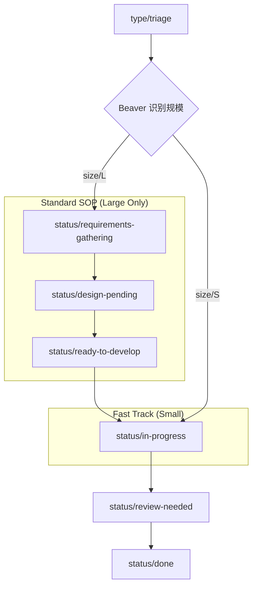

# Beaver 标签体系规范 (GitHub Issue Label System)

为了实现自动化的状态追踪与智能通知，Beaver 采用一套基于前缀的结构化标签体系。标签不仅是分类工具，更是触发 AI 代理“推理”与“行动”的信号点。

## 1. 标签命名规范

- **格式**：`前缀/名称` (例如：`status/in-progress`)
- **颜色建议**：同一前缀的标签建议使用相近色系以便于视觉识别。

## 2. 核心标签分类

### 2.1 任务类型 (type/...)

定义任务的本质属性。

- `type/feat`: 新功能需求。
- `type/bug`: 缺陷修复。
- `type/refactor`: 代码重构。
- `type/docs`: 文档编写。
- `type/chore`: 基础设施、构建流等杂项。

### 2.2 优先级 (p/...)

决定 Beaver 推理逻辑中的风险权重。

- `p0/blocker`: 阻塞级。需在当日日报中置顶显示。
- `p1/urgent`: 紧急。需在当日日报中置顶显示。
- `p2/high`: 高优先级。
- `p3/normal`: 普通。

### 2.3 生命周期状态 (status/...)

标注 Issue 当前所处的阶段。

| 状态标签 | 适用规模 | 语义说明 |
| :--- | :--- | :--- |
| **`status/triage`** | 通用 | 待分拣。新 Issue 的初始状态，等待分析规模。 |
| **`status/requirements-gathering`** | **Size L 专属** | 需求细化中。需产出 PRD 或 RFC。 |
| **`status/design-pending`** | **Size L 专属** | 方案设计/评审中。需产出设计文档。 |
| **`status/ready-to-develop`** | **Size L 专属** | 方案已定，待开发。小任务分拣后跳过此步。 |
| **`status/in-progress`** | 通用 | 开发/处理中。 |
| **`status/blocked`** | 通用 | 任务阻塞。需标注阻塞原因。 |
| **`status/review-needed`** | 通用 | 等待代码评审 (PR) 或方案评审。 |
| **`status/qa-testing`** | **Size L 建议** | 独立测试阶段。小任务通常在 Review 后直接完成。 |
| **`status/done`** | 通用 | 已完成且已合并。 |

### 2.4 规模区分 (size/...) - **新增**

用于决定该任务适用何种复杂度的 SOP 流程。

- `size/L` (Large): 大规模任务。需遵循完整 SOP，包括需求细化、方案评审及 E2E 测试。
- `size/S` (Small): 小规模任务。适用快速路径，跳过冗余阶段，直接进入开发。

### 2.5 Beaver 代理专用 (beaver/...)

由 Beaver 代理在执行合规性校验或推理时自动挂载，用于提示人工介入或标识系统状态。

- `beaver/needs-split`: 规模超限。检测到 PR 中特定核心目录的变更行数 (LOC) 超过 200 行（文档、测试等不计入），或子任务拆分粒度不够，建议二次拆分。
- `beaver/missing-test`: 缺失测试验证。在标记为 done 前未检测到有效的测试结论或截图证据。
- `beaver/missing-context`: 缺乏上下文。Issue 描述不全，或缺少强制关联的文档 (如 PRD/RFC 链接) 以及关联的 Issue 编号。
- `beaver/upstream-blocked`: 上游阻塞。由 Beaver 跨任务依赖追踪识别到，因为其依赖的上游任务被阻塞或延期导致当前任务间接阻塞。
- `beaver/stale`: 长尾停滞。检测到在某状态（如 `in-progress` 或 `review-needed`）停留时间超过健康阈值（如 3-5 天），需要跟进。
- `beaver/overdue`: 已逾期。检测到当前时间已超过该任务的 DDL，且未完成。

## 3. 差异化 SOP 流程设计

Beaver 会根据 `size/` 标签自动调整其通知与跟进的策略：

| 任务规模 | 适用流程 | Beaver 关注点 |
| :--- | :--- | :--- |
| **size/L** (大) | **标准 SOP (全生命周期)** | 关注 PRD 质量、设计对齐、多阶段 Review 延迟、里程碑风险。 |
| **size/S** (小) | **快速路径 (Fast Track)** | 仅关注代码合规性、单次 PR 响应速度及是否已关闭。 |

## 4. 状态流转图 (Mermaid)

## 5. 状态驱动的系统行为 (SRA 映射)

Beaver 会根据 `status/` 标签的变更及停留时长，执行差异化的自动化逻辑：

| 状态标签 | 适用规模 | 感知 (Sense) 触发点 | 预期行动 (Action) |
| :--- | :--- | :--- | :--- |
| **`status/triage`** | 通用 | 新 Issue 创建 | **晨间提醒**：加入管理者池。**LLM 初筛**：建议 Size 及负责人。 |
| **`status/requirements-gathering`** | **Size L** | 挂载标签 | **Gatekeeper**：强检 PRD/RFC 链接。停留 >3d 周报预警。 |
| **`status/design-pending`** | **Size L** | 挂载标签 | **Gatekeeper**：强检方案文档。提醒架构师评审。 |
| **`status/ready-to-develop`** | **Size L** | 状态变更 | **晨间提醒**：加入开发者今日待办清单。 |
| **`status/in-progress`** | 通用 | 状态变更 | **日报**：列入活跃清单。无提交停留 >5d 自动询问。 |
| **`status/review-needed`** | 通用 | 状态变更/PR | **实时告警**：私信 Reviewer。校验 CI。 |
| **`status/blocked`** | 通用 | 状态变更 | **实时告警**：频道红字预警。LLM 提取根因至日报。 |
| **`status/done`** | 通用 | 状态变更 | **Gatekeeper**：校验 PR 合并。计算 Cycle Time。 |

| 约束项 | 感知 (Sense) 触发点 | 推理 (Reason) 逻辑 | 预期行动 (Action) |
| :--- | :--- | :--- | :--- |
| **代码变更规模 (LOC)** | 关联 PR 的代码提交 | 校验特定核心目录代码变更是否超过 200 行（排除测试与文档） | **Gatekeeper**：若核心目录 `LOC > 200`，在 PR 中自动标记 `Check Failed`。私信开发者要求二次拆分。 |
| **父子拆分审计** | Size L 挂载子任务列表 (Task List) | 评估拆分原子性 | **LLM 审计**：评估每个子任务的核心逻辑是否能在 200 行内实现（排除测试与文档）。若过大，回复“⚠️ 建议细化”。 |
| **测试结论核对** | 子任务/小任务请求标记 `status/done` | 验证是否存在可信测试结论 | **Gatekeeper**：核对测试结果与 LOC 限制。无证据或超限则**发表评论并通知**。 |

| **子任务进度 Rollup** | 任意 `size/S` 任务流转 | 计算对父任务进度的贡献 | **日报**：在父任务卡片中更新进度百分比及“已验证完成”的任务数。 |
| **子任务阻塞** | 子任务挂载 `status/blocked` | 识别风险向上溢出 | **实时告警**：在父任务卡片标记“间接阻塞风险”，并同步至管理频道。 |

| DDL 触发场景 | 感知 (Sense) 触发点 | 推理 (Reason) 逻辑 | 预期行动 (Action) |
| :--- | :--- | :--- | :--- |
| **临近 DDL (< 48h)** | 轮询 DDL 字段 | 识别为“即将逾期”高风险 | **实时告警**：私信负责人确认进度。**日报**：在任务标题旁挂载“⏳ 48h 内到期”标识。 |
| **已逾期 (Overdue)** | 当前时间 > DDL | 识别为进度脱控 | **实时告警**：向管理频道发送“进度报警”。**日报**：将任务标记为红色置顶。 |
| **DDL 与状态冲突** | `status/design-pending` 且 DDL < 3d | 识别为前期耗时过长，后期严重风险 | **LLM 行动**：评论询问是否需要调整 DDL 或 缩减任务范围 (Size S)。 |
| **迭代复盘 (Retrospective)**| Milestone 变更为 `Closed` | 聚合该里程碑全生命周期数据 | **复盘报告**：生成该迭代的 The Good/The Bad 及下一迭代的优化建议。 |

## 6. 标签流转的“守门员”规则 (Guardrails)

为了保证流程的规范性和数据的准确性，Beaver 会作为“守门员”对标签的变更进行自动校验。若检测到违规操作，将**在评论区给出指引并发出通知**，而不会自动回滚标签。

### 6.1 非法状态跳转拦截 (Status Guard)

- ❌ `status/in-progress` ➔ `status/done`: **禁止**。必须先经过 `status/review-needed` 阶段进行评审。
- ❌ `status/triage` ➔ `status/in-progress` (针对 `size/L`): **禁止**。大型任务必须经过需求与设计阶段 (`status/requirements-gathering`, `status/design-pending`)。
- ❌ 缺失 `size/` 标签流转: **禁止**。任何任务离开 `status/triage` 前必须明确规模。

### 6.2 合并门禁依赖 (Merge Gate)

- **合规前置条件**：任何 Pull Request 试图合并时，其关联的 Issue 必须具备完整的 `type/` 和 `size/` 分类标签。
- **状态要求**：关联 Issue 的状态必须处于 `status/review-needed`。

### 6.3 质量与测试强校验 (Quality Gate)

- **测试证据拦截**：若任务试图变更为 `status/done`，但 Beaver 未在评论区或关联 PR 中找到可信的测试结论（如日志、截图或自动化测试链接），将**保留当前标签、发表评论并发送通知**并挂载 `beaver/missing-test`。
- **规模超限拦截**：若提交的 PR 中，针对特定核心目录的变更行数超过 200 行 (LOC，不包含文档、测试用例等)，将挂载 `beaver/needs-split` 标签，并在 PR Checks 中将其标记为 failed，要求开发者进行二次拆分。
