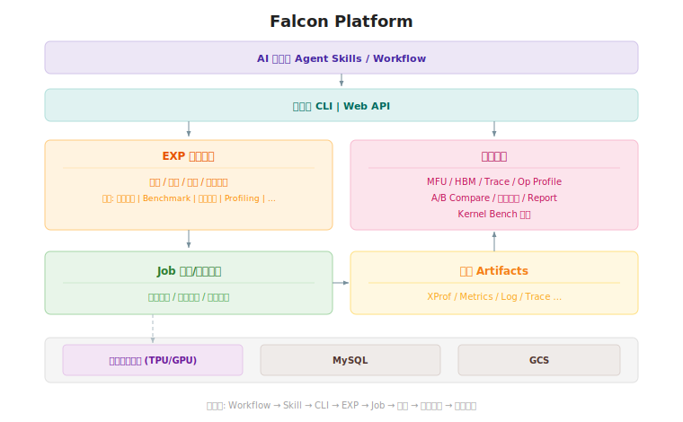

# Falcon 整体架构与模块分界

本文档对 Falcon 平台的整体架构设计以及各核心模块的职责分界进行了详细拆分与说明，作为项目开发的全局视图。通过明确“做什么”与“不做什么”，确保各层级与模块之间的解耦与高内聚。

## 整体架构图

Falcon 的系统架构遵循清晰的分层设计，各模块职责明确，通过定义良好的接口进行交互。

核心数据流：**Workflow → Skill → CLI → EXP → Job → 制品 → 数据分析 → 分析结果**

## 核心模块分界与职责

### 0. AI 编排层 (Agent Skills & Workflows Layer)

面向 AI Agent（如 Gemini、Claude Code）或复杂人类工作流的场景编排，位于接口层之上。

**✅ 做什么 (Do):**

* **场景化指引 (Skills):** 提供给 AI Agent 的高阶使用说明（Prompt/System Instructions），例如”当用户要求定位内存泄漏时，应该按什么顺序调用哪些 CLI 命令”。
* **组合与编排:** 将基础的 CLI 命令组合成完成特定大目标（如自动认领优化目标、执行对比并生成分析报告）的标准作业流程 (SOP)。
* **上下文感知:** 在特定上下文中提供必要的环境约束和背景知识，指导 Agent 做出正确决策。

**❌ 不做什么 (Don't):**

* **不包含底层实现:** 仅由自然语言指令、Markdown 文档或简单 Shell 脚本组成，不包含 Python 业务代码。
* **不替代基础工具:** 通过接口层 (CLI/Web API) 提供的原子命令完成操作，不直接解析日志或调用底层服务。

### 1. 接口层 (Interface Layer)

负责处理用户和 AI Agent 的交互，提供统一的接入入口。接口层直接访问 EXP 实验管理和数据分析两大模块。

* **CLI (Command Line Interface):** 基于 `click` 框架，提供用户日常使用的命令行工具。包括：`session` 管理与提交、`goal` 比较与报告、`profile` 获取与深度分析等。所有命令支持 `--json` flag 输出结构化 JSON，供 AI Agent 或自动化脚本消费。
* **Web API (规划中):** 预留的 RESTful 接口，为未来的 Web Dashboard 与可视化图表组件提供数据支持。

**✅ 做什么 (Do):**

* **解析输入:** 将用户输入 (命令行参数) 转换为对 EXP 或数据分析模块的标准方法调用。
* **格式化输出:** 负责结果的最终呈现与序列化 (CLI 表格渲染、终端颜色控制、Markdown 报告打印；`--json` 模式输出结构化 JSON)。
* **协议对接:** 处理特定协议的生命周期与身份认证 (如 Web API 的鉴权)。

**❌ 不做什么 (Don't):**

* **不直接访问存储:** 通过 EXP 或数据分析模块间接读写 MySQL / GCS，不直接建立连接。
* **不包含业务逻辑:** 配置差异比对、Metrics 分析等计算逻辑下沉到 EXP 和数据分析模块。
* **不直接调度 Job:** Job 由 EXP 内部触发，接口层不直接操作 Job 编排。

### 2. EXP 实验管理 (Experiment Management)

Falcon 的核心业务模块，管理实验全生命周期。接口层直接访问。

**✅ 做什么 (Do):**

* **实验管理:** 维护实验的生命周期流转 (PENDING → PROVISIONING → RUNNING → COMPLETED 等)。
* **配置管理:** 完整保存每次实验的配置快照（parallelism config、remat、batch size 等）。
* **实验对比:** 执行配置差异计算和性能回归检测。
* **触发 Job:** 根据实验配置，向 Job 任务/资源编排模块提交任务。
* **场景支持:** 覆盖算法实验、Benchmark、精度对齐、Profiling、Kernel Bench 等多种实验场景。

**❌ 不做什么 (Don't):**

* **不执行分析计算:** Profiling 数据解析、MFU 计算等交由数据分析模块处理。
* **不感知集群细节:** 通过 Job 编排模块间接使用资源池，不直接操作 K8s API 或 xpk。

### 3. 数据分析 (Data Analysis)

负责对实验制品进行深度分析，生成结构化的分析结果。接口层直接访问。

**✅ 做什么 (Do):**

* **Profiling 分析:** 调用 `XProfAnalyzer` 或 `DeepProfileAnalyzer`，对 XProf 制品进行 MFU / HBM / Trace / Op Profile 等维度的结构化分析。
* **A/B Compare:** 对比两次实验的性能指标，检测回归，输出算子级 Diff、Roofline 演进等。
* **精度对比:** 跨框架（如 MaxText vs Megatron）的数值精度对齐分析。
* **Report 生成:** 将分析结果渲染为结构化报告（`dataclass` 输出），交由接口层做最终呈现。
* **Kernel Bench 分析:** 对 Pallas Kernel 的性能数据进行专项分析。

**❌ 不做什么 (Don't):**

* **不管理实验状态:** 实验生命周期、配置管理属于 EXP 模块职责。
* **不处理最终呈现:** 只输出结构化数据（`dataclass`），由接口层负责样式渲染和格式化。

### 4. Job 任务/资源编排 (Job Orchestration)

负责将实验配置转化为可执行的集群任务，管理任务生命周期。由 EXP 内部触发，不直接暴露给接口层。

**✅ 做什么 (Do):**

* **任务调度:** 根据队列深度、资源空闲度制定调度决策，通过底层资源池提交任务。
* **资源分配:** 跨可用区、多平台（TPU/GPU）的资源选择与分配。
* **状态监控:** 跟踪任务执行状态，执行轮询驱动的日志收集。
* **任务生命周期代理:** 代理 K8s Job 的提交、取消，以及 Pod 日志获取。

**❌ 不做什么 (Don't):**

* **不感知业务语义:** 只接受标准化的任务描述，不依赖上层业务模型。
* **不执行数据分析:** 任务产出制品后，分析工作由数据分析模块承接。

### 5. 制品 (Artifacts)

Job 在资源池上执行后产出的实验数据，是 EXP 实验管理和数据分析之间的数据桥梁。

**包含内容:**

* XProf profiling 数据（XPlane Protobuf）
* Metrics（step_time、tflops、MFU、memory 等）
* Log（训练日志、错误日志）
* Trace（Chrome Traces、HLO Modules、LLO IR Dumps）
* 配置副本（YAML 资源副本、实际生效配置）

**存储规则:**

* 制品存储于 GCS，元数据索引记录在 MySQL。
* 数据库中严禁直接存储超过数 MB 级别的大文件，必须写入 GCS 并保留 URI 引用。

### 6. 基础资源层 (Infrastructure Layer)

提供计算、存储和数据库等基础设施能力，供上层各模块使用。

* **多集群资源池 (TPU/GPU):** 跨可用区的 GKE 集群，提供 TPU v4/v5e/v6e 和 GPU A100/H100 等算力。
* **MySQL:** 存储具有强结构或高频搜索需要的元数据（实验状态、Job 信息、分析结果概要等）。EXP、Job、数据分析模块均读写 MySQL。
* **GCS:** 作为不可变数据的安全存储，存放制品中的大文件。

**❌ 不做什么 (Don't):**

* **不包含业务逻辑:** 纯粹的基础设施层，不依赖或感知上层业务模型。
* **不主动拉取配置:** 被动响应上层模块的调用指令。
