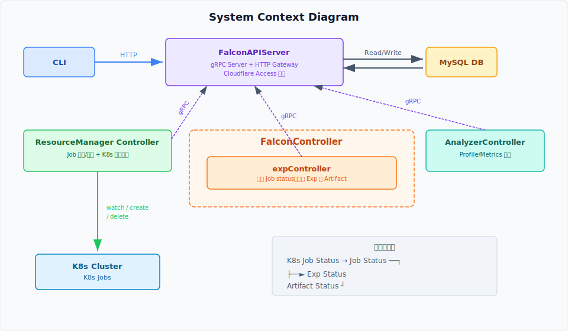
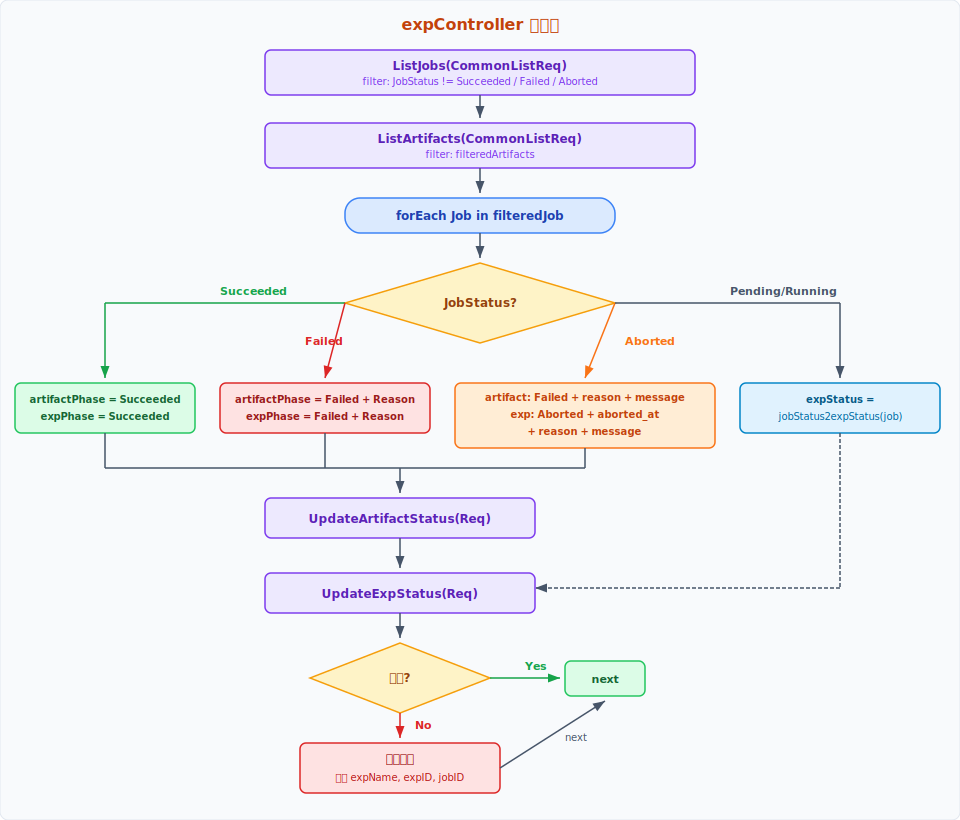
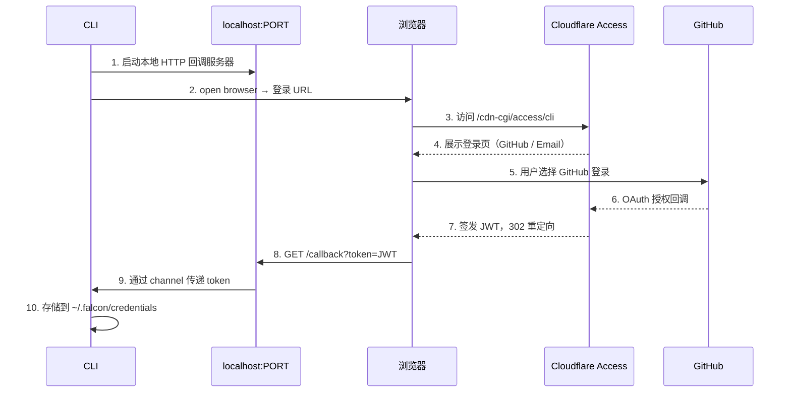
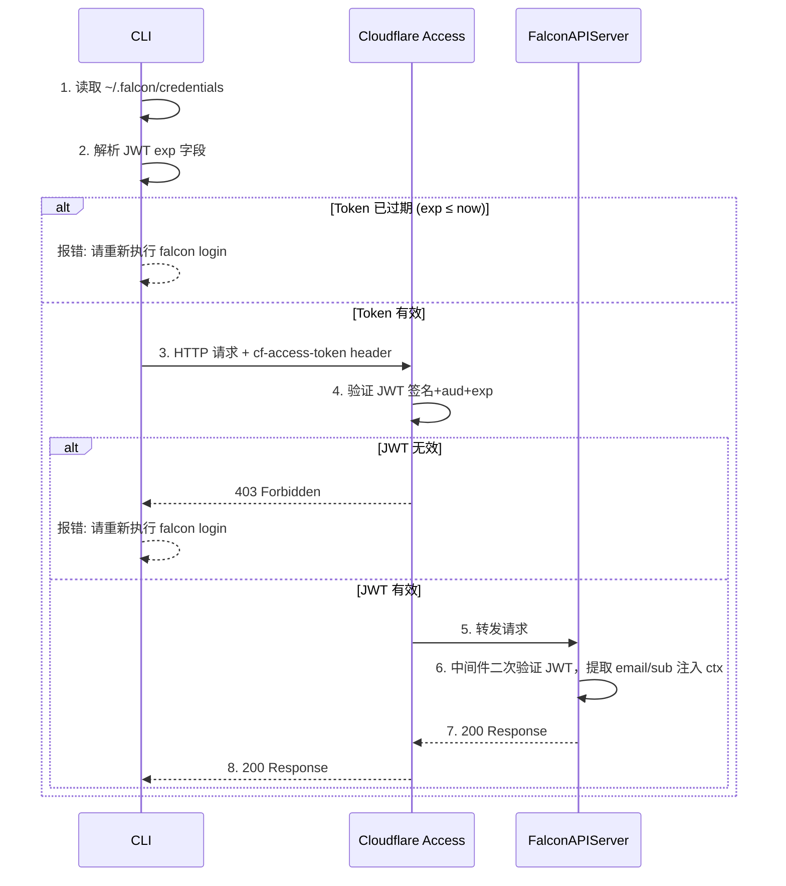

# Experiment Core Components Design Document

## 1. Context & Scope

在实验工作中，存在大量重复行为：基于远端 K8s Pod 运行实验、上传/下载制品（artifacts）等。随着实验数量和制品规模增长，出现了以下管理问题：

- **配置追溯困难** — 难以回溯某次实验使用了哪些配置参数
- **结果比较低效** — 缺乏结构化方式在多次实验间比较结果
- **制品管理缺失** — 制品与实验之间缺少关联关系，难以检索和清理
- **制品分析不便** — 没有统一的方式对制品进行分析

本设计旨在将这些重复工作沉淀为平台化能力，为后续使用提供便利。核心关注两件事：

1. **实验任务的生命周期管理** — 从创建、执行到完成的全流程状态管理
2. **制品管理** — 实验产出物的存储、关联与检索

## 2. Design Goals

### 2.1 Goals

1. **Experiment 全生命周期管理** — 建立 Experiment、Job、Artifacts 三个实体的关系，实现从创建到完成的全流程管理
2. **FalconAPIServer** — 作为平台与外部交互的统一入口
3. **FalconController** — 管理 Experiment、Job、Artifacts 的核心控制器

### 2.2 Non-Goals

- **支持特定实验类型的业务逻辑**（如 profiling, benchmark 等） — 底层 Experiment 对象设计上可扩展，但本次仅关注通用的实验生命周期管理，不涵盖特定实验类型的业务逻辑

### 2.3 Success Metrics

1. **API 接口行为验证** — 通过测试 FalconAPIServer 对外暴露的 API 接口，判断接口行为是否符合预期
2. **状态机流转验证** — 通过测试 Experiment 对象的状态机流转是否符合预期，判断生命周期管理是否正确

## 3. The Design

### 3.1 System Context Diagram



**组件职责：**

| 组件 | 职责 |
|------|------|
| CLI | 外部入口，通过 HTTP 调用 FalconAPIServer 创建 Experiment |
| FalconAPIServer | gRPC Server + HTTP Gateway + 基于 Cloudflare Access 认证，统一数据访问层，所有实体的 CRUD 通过此服务完成 |
| ResourceManager Controller | Watch DB 中的 Job → 在 K8s 创建对应 Job → Watch K8s Job 状态 → 回写 DB；Watch 到 Aborting 状态的 Job → 调用 delete API 终止 K8s Job → 更新 Job 为 Aborted |
| FalconController.expController | 周期性拉取需要更新的 Job，基于 Job status，更新 Exp 和 Artifact|
| MySQL | 持久化存储 User、Experiment、Job、Artifact 四个实体 |

### 3.2 Core Architecture

#### 3.2.1 实体模型与状态机

系统包含三个核心实体，层级关系为：**Experiment → Job**，同时 Experiment 关联 **Artifact**。

**Job 状态机：**

```text
Pending ──► Running (allTasks is running) ──► Succeeded (allTasks succeeded)
                                 └──► Failed (any task failed)

any non-terminal (Pending/Running) ──► Aborting ──► Aborted
```

**Experiment 状态机：**

```text
Created ──► Running (Job Running) ──► Succeeded (Job Succeeded + Artifact Succeeded)
                                  └──► Failed (Job Failed or Artifact Failed)

any non-terminal (Created/Running) ──► Aborting (AbortExp called) ──► Aborted
```

状态映射函数：`jobStatus2expStatus`（用于 Pending/Running 阶段）

**Artifact 状态机：**

```text
Created ──► Succeeded
   └──► Failed
```

#### 3.2.2 FalconAPIServer

gRPC Server，同时通过 HTTP Gateway 将部分接口暴露给 CLI。

- **内部组件**（ResourceManager Controller、FalconController）通过 gRPC 访问
- **外部**（CLI）通过 HTTP Gateway 访问

#### 3.2.3 FalconController

FalconController 包含两个子控制器，均以**周期性轮询**模式工作：

**expController：**



1. 调用 `ListJobs(CommonListReq)` 获取 `filteredJob`（JobStatus != Succeeded and != Failed and != Aborted）的 JobList
2. 调用 `ListArtifacts(CommonListReq)` 获取 `filteredArtifacts` 的 ArtifactList
3. 逐个遍历 Job：
   - **JobStatus == Succeeded：** 设置 Artifact 和 Exp Phase 为 Succeeded，`UpdateArtifactStatus` -> `UpdateExpStatus`
   - **JobStatus == Failed：** 设置 Artifact 和 Exp Phase 为 Failed，并且附上 Reason，`UpdateArtifactStatus` -> `UpdateExpStatus`
   - **JobStatus == Aborted：** 设置 Artifact Failed + reason + message，Exp Aborted + aborted_at + reason + message, `UpdateArtifactStatus` -> `UpdateExpStatus`
   - **JobStatus == Pending/Running：** 通过 `jobStatus2expStatus` 映射，`UpdateExpStatus`
4. 所有更新失败时打印日志（关联 expName, expID, jobID），继续处理下一个

注意：整个过程必须是可以重入的。

### 3.3 Interfaces & Data Flow

#### 3.3.1 API Endpoints

**HTTP 接口（通过 HTTP Gateway 暴露给 CLI）：**

| 方法 | 接口 | 说明 |
|------|------|------|
| POST | CreateExp(CreateExpReq) | 创建 Experiment（事务写入 Experiment + Job + Artifact） |
| POST | AbortExp(ExpID) | 中止 Experiment（事务更新 Exp + Job 状态为 Aborting，设置 aborting_at） |
| GET | GetExp(ExpID) | 查询单个 Experiment |
| GET | ListExps(CommonListReq) | 列出 Experiment |
| DELETE | DeleteExp(ExpID) | 删除 Experiment (事务删除 Exp + Job + Artifact，必须确保是已经 Aborted 了) |

**gRPC 接口（内部组件使用）：**

| 接口 | 调用方 | 说明 |
|------|--------|------|
| UpdateJobStatus(UpdateJobStatusReq) | ResourceManager Controller | 更新 Job 状态 |
| ListJobs(CommonListReq) | expController | 列出需要更新的 Job |
| UpdateExpStatus(UpdateExpStatusReq) | expController | 更新 Experiment 状态 |
| UpdateArtifactStatus(UpdateArtifactStatusReq) | ArtifactController | 更新 Artifact 状态 |
| ListArtifacts(CommonListReq) | expController / ArtifactController | 列出需要处理的 Artifact |

#### 3.3.2 Data Storage

所有实体持久化在 MySQL 中。User 记录由 Auth 中间件在 JWT 验证通过后自动写入（首次请求时 upsert）。CreateExp 时使用**数据库事务**一次性写入 Experiment、Job 和 Artifact 记录，保证一致性。

#### 3.3.3 Component Interaction Diagram

**完整数据流（参见 [System Context Diagram](images/system-context.svg)）：**

1. **CLI** → HTTP → **FalconAPIServer** → 事务写入 DB（Experiment + Job + Artifact）
2. **ResourceManager Controller** listJobs → 在 K8s 创建 Job → watch K8s Job 状态 → 通过 gRPC 回写 Job status 到 DB
3. **expController** poll Job → 基于 Job 和 Artifact 状态更新 Artifact 和 Exp status
4. **Abort 流程：** CLI → AbortExp → FalconAPIServer 事务更新 Exp + Job 为 Aborting（设置 aborting_at）→ ResourceManager Controller watch 到 Aborting Job → 删除 K8s Job → 更新 Job 为 Aborted（设置 aborted_at）→ expController watch 到 Job Aborted → 更新 Exp 为 Aborted（设置 aborted_at）

#### 3.3.4 CLI 设计

- 实现 FalconAPIServer 对外暴露的所有 HTTP 接口，特别需要注意的是，对于 CreateExp 接口，用户指定 --config 时，该文件目前支持 yaml 格式
- 提供 falcon auth login 能力
- 直接写在这个 repo 下，pkg/client/v1

**如何使用 cli？**
创建一个 profiling exp 为例：

```bash
  falcon exp create \
    --name model-profiling-001 \
    --cluster tpu-v5p-cluster-a \
    --type profiling \
    --role-to-task-spec ./tasks.yaml \
    --config ./profiling.yaml # optional, 这里的内容会被 Marshal 成 string 发送 server 并且存入 DB，便于后续做实验配置的比较，同时会把这个内容会作为 CUSTOM_CONFIG_KEY 这个 env key 的 value

  ./tasks.yaml（对应 map<string, TaskSpec> role_to_task_spec，顶层 key 即 role 名）：

  main:
    command: "python -u -m sgl_jax.launch_server --enable-profiling --num-steps=10 --profiling-stage prefill,decode ..."
    replica: 1
    image: "gcr.io/primatrix/sglang_jax:dev"
    device_count: 8
    device_type: tpu-v5p
    device_topo: 2x2x2
    envs:
      JAX_PLATFORMS: tpu
      LOG_LEVEL: info

  ./profiling.yaml（对应 config string，CLI 读取文件后整体作为字符串透传，服务端不解析）：

  model: qwen/qwen3-32b
  random_input_len: 16384 
  random_output_len: 1024 
  random_range_ratio: 1.0
  max_concurrency: 64
```

**状态传播链：**

```text
K8s Job Status → Job Status → Artifact Status → Experiment Status
```

### 3.4 FalconAPIServer Auth 模块

采用 **Cloudflare Access + Local Server** 方案。CLI 通过浏览器完成 Cloudflare Access 登录，获取 JWT 后缓存到本地，后续请求携带 JWT。FalconAPIServer 验证 JWT 有效性。无需额外数据库表，JWT 本身无状态。

#### 3.4.1 CF_Authorization JWT 结构

Cloudflare Access 签发的 JWT（RS256 签名）：

```json
{
  "aud": ["<Application AUD Tag>"],
  "email": "user@example.com",
  "sub": "unique-user-id",
  "iss": "https://<team>.cloudflareaccess.com",
  "iat": 1713168000,
  "exp": 1713254400,
  "type": "app",
  "country": "US"
}
```

| 字段 | 说明 |
|------|------|
| aud | Cloudflare Access Application Audience Tag |
| email | 用户邮箱（对应 Experiment.Creator） |
| sub | 用户唯一 ID（对应 Experiment.CreatorID） |
| exp | 过期时间（Session Duration，Cloudflare Dashboard 配置，如 1h） |

公钥端点：`https://<team>.cloudflareaccess.com/cdn-cgi/access/certs`（JWKS 格式，用于验证签名）

#### 3.4.2 Login 时序图



#### 3.4.3 普通请求时序图（含 Auth 检查）



注意：所有从 CLI 发起的请求都会先检查本地 JWT 是否过期，过期则要求重新登录。服务端同时验证 JWT 作为 defense in depth。

#### 3.4.4 User 自动注册

FalconAPIServer 在 Auth 中间件验证 JWT 成功后，执行 User 自动注册逻辑：

1. 从 JWT claims 中提取 `email` 和 `sub`
2. 以 `sub` 为主键查询 User 表
3. 若不存在，插入新 User 记录（`user_id = sub`，`email = email`）
4. 若已存在，不做任何操作

该逻辑在每次请求的 Auth 中间件中执行，保证首次使用系统的用户自动完成注册。实现上使用 `INSERT IGNORE` 或等效的 upsert 语义，避免并发请求时的竞态问题。

### 3.5 Model Schema & API Definition

#### Model Schema

```golang
// ---- User ----
UserID    string    `gorm:"column:user_id;type:varchar(255);primaryKey"` // Cloudflare Access sub
Email     string    `gorm:"column:email;type:varchar(255);not null;uniqueIndex:uk_user_email"`
CreatedAt time.Time `gorm:"column:created_at;autoCreateTime"`

// ---- Exp spec ----
ClusterName    string            `gorm:"column:cluster_name;type:varchar(255);not null"`
ExpType        ExpType           `gorm:"column:exp_type;type:varchar(255);not null"`
RoleToTaskSpec RoleToTaskSpec    `gorm:"column:role_to_task_spec;type:text;serializer:json"`
Config         string            `gorm:"column:config;type:text;serializer:json"`
ArtifactPath   string            `gorm:"column:artifact_path;type:varchar(512)"`
Priority       int32             `gorm:"column:priority;not null;default:-1"`

// ---- Job spec ----
ClusterName  string   `gorm:"column:cluster_name;type:varchar(255);not null"`
ExpType      ExpType  `gorm:"column:exp_type;type:varchar(255);not null"`
Role         string   `gorm:"column:role;type:varchar(255);not null"`
TaskSpec     TaskSpec `gorm:"column:task_spec;type:text;serializer:json"`
ArtifactPath string   `gorm:"column:artifact_path;type:varchar(512)"`
Priority     int32    `gorm:"column:priority;not null;default:-1"`

// ---- Artifact spec ----
Path         string       `gorm:"column:path;type:varchar(512);not null"`
ArtifactType ArtifactType `gorm:"column:artifact_type;type:varchar(512);not null"`
```

#### API

```protobuf
service ExperimentService {
    rpc CreateExp(CreateExpReq) returns (ExpCommonResp);
    rpc UpdateExpStatus(UpdateExpStatusReq) returns (ExpCommonResp);
    rpc AbortExp(int64) returns (ExpCommonResp);
    rpc GetExp(int64) returns (ExpItem);
    rpc ListExps(CommonListReq) returns (ListExpsResp);
    rpc DeleteExp(int64) returns (ExpCommonResp);
}

service JobService {
    rpc CreateJob(CreateJobReq) returns (JobCommonResp);
    rpc UpdateJobStatus(UpdateJobStatusReq) returns (JobCommonResp);
    rpc GetJob(int64) returns (JobItem);
    rpc ListJobs(CommonListReq) returns (ListJobsResp);
    rpc DeleteJob(int64) returns (JobCommonResp);
}

service ArtifactService {
    rpc CreateArtifact(CreateArtifactReq) returns (ArtifactCommonResp);
    rpc UpdateArtifactStatus(UpdateArtifactStatusReq) returns (ArtifactCommonResp);
    rpc GetArtifact(int64) returns (ArtifactItem);
    rpc ListArtifacts(CommonListReq) returns (ListArtifactsResp);
    rpc DeleteArtifact(int64) returns (ArtifactCommonResp);
}
```

更多内容请见 [Exp, Job Schema & FalconAPIServer API](./Exp,Job%20Schema,%20FalconAPIServer%20API.md)。

### 3.6 Trade-offs

1. **周期性轮询 vs 事件驱动（ListAndWatch）** — 选择周期性 poll 而非类似 K8s Informer 的 ListAndWatch 机制。牺牲了实时性，但大幅简化实现复杂度。当前场景对延迟不敏感，poll 间隔可满足需求。后续如需更高实时性可演进为 ListAndWatch。
2. **Controller 通过 APIServer 访问 DB vs 直接访问 DB** — 参考 K8s 中 APIServer 与 Controller 的架构，所有 Controller 统一通过 FalconAPIServer 完成数据操作，避免直接与 MySQL 交互。收敛数据访问入口，便于统一校验、审计和后续扩展。
3. **CreateExp 事务写入两个实体 vs 分步创建** — 创建操作集中在 APIServer 中完成，一次事务写入 Experiment + Job + Artifact，保证一致性。Controller 职责单纯化，仅负责 Status 更新，不参与实体创建。

### 3.7 Test Strategy

1. **状态机测试** — 针对 FalconController 中各子 Controller（expController）的状态流转逻辑编写单元测试，覆盖正常流转和异常分支
2. **APIServer 测试** — 使用 mock DB 测试 API 接口行为，验证请求校验、事务写入、响应格式等
3. **集成测试** — 覆盖 Experiment 的完整生命周期，验证从创建到最终状态的端到端流程
4. **验证 CLI 可用性** - 覆盖 CLI 提供的 HTTP 接口验证

### 3.8 Deployment & Dependencies

- **语言**：Golang
- **部署方式**：FalconAPIServer 和 FalconController 为两个独立二进制，分别部署在 K8s 上
- **外部依赖**：MySQL

#### Development Subtasks

1. 先把 FalconAPIServer including oauth2, grpc server, http gateway 架子搭好，便于后续大家增加 API 以及实现
2. 实现 FalconAPIServer：Exp，Job， Artifact HTTP 和 gRPC 接口
3. 实现 FalconController
4. 开发并通过测试，含端到端的 APIServer 和 Controller
5. 制作镜像上 GKE 环境测试

## 4. Alternatives Considered

- **消息队列驱动状态变更（NATS/Kafka）** — 可通过消息队列实现事件驱动的状态变更，实时性更好。但引入额外中间件增加了部署和运维复杂度，当前场景对实时性要求不高，选择直接 polling 简化实现。
