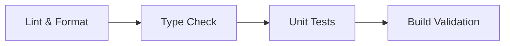

# CI/CD 流水线

本文定义 pallas-kernel 项目的持续集成与质量保障流程。

---

## 1. CI 流水线

### 1.1 触发条件

- **PR 提交**：自动运行完整 CI 流水线
- **Push to main**：运行完整 CI + 构建验证

### 1.2 阶段划分



#### Stage 1: Lint & Format

```yaml
- name: Lint & Format
  run: |
    ruff check src/ tests/ benchmarks/
    ruff format --check src/ tests/ benchmarks/
```

验证代码风格符合 ruff 配置，格式不符的 PR 自动拒绝。

#### Stage 2: Type Check

```yaml
- name: Type Check
  run: mypy src/tops/ --strict
```

mypy 严格模式，要求所有公开函数有类型标注。

#### Stage 3: Unit Tests

```yaml
- name: Unit Tests (CPU)
  run: pytest tests/ -v --tb=short
  env:
    JAX_PLATFORMS: cpu
```

在 CPU 模式下运行 JAX 单元测试，不依赖 TPU 硬件。验证 kernel 的数值正确性。

#### Stage 4: Build Validation

```yaml
- name: Build
  run: uv build
```

确保 package 可正确构建为 wheel。

---

## 2. TPU 集成测试

TPU 硬件资源有限，集成测试通过手动触发或定期调度运行：

### 2.1 触发方式

- **手动触发**：PR 标记 `needs-tpu-test` label
- **定期调度**：每周一次（cron）

### 2.2 测试内容

| 测试类型 | 说明 |
|---------|------|
| 正确性测试 | 在真实 TPU 上运行 kernel，与参考实现对比数值精度 |
| Benchmark 回归 | 性能不低于基线的 95%（允许 5% 波动） |

### 2.3 参考实现对比

每个 kernel 的测试必须包含与 NumPy 或 PyTorch 参考实现的对比：

```python
def test_matmul_correctness():
    # 参考实现
    expected = np.matmul(a_np, b_np)

    # Pallas kernel
    result = matmul_tiled(a_jax, b_jax)

    np.testing.assert_allclose(
        result, expected, rtol=1e-5, atol=1e-5
    )
```

---

## 3. Pre-commit 钩子

### 3.1 配置

通过 `.pre-commit-config.yaml` 配置：

```yaml
repos:
  - repo: https://github.com/astral-sh/ruff-pre-commit
    rev: v0.4.0
    hooks:
      - id: ruff
        args: [--fix]
      - id: ruff-format
  - repo: https://github.com/pre-commit/pre-commit-hooks
    rev: v4.6.0
    hooks:
      - id: check-added-large-files
        args: ['--maxkb=500']
      - id: detect-private-key
```

### 3.2 安装

```bash
uv pip install pre-commit
pre-commit install
```

---

## 4. 版本发布流程

### 4.1 语义版本号

遵循 [Semantic Versioning](https://semver.org/)：

| 版本变化 | 时机 |
|---------|------|
| MAJOR (X.0.0) | 破坏性 API 变更 |
| MINOR (0.X.0) | 新增 kernel 或功能 |
| PATCH (0.0.X) | Bug 修复、性能优化 |

### 4.2 CHANGELOG

每个版本发布前更新 `CHANGELOG.md`：

```markdown
## [0.2.0] - 2026-XX-XX

### Added
- GLA (Gated Linear Attention) kernel: forward + backward

### Changed
- matmul_tiled: 提升 block_k=256 时的性能 15%
```

### 4.3 发布方式

项目成熟后启用 PyPI 自动发布：

```yaml
- name: Publish
  if: startsWith(github.ref, 'refs/tags/v')
  run: uv publish
  env:
    UV_PUBLISH_TOKEN: ${{ secrets.PYPI_TOKEN }}
```

当前阶段通过 git tag + branch 方式管理版本（如 `release/v0.3`），下游项目通过 git URL 依赖：

```toml
dependencies = [
    "tops @ git+https://github.com/primatrix/pallas-kernel.git@release/v0.3",
]
```
