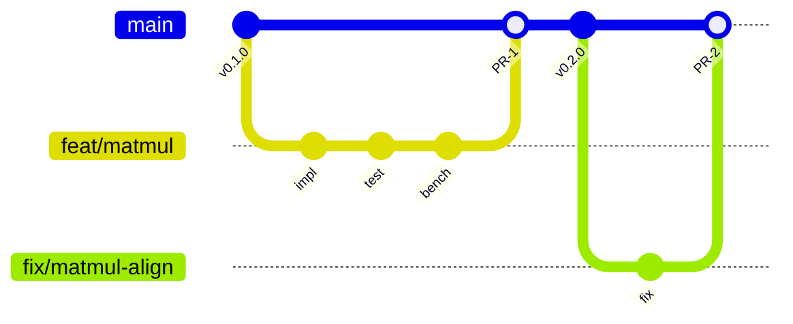
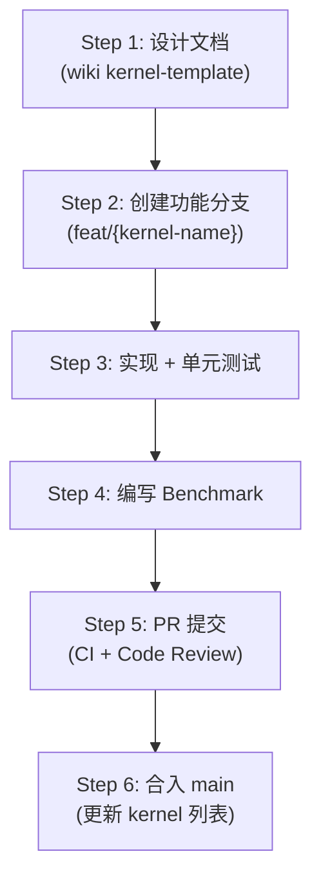

# 开发流程

本文规范从需求到合入的完整开发闭环。

---

## 1. 分支策略



| 分支类型 | 命名格式 | 说明 |
|---------|---------|------|
| 主分支 | `main` | 保持稳定，所有变更通过 PR 合入 |
| 功能分支 | `feat/{kernel-name}` | 新 kernel 或新功能 |
| 修复分支 | `fix/{description}` | Bug 修复 |
| 发布分支 | `release/v{X.Y}` | 版本发布 |

---

## 2. Kernel 开发生命周期

每个新 kernel 遵循以下 6 步流程：



### Step 1: 设计文档

在 wiki 中使用 [Kernel 文档模板](./kernel-template) 编写设计文档，明确：

- 算法设计与数学公式
- Grid/Block 划分策略
- 内存布局与数据搬运方案
- 测试方案与精度要求

### Step 2: 创建功能分支

```bash
git checkout main
git pull origin main
git checkout -b feat/matmul-tiled
```

### Step 3: 实现 + 单元测试

遵循 TDD 流程：

1. 先写测试（与参考实现对比）
1. 运行测试确认失败
1. 实现 kernel
1. 运行测试确认通过

### Step 4: 编写 Benchmark

参照 [Benchmark 规范](./benchmarking) 编写 benchmark 脚本，建立性能基线。

### Step 5: PR 提交

确保 CI 全部通过后，提交 PR 等待 Code Review。

### Step 6: 合入 main

合入后更新 wiki 中的 kernel 列表文档。

---

## 3. PR 规范

### 3.1 标题格式

```text
feat(kernel-name): 简述
fix(kernel-name): 简述
perf(kernel-name): 简述
```

### 3.2 PR Body 必须包含

| 内容 | 说明 |
|------|------|
| 算法说明 | 简述 kernel 的算法设计 |
| 测试结果 | 数值精度对比结果 |
| Benchmark 数据 | 性能测试数据（包含对比基线） |
| Breaking Changes | 如有破坏性变更需说明 |

### 3.3 PR Body 模板

```markdown
## Summary

简述本 PR 实现的内容。

## Algorithm

算法说明。

## Test Results

| 测试 | dtype | rtol | atol | 结果 |
|------|-------|------|------|------|
| forward | bf16 | 1e-2 | 1e-2 | PASS |
| backward | bf16 | 1e-2 | 1e-2 | PASS |

## Benchmark

| Shape | dtype | Pallas (ms) | JAX native (ms) | Speedup |
|-------|-------|-------------|-----------------|---------|
| [1024,1024,1024] | bf16 | X.XX | X.XX | X.Xx |
```

### 3.4 Review 要求

- 至少 **1 位**团队成员审批
- CI 全部通过
- 新 kernel 的 PR 需附带设计文档链接

---

## 4. 测试要求

### 4.1 正确性测试

每个 kernel 必须有对应的单元测试，与参考实现对比：

```python
import jax
import numpy as np
import jax.numpy as jnp
import pytest

from tops.kernels.matmul import matmul_tiled

@pytest.mark.parametrize("dtype", [jnp.float32, jnp.bfloat16])
@pytest.mark.parametrize("M,K,N", [
    (128, 128, 128),    # 最小对齐尺寸
    (512, 1024, 512),   # 推荐尺寸
    (1024, 1024, 1024), # 标准尺寸
    (127, 255, 513),    # 非对齐（测试 padding）
])
def test_matmul_correctness(M, K, N, dtype):
    key = jax.random.PRNGKey(0)
    a = jax.random.normal(key, (M, K), dtype=dtype)
    b = jax.random.normal(key, (K, N), dtype=dtype)

    expected = jnp.matmul(a, b)
    result = matmul_tiled(a, b)

    rtol = 1e-2 if dtype == jnp.bfloat16 else 1e-5
    atol = 1e-2 if dtype == jnp.bfloat16 else 1e-5
    np.testing.assert_allclose(result, expected, rtol=rtol, atol=atol)
```

### 4.2 数值精度阈值

| dtype | rtol | atol | 说明 |
|-------|------|------|------|
| float32 | 1e-5 | 1e-5 | 标准精度 |
| bfloat16 | 1e-2 | 1e-2 | bf16 精度有限 |
| float16 | 1e-3 | 1e-3 | 半精度 |

### 4.3 边界条件覆盖

每个 kernel 的测试必须覆盖：

| 边界条件 | 说明 |
|---------|------|
| 非对齐维度 | 如 127、255 等非 128 倍数 |
| 极小输入 | 如 1×1、1×128 |
| 极大输入 | 接近 VMEM 容量上限 |
| 特殊值 | NaN、Inf、零矩阵 |
| 不同 dtype | float32、bfloat16、float16 |
