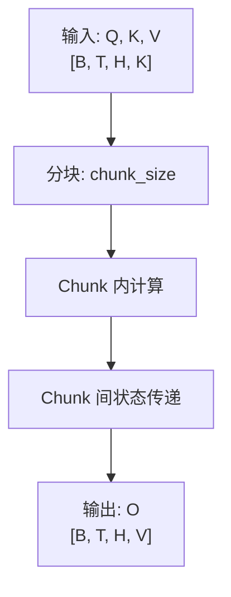

# Kernel 文档模板

新增 kernel 时，复制本模板并填写各节内容。模板中 `{placeholder}` 为需要替换的占位符。

---

<!-- 以下为模板内容，复制时删除本行 -->

## {Kernel 名称}

### 概述

- **算法简述**：{一句话定义这个 kernel 做什么}
- **适用场景**：`{在哪些模型/模块中使用，如 MaxText GLA attention、sglang-jax MoE routing}`
- **性能定位**：{compute-bound / memory-bound}，Arithmetic Intensity ≈ {数值}

### 算法设计

#### 数学公式

`{核心计算的数学表达式，使用 LaTeX 语法}`

$$
O = \text{softmax}\left(\frac{QK^T}{\sqrt{d_k}}\right) V
$$

#### 计算流程



#### 与标准实现的差异

{说明相比 JAX native / PyTorch 实现的设计差异及原因}

### 实现方案

#### Grid/Block 划分

```python
grid = ({grid_dims})
dimension_semantics = ({semantics})
block_size = {value}  # 选择原因：{解释}
```

| Grid 维度 | 值 | semantics | 说明 |
|----------|---|-----------|------|
| batch | B | parallel | 无依赖 |
| head | H | parallel | 无依赖 |
| seq_chunk | T/chunk_size | arbitrary | chunk 间有状态依赖 |

#### 内存布局与数据搬运

```text
HBM: Q[B,T,H,K], K[B,T,H,K], V[B,T,H,V]
  │
  │ DMA (BlockSpec 自动管理 / 手动)
  ▼
VMEM: q_tile[chunk,K], k_tile[chunk,K], v_tile[chunk,V]
  │
  │ MXU / Vector
  ▼
VMEM: o_tile[chunk,V]
  │
  │ DMA
  ▼
HBM: O[B,T,H,V]
```

{说明选择 BlockSpec 自动管理还是手动 DMA 的原因}

#### 计算单元分配

| 计算 | 单元 | 说明 |
|------|------|------|
| QK^T matmul | MXU | 主要计算 |
| softmax / exp | Vector + EUP | 非线性 |
| 索引计算 | Scalar ALU | 已优化（SMEM 查找表 / unroll） |

#### Forward / Backward

{如果 kernel 支持训练}

- **Forward**：{前向实现要点}
- **Backward**：{反向实现要点，包含 `custom_vjp` 设计}
- **Fused 路径**：{如有 fused 实现}

#### 关键优化点

- {优化 1，如 tiling 策略}
- {优化 2，如 prefetch pipeline}
- {优化 3，如 SMEM 索引查找表}

### API 接口

```python
def {kernel_name}(
    {param1}: jax.Array,  # shape [{shape}], dtype {dtype}
    {param2}: jax.Array,  # shape [{shape}], dtype {dtype}
    *,
    {kwarg1}: {type} = {default},
) -> {return_type}:
    """
    {一句话说明}

    Args:
        {param1}: {说明}，shape 约束：{约束}
        {param2}: {说明}

    Returns:
        {说明}，shape [{shape}]
    """
```

#### 使用示例

```python
import jax
import jax.numpy as jnp
from tops.kernels.{name} import {kernel_name}

key = jax.random.PRNGKey(0)
{input_init_code}

output = {kernel_name}({args})
```

### 测试

| 项目 | 值 |
|------|-----|
| 参考实现 | {NumPy / PyTorch / JAX native} |
| rtol (float32) | {1e-5} |
| atol (float32) | {1e-5} |
| rtol (bfloat16) | {1e-2} |
| atol (bfloat16) | {1e-2} |

#### 覆盖的边界条件

- [ ] 最小对齐尺寸 (128×128)
- [ ] 非对齐维度 (127, 255, 513)
- [ ] 极大输入（接近 VMEM 上限）
- [ ] 特殊值 (NaN, Inf, 零矩阵)
- [ ] 所有支持的 dtype

### Benchmark

#### 测试矩阵

| Shape | dtype | Pallas (ms) | Native (ms) | Speedup | TFLOPS |
|-------|-------|-------------|-------------|---------|--------|
| {shape_1} | bf16 | | | | |
| {shape_2} | bf16 | | | | |
| {shape_3} | f32 | | | | |

#### Roofline 分析

| 指标 | 值 |
|------|-----|
| Arithmetic Intensity | {AI} FLOP/Byte |
| 理论峰值 TFLOPS | {peak} |
| 实测 TFLOPS | {actual} |
| MFU | {mfu}% |
| Bound 类型 | {compute-bound / memory-bound} |

### 已知限制

| 限制 | 说明 |
|------|------|
| 支持的 dtype | {float32, bfloat16} |
| 输入形状限制 | `{如：T 必须是 chunk_size 的倍数}` |
| TPU 版本兼容性 | `{v4: 支持, v5e: 支持, v6e: 验证中, v7x: 支持}` |
