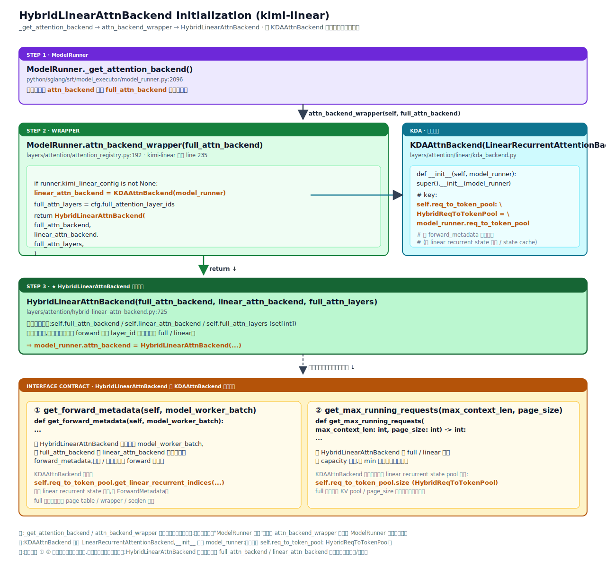
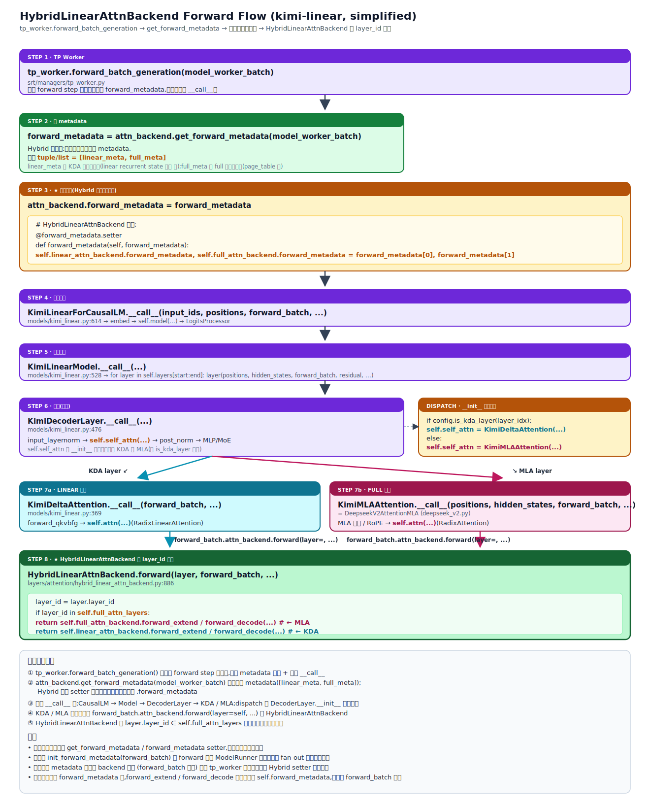

# SGLangJax 支持 HybridLinearAttnBackend Design Document

## 1. Background

### 1.1 动机

SGLangJax 即将支持 Kimi-Linear 模型。Kimi-Linear 采用 KDA（Kimi Delta
Attention，线性注意力）与 MLA（Multi-head Latent Attention，标准压缩注意力）
**逐层混合**的架构：同一份权重里，一部分 layer 走 KDA 路径，另一部分 layer 走
MLA 路径。

直接在模型代码里按 layer 切换 backend 会让 `model_runner` 与上层调度都需要感知
"当前 layer 用哪种注意力"。为隔离这一变动，我们参考上游 SGLang 的做法，引入
`HybridLinearAttnBackend`：对外仍是单一 `attn_backend`，内部按 `layer_id` 二次
分发到 `full_attn_backend`（MLA）或 `linear_attn_backend`（KDA），并配合
`HybridReqToTokenPool` 同时承载常规 KV cache 与 KDA 状态索引。

### 1.2 SGLangJax 现状

| 组件 | 状态 |
|---|---|
| KDA backend | ❌ 未实现 |
| MLA backend | ❌ 未实现， 先使用非吸收版本的 MLA，对应 FlashAttentionBackend|
| memory_pool | ❌ 未实现， 开发中|
| HybridLinearAttnBackend | ❌ 未实现 |
| Kimi-Linear 模型代码 | ❌ 未实现，开发中 |

上游参考实现：
[sgl-project/sglang@54e21bb3 hybrid_linear_attn_backend.py:727][upstream-hybrid]

[upstream-hybrid]: https://github.com/sgl-project/sglang/blob/54e21bb3a585b7e9588f4ba7f5ce8dbe5492e047/python/sglang/srt/layers/attention/hybrid_linear_attn_backend.py#L727

### 1.3 Goals

- SGLangJax 支持 HybridLinearAttnBackend。

### 1.4 Success Metrics

- **M1** —— 通过测试计划。

## 2. 架构设计

`HybridLinearAttnBackend` 的核心设计可以用「两张数据流图 + 三条契约」概括。
两图取自上游 SGLang 实现（路径前缀为 `python/sglang/...`），SGLangJax 等价
落点在 §3 给出。

### 2.1 初始化数据流（init flow）

`ModelRunner._get_attention_backend()` 在检测到 `kimi_linear_config` 时，先
按常规路径构造 `full_attn_backend`，再调用 `attn_backend_wrapper(...)` 把它
和新建的 `KDAAttnBackend` 一起包成 `HybridLinearAttnBackend`：



要点：

- `HybridLinearAttnBackend` 自身**不申请显存、不持池**，仅持有两个子 backend
  与 `full_attn_layers` 白名单；后续在 forward 时按 `layer_id` 二次分发。
- `KDAAttnBackend` 继承 `LinearRecurrentAttentionBackend`，构造时仅需 `model_runner`，
  关键字段是 `self.req_to_token_pool: HybridReqToTokenPool`，供后续
  `forward_metadata` 读取 linear recurrent state 索引使用。

### 2.2 前向数据流（forward flow）

每个 forward step 的入口在 `tp_worker.forward_batch_generation`。新设计下，
**metadata 由 tp_worker 显式产出**，再经 Hybrid 的 `forward_metadata` setter
拆包注入两个子 backend；模型主体逐层调用，最终在 `HybridLinearAttnBackend.
__call__` 内按 `layer_id` 分发：



要点：

- **dispatch 时机**：层内 backend 选择在 `KimiDecoderLayer.__init__` 阶段一
  次绑定（`config.is_kda_layer(layer_idx)` 决定 `self.self_attn` 是
  `KimiDeltaAttention` 还是 `KimiMLAAttention`），forward 阶段不再判断。
- **二次分发**：模型层调用 `forward_batch.attn_backend.__call__(layer=...)`，
  Hybrid 内部按 `layer.layer_id ∈ full_attn_layers` 走 full / linear 子
  backend 的 `forward_extend / forward_decode`。
- **metadata 流向**：tp_worker → `Hybrid.get_forward_metadata`（聚合两路，
  返回 `HybridLinearAttentionBackendMetadata` 命名 dataclass） →
  `Hybrid.forward_metadata` setter（按字段拆包：把 dataclass 的
  `full_attn_metadata` / `linear_attn_metadata` 分别赋给 `full_attn_backend` /
  `linear_attn_backend` 的 `forward_metadata`）。子 backend 在
  `forward_extend / forward_decode` 内部直接读 `self.forward_metadata`，
  不再从 `forward_batch` 重算。

### 2.3 双轨 KV cache 与 memory_pool 协作

`HybridLinearAttnBackend` **本身不直接管池**，KV cache 与 KDA 状态的存取分别
落到两个子 backend 上：

| 路径 | 子 backend | 存的是什么 | 读取入口 |
|---|---|---|---|
| MLA layer | `full_attn_backend` | 标准 KV cache（常规 token-level KV pool） | 子 backend 内的 page table / wrapper |
| KDA layer | `linear_attn_backend`（`KDAAttnBackend`） | KDA linear recurrent state 索引 | `self.req_to_token_pool.get_linear_recurrent_indices(...)` |

两类存储统一挂在 `HybridReqToTokenPool` 下：req → token 映射保留原语义，新增
linear recurrent state 索引段供 KDA 使用。`HybridLinearAttnBackend` 仅负责"按 layer 分
发到对应子 backend"，不参与池的分配 / 回收，保持计算与存储职责分离。

### 2.4 接口契约

`HybridLinearAttnBackend` 与其子 backend 必须共同实现以下两条接口（KDA 子
backend 是新类，须按本契约实现；MLA 子 backend 已有实现，需对齐）：

1. **`get_forward_metadata(self, model_worker_batch)`**
   - Hybrid：调用两个子 backend 的同名方法，聚合为
     `HybridLinearAttentionBackendMetadata`（含 `full_attn_metadata` 与
     `linear_attn_metadata` 两个字段）。

2. **`get_max_running_requests(self, max_context_len, page_size) -> int`**
   - Hybrid：对两个子 backend 的返回值取 `min`，作为整模型上限。

## 3. SGLangJax 接入方案

本节基于 §2 的两张数据流图，给出 SGLangJax 上的最小可用接入清单。所有路径以
`python/sgl_jax/srt/` 为根。**本 PR 仅承担 `HybridLinearAttnBackend` 与
`KimiLinearConfig`，并在 `model_runner` / `tp_worker` 上完成串接；其余依赖类与
模型代码由后续 PR 落地。**

### 3.1 文件改动一览

#### 新增文件

| 路径 | 用途 | 责任方 |
|---|---|---|
| `configs/kimi_linear.py` | Kimi-Linear 模型配置；**镜像上游** [sgl-project/sglang `configs/kimi_linear.py`](https://github.com/sgl-project/sglang/blob/main/python/sglang/srt/configs/kimi_linear.py)（仅参考，按 SGLangJax 习惯落到 `sgl_jax/srt/configs/` 下） | 本 PR |
| `layers/attention/hybrid_linear_attn_backend.py` | `HybridLinearAttnBackend` + `attn_backend_wrapper` helper | 本 PR |
| `layers/attention/linear/__init__.py` | 新增子包 | 本 PR |
| `layers/attention/linear/linear_recurrent_attention_backend.py` | `LinearRecurrentAttentionBackend`（state-based 注意力后端基类） | **其它 PR** |
| `layers/attention/linear/kda_backend.py` | `KDAAttnBackend(LinearRecurrentAttentionBackend)` | **其它 PR** |
| `models/kimi_linear.py` | `KimiLinearForCausalLM` 等模型类 | **其它 PR** |

#### 修改文件

| 路径 | 改动点 | 责任方 |
|---|---|---|
| `configs/model_config.py` | 注册 `KimiLinearConfig` 与 `KimiLinearForCausalLM` 架构 | 本 PR |
| `model_executor/model_runner.py` | ① 新增 `self.kimi_linear_config` 属性；② `_get_attention_backend()` 末尾加 hybrid 分支：检测到 `kimi_linear_config != None` 时调用 `attn_backend_wrapper(self, full_attn_backend)` 包装返回 | 本 PR |
| `managers/tp_worker.py` | `forward_batch_generation` 入口新增 metadata 编排：先 `attn_backend.get_forward_metadata(batch)`，再用 setter 注入 `attn_backend.forward_metadata = ...` | 本 PR |
| `mem_cache/memory_pool.py` | 新增 `HybridReqToTokenPool`（扩展现有 `ReqToTokenPool`） | **其它 PR** |
| `models/registry.py` | 注册 `KimiLinearForCausalLM` | **其它 PR** |

### 3.2 新增对象与字段

#### `HybridLinearAttnBackend`

`layers/attention/hybrid_linear_attn_backend.py`

```python
@register_pytree_node_class
@dataclass
class HybridLinearAttentionBackendMetadata:
    full_attn_metadata: AttentionBackendMetadata
        # AttentionBackendMetadata 会加在 base_attn_backend.py 中并注册为 pytree
    linear_attn_metadata: LinearRecurrentAttentionBackendMetadata
        # 由 KDA PR 保证

@register_pytree_node_class
class HybridLinearAttnBackend(AttentionBackend):
    """Manages a full and linear attention backend."""

    def __init__(
        self,
        full_attn_backend: AttentionBackend,
        linear_attn_backend: LinearRecurrentAttentionBackend,
        full_attn_layers: list[int],
    ):
        self.full_attn_layers = full_attn_layers
        self.full_attn_backend = full_attn_backend
        self.linear_attn_backend = linear_attn_backend
        self.hybrid_linear_attn_metadata = nnx.data(HybridLinearAttentionBackendMetadata())

    # tree_flatten / tree_unflatten:
    #   children = [full_attn_backend, linear_attn_backend, hybrid_linear_attn_metadata]
    #   aux_data = [full_attn_layers]

    def get_forward_metadata(self, model_worker_batch) -> HybridLinearAttentionBackendMetadata: ...

    @forward_metadata.setter
    def forward_metadata(self, value: HybridLinearAttentionBackendMetadata):
        # 按字段拆给两个子 backend：
        #   self.full_attn_backend.forward_metadata   = value.full_attn_metadata
        #   self.linear_attn_backend.forward_metadata = value.linear_attn_metadata
        ...

    def __call__(
        self,
        q: Optional[torch.Tensor] = None,          # For full attention
        k: Optional[torch.Tensor] = None,          # For full attention
        v: Optional[torch.Tensor] = None,          # For full attention
        layer: RadixAttention = None,
        forward_batch: ForwardBatch = None,
        save_kv_cache: bool = True,
        mixed_qkv: Optional[torch.Tensor] = None,  # For linear attention
        a: Optional[torch.Tensor] = None,          # For linear attention
        b: Optional[torch.Tensor] = None,          # For linear attention
        **kwargs,
    ): ...

    def get_max_running_requests(self, max_context_len, page_size) -> int: ...
```

> **不持池、不申请显存**。仅做按层分发与 metadata 持有。
>
> `__call__` 的具体签名待 [primatrix/wiki#112](https://github.com/primatrix/wiki/pull/112) 落定后，再结合 SGLangJax 现有 `flash_attention_backend.__call__` 调整。当前签名直接参考上游 SGLang。

#### `KimiLinearConfig`

`configs/kimi_linear.py`（镜像上游）

```python
class KimiLinearConfig(PretrainedConfig):
    full_attention_layer_ids: set[int]             # MLA layer 白名单
    num_hidden_layers: int
    # ... 其余模型超参（见上游链接）

    def is_kda_layer(self, layer_idx: int) -> bool:
        return layer_idx not in self.full_attention_layer_ids
```

## 4. Test Plans

| # | 类型 | 测试点 | 期望 | 覆盖目标 |
|---|---|---|---|---|
| TP-1 | unit | `HybridLinearAttnBackend.get_forward_metadata(batch)` | 返回 `HybridLinearAttentionBackendMetadata`，其 `full_attn_metadata` / `linear_attn_metadata` 字段分别等于 `full_attn_backend.get_forward_metadata(batch)` 与 `linear_attn_backend.get_forward_metadata(batch)` 的输出 | 接口（元信息聚合） |
| TP-2 | unit | `HybridLinearAttnBackend.forward_metadata = HybridLinearAttentionBackendMetadata(full_attn_metadata=fm, linear_attn_metadata=lm)` setter | 触发后 `linear_attn_backend.forward_metadata == lm` 且 `full_attn_backend.forward_metadata == fm` | 接口（setter 按字段拆包） |
| TP-3 | unit | `HybridLinearAttnBackend.__call__(layer, ...)` 按 `layer.layer_id` 分发 | `layer_id ∈ full_attn_layers` → 走 full sub-backend；否则 → 走 linear sub-backend（用 mock 子 backend 验证调用计数） | 接口（按层分发） |
| TP-4 | unit | `HybridLinearAttnBackend.get_max_running_requests(ctx_len, page_size)` | 返回 `min(full_sub.get_max_running_requests, linear_sub.get_max_running_requests)` | 接口（容量取小） |
| TP-5 | integration | `ModelRunner.init_attention_backend()` with `kimi_linear_config != None` | `model_runner.attn_backend` 是 `HybridLinearAttnBackend`，子 backend 类型 = `(KDAAttnBackend, FlashAttention/Native)`，`full_attn_layers` 来自 config | model_runner.init |
| TP-6 | integration | 2-layer mock Kimi-Linear（1 KDA + 1 MLA）跑一次 forward | 单步 forward 后，linear sub-backend 的 forward 被调用一次、full sub-backend 的 forward 被调用一次；顺序符合 layer 索引 | model_runner.forward |
