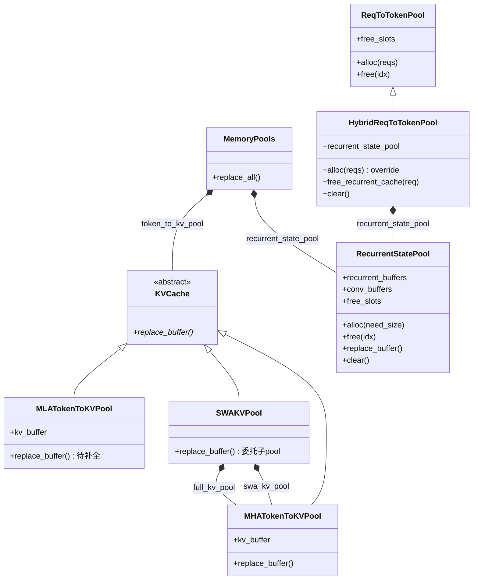
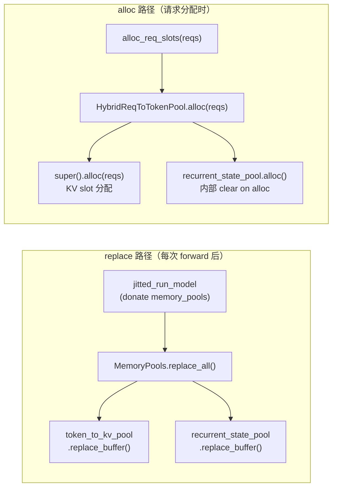
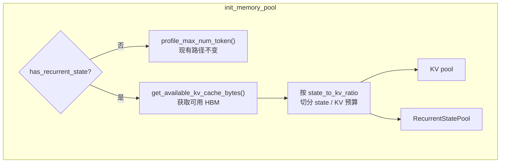

# RFC-0015: Hybrid Architecture Recurrent State 管理

## 概述

为 sglang-jax 混合注意力架构（MLA + KDA Linear Attention）设计 recurrent state 管理方案，新增 `RecurrentStatePool` 和 `MemoryPools` pytree 容器，支持 Kimi-Linear-48B-A3B-Instruct 在 `model_runner` 中的完整生命周期管理。

## 背景

Kimi-Linear-48B（`moonshotai/Kimi-Linear-48B-A3B-Instruct`）采用混合注意力架构：27 层，其中 7 层为 full attention（MLA），20 层为 KDA（Key-Decay Attention，linear attention 变体）。Full attention 层分布在 `[4, 8, 12, 16, 20, 24, 27]`（非均匀间距），KDA 层显式列在 `linear_attn_config.kda_layers` 中。KDA 层需要维护跨 step 的 recurrent state（累积式 `state += k^T v`）和 conv state（`short_conv_kernel_size=4` 的因果卷积滑窗），当前 `model_runner.py` 无此机制。

### 目标

1. 新增 `RecurrentStatePool`，管理 20 个 KDA 层的 recurrent state（累积 buffer）和 conv state（卷积滑窗 buffer），独立 slot 分配器（`free_slots`），clear on alloc 内部清零
2. 新增 `HybridReqToTokenPool`（继承 `ReqToTokenPool`），协调 KV slot 和 recurrent state slot 的分配/释放/复用，`ReqToTokenPool.alloc` 签名同步对齐 sglang PyTorch（从 `alloc(need_size: int)` 改为 `alloc(reqs)`）
3. `init_memory_pool` 新增 `has_recurrent_state` 分支，为混合架构模型创建 KV pool + `RecurrentStatePool` + `HybridReqToTokenPool`，并修正内存预算
4. `recurrent_state_pool` 生命周期管理（JIT donate + `replace_buffer`，slot 由 `HybridReqToTokenPool` 协调管理）
5. `MLATokenToKVPool` pytree 补全：新增 `@register_pytree_node_class` + `tree_flatten/tree_unflatten` + `replace_buffer`（需处理 `start_layer` offset）。初期使用 `MHATokenToKVPool` 先跑通 pipeline，待 MLA 吸收版（sgl-project/sglang-jax#926）实现落地后补全
6. 现有模型接口迁移（每个模型约 2 行改动）：(1) 修改入参：所有模型文件 `__call__` 第二参数从 `token_to_kv_pool` 改为 `memory_pools`；(2) 修改返回值：第二返回值从 `layers_kv_fused`（裸 `list[jax.Array]`）改为包含所有 pool 更新的 dict

### 非目标

- decoder loop 集成、权重加载
- 统一 config 类（后续独立任务）

### 后续任务

1. **Hybrid backend 分发**：按 `full_attn_layers` / `kda_layers` 将 full attention 层路由到标准 attention backend、KDA 层路由到 linear attention backend（参考 sglang PyTorch `HybridLinearAttnBackend`）
2. **KV cache 层过滤**：只为 full attention 层分配 KV cache，减少内存占用（参考 sglang PyTorch `HybridLinearKVPool` 的 `full_attention_layer_id_mapping`）
3. **RadixCache 兼容**：混合架构下重新启用 RadixCache（需解决前缀复用时 recurrent state 重算问题）

## 方案

### 类关系总览

**静态结构（继承 + 组合）：**



**运行时调用链：**



### RecurrentStatePool 对象设计

**与 KV pool 的区别：**

| 方面 | KV pool（MHATokenToKVPool / MLATokenToKVPool） | RecurrentStatePool |
|------|-----------------------------------------------|-------------------|
| 索引维度 | per-token（`max_total_num_tokens`） | per-request（`max_num_reqs`） |
| 更新方式 | 位置覆盖写入，新 token 直接覆盖旧位置 | 累积式（`state += k^T v`），值逐步增长 |
| 请求结束时 | 无需清零（下次覆盖） | 无需清零（下次 alloc 时清零，clear on alloc） |
| buffer 结构 | 每层一个数组，存在 Python list 中 | 双 list：`recurrent_buffers`（list-of-array）+ `conv_buffers`（list-of-list-of-array，PyTorch 风格预留多 conv 段）|
| dtype | 跟随模型配置（通常 bf16） | recurrent: 默认 f32（bf16 累积误差放大 221 万倍）；conv: 默认 bf16；均可通过环境变量覆盖（和 sglang PyTorch `Mamba2StateDType` 一致） |

**不继承 KVCache：** `KVCache` 的抽象方法（`get_kv_buffer` 等）对 recurrent state 无意义。独立类（和 sglang PyTorch `MambaPool` 一致）。

**双 List layout（每层独立 array，对齐 sgl-jax KV pool 风格 + sglang PyTorch `KimiLinearStateShape`）：**

| Buffer | Shape（全局） | per-device Shape（TP=4） | dtype | 用途 |
|--------|--------------|-------------------------|-------|------|
| `recurrent_buffers` | `list[jax.Array]`，长度 `L`；每元素 shape `[N+1, H, D, D]` | 每元素 per-device `[N+1, H/tp, D, D]` | 默认 f32 | KDA 累积 state（`state += k^T v`），最后两维分别是 K 维和 V 维 |
| `conv_buffers` | `list[list[jax.Array]]`，外层长度 `L`；每元素 shape 表示为 `[[N+1, K-1, proj_v + 2·proj_k]]`（外层方括号 = 内层 list，当前 1 段；未来扩段写为 `[[..., proj_q], [..., proj_k], [..., proj_v]]`） | 每元素 per-device `[[N+1, K-1, (proj_v + 2·proj_k)/tp]]` | 默认 bf16 | 因果卷积滑窗（`short_conv_kernel_size=4` → K-1=3）；内层 list 长度预留可扩展（容纳未来多 conv 段实现；对齐 PyTorch `KimiLinearStateShape.conv: List[tuple]`）|

其中：

**维度符号（所有值从 `hf_config.linear_attn_config` 派生，不硬编码）：**

| 符号 | 含义 | Kimi-Linear-48B 值 | 来源 |
|------|------|-------------------|------|
| `L` | KDA 层数 | 20 | `len(kda_layers)` |
| `N` | 最大并发请求数 | 内存预算推算 | `max_num_reqs` |
| `H` | attention head 数 | 32 | `linear_attn_config.num_heads` |
| `D` | head 维度 | 128 | `linear_attn_config.head_dim` |
| `K` | conv kernel size | 4 | `linear_attn_config.short_conv_kernel_size` |

> **注意参数来源：** `head_dim` 和 `num_heads` 必须从 `linear_attn_config` 取，**不是**顶层 `hf_config.head_dim`（=72，MLA 的 head_dim）或 `hf_config.num_attention_heads`（=32，碰巧相同但语义不同）。
>
> **list 索引语义：** `recurrent_buffers` / `conv_buffers` 外层 list 的索引（长度 `L`）是 KDA 子集索引（`0..L-1`），由调用方传入；**不是**模型全局 layer_id。映射在 model 组装时建立——KDA 层在 `config.linear_attn_config.kda_layers` 列表中的位置即为该层访问 pool 时使用的下标。

**conv `proj_size`：** `proj_v = num_heads × head_dim = 4096`，`proj_k = num_heads × head_dim = 4096`，`proj_size = proj_v + 2·proj_k = 12288`。shape 和维度顺序对齐 sglang PyTorch `KimiLinearStateShape`。

**Slot 管理：** Slot 0 为 dummy，有效 slot 从 index 1 开始（和 sglang PyTorch `MambaPool.free_slots = arange(1, size+1)` 一致）。

**Sharding：**

- `recurrent_buffers` 每元素：`P(None, "tensor", None, None)`，按 H 轴 TP 切分
- `conv_buffers` 每元素（内层 list 中的每个 array）：`P(None, None, "tensor")`，按合并投影维度 TP 切分（对应 sglang PyTorch 的 `divide(proj_size, tp_world_size)`）
- 构造时 assert `num_heads % tp_size == 0` 和 `proj_size % tp_size == 0`

**构造参数：**

- `num_layers` — KDA 层数，`len(hf_config.linear_attn_config.kda_layers)`
- `max_num_reqs` — 最大并发请求数（内存预算推算）
- `num_heads` — `hf_config.linear_attn_config.num_heads`（全局值；由 sharding 自动按 TP 切分到各设备）
- `head_dim` — `hf_config.linear_attn_config.head_dim`
- `conv_kernel_size` — `hf_config.linear_attn_config.short_conv_kernel_size`
- `temporal_dtype` — recurrent buffers 的 dtype，优先级：环境变量 `SGLANG_JAX_RECURRENT_STATE_DTYPE` > 默认 f32
- `conv_dtype` — conv buffers 的 dtype，优先级：环境变量 `SGLANG_JAX_CONV_STATE_DTYPE` > 默认 bf16

**数据成员：**

- `recurrent_buffers: list[jax.Array]` — 长度 `L`，每元素 shape `[N+1, H, D, D]`，默认 f32 全零（dtype 由 `temporal_dtype` 决定）
- `conv_buffers: list[list[jax.Array]]` — 外层长度 `L`，每元素 shape 表示为 `[[N+1, K-1, proj_v + 2·proj_k]]`（内层 list 当前长度 1，默认 bf16 全零）；内层 list 长度预留可扩展（容纳未来多 conv 段实现；对齐 PyTorch `KimiLinearStateShape.conv: List[tuple]`）
- `free_slots` — 独立 slot 分配器，初始化为 `[1, 2, ..., max_num_reqs]`（和 sglang PyTorch `MambaPool` 一致）

**接口方法：**

- `alloc(need_size)` — 从 `free_slots` 分配 slot；逐层 list element mutation 清零对应 slot（clear on alloc）；容量不足返回 None 不修改状态；返回 indices
- `free(idx)` — 归还 slot 到 `free_slots`
- `replace_buffer(buffers)` — `buffers: tuple[list[jax.Array], list[list[jax.Array]]]`，[0]=`recurrent_buffers` list（长 `L`），[1]=`conv_buffers` list-of-list（外长 `L`、内长 1）；assert 长度 = `num_layers`；list-slice 替换两个成员；sharding fix 对每个 list 元素 `device_put`（见 §3.3）
- `clear()` — 重置 `free_slots` 并逐层清零 `recurrent_buffers` / `conv_buffers`（list element mutation，每层独立赋值），在 `flush_cache` 中调用

**pytree 注册：** children 含 `recurrent_buffers` 和 `conv_buffers`（list 是默认 pytree 容器），实际 leaves 数 = `2L`（外层 list 各 L 个，内层 conv list 当前每个长度 1）。

**文件位置：** `python/sgl_jax/srt/mem_cache/recurrent_state_pool.py`

### HybridReqToTokenPool

> 继承 `ReqToTokenPool`，协调 KV slot 和 recurrent state slot 的分配/释放，对齐 sglang PyTorch `HybridReqToTokenPool`。

**设计：**

- 继承 `ReqToTokenPool`，override `alloc(reqs)`
- 持有 `RecurrentStatePool` 引用（同一对象也在 `MemoryPools` 中——前者管 slot，后者管 buffer donation）
- 维护 `req_index_to_recurrent_index_mapping` 张量，桥接 `req_pool_idx` → `recurrent_pool_idx`
- 标准模型使用原始 `ReqToTokenPool`，混合模型使用 `HybridReqToTokenPool`

**接口：**

- `alloc(reqs)` — override：先 `super().alloc(reqs)` 分配 KV slot，再逐 req 检查 `recurrent_pool_idx`——首次 alloc 时该字段为 None，分配新 slot 后写入 req；后续 chunk 再次进入 alloc 时该字段已有值，直接复用，跳过分配和清零以保留累积 state
- `free_recurrent_cache(req)` — 释放 recurrent state slot：调 `recurrent_state_pool.free(idx)`，设 `req.recurrent_pool_idx = None`
- `get_recurrent_indices(req_pool_indices)` — 通过 mapping 张量查找对应 recurrent slot indices
- `clear()` — override：`super().clear()` + `recurrent_state_pool.clear()`，重置两侧

**`recurrent_pool_indices` 暴露方式：**

- `HybridReqToTokenPool.get_recurrent_indices(req_pool_indices)` 提供 mapping 查表，返回该批次每个请求的 `recurrent_pool_idx`
- 具体由配套 RFC [primatrix/wiki#115](https://github.com/primatrix/wiki/pull/115)（HybridLinearAttnBackend）新增的 backend metadata `HybridLinearAttentionBackendMetadata.linear_attn_metadata` 携带，对齐 sglang PyTorch `MambaAttnBackendBase._forward_metadata` 模式
- 本 RFC 不改动 `ScheduleBatch` / `ModelWorkerBatch` / `ForwardBatch`

**文件位置：** `python/sgl_jax/srt/mem_cache/memory_pool.py`（同 `ReqToTokenPool`）

### RecurrentStatePool 生命周期

> replace 由 `MemoryPools` 编排（见下节），slot 由 `HybridReqToTokenPool` 协调管理。两个 buffer（recurrent + conv）在所有路径中同步操作。

**Replace 调用链**（每次 forward 后）：

```text
jitted_run_model (JIT donate memory_pools)
    → 模型 forward 返回 pool_updates dict
    → _forward 调用 memory_pools.replace_all(pool_updates)
    → replace_all 内部匹配 key，调用 recurrent_state_pool.replace_buffer((new_recurrent_buffers, new_conv_buffers))
```

**Alloc 调用链**（请求分配时）：

```text
prepare_for_extend → alloc_req_slots(reqs)
    → HybridReqToTokenPool.alloc(reqs)
        → super().alloc(reqs)：KV slot 分配（复用/新分配）
        → 逐 req 检查 recurrent_pool_idx：
            有 → 复用（chunked prefill）
            无 → recurrent_state_pool.alloc(1)（内部 clear on alloc）
        → 更新 req_index_to_recurrent_index_mapping
```

**Free 调用链**（请求结束时，KV 和 State 分别释放）：

```text
cache_finished_req / release_req
    → req_to_token_pool.free(idx)              归还 KV slot（继承，不变）
    → hybrid_pool.free_recurrent_cache(req)    归还 recurrent state slot
```

**Flush 调用链**（全量重置）：

```text
flush_cache（仅 chunked_req == None 时可执行）
    → hybrid_pool.clear()
        → super().clear()               重置 KV slot 分配器
        → recurrent_state_pool.clear()   重置 recurrent free_slots + 清零两个 buffer
```

**注入路径**（同 `req_to_token_pool` 模式）：`tp_worker → scheduler → ScheduleBatch / scheduler 自身`。混合模型使用 `HybridReqToTokenPool` 实例替代 `ReqToTokenPool`，上层代码通过继承多态透明调用。

**约束：**

- **RadixCache 禁用**：`has_recurrent_state` 模型在 `server_args.__post_init__` 中强制 `disable_radix_cache = True`（前缀 slot 全零会导致后缀计算出错），同 sglang PyTorch `_handle_mamba_radix_cache(support_mamba_cache=False)`
- **Overlap scheduler 禁用**：`has_recurrent_state` 模型在 `check_server_args` 中 assert `disable_overlap_scheduler`（本版本不支持 `mamba_ping_pong_track_buffer_size`，无双 buffer 交替机制）
- **TP 兼容**：JIT donate 后 sharding 正确保持（TP=1/4 实验验证），两个 buffer 使用不同 sharding spec（recurrent 按 H 轴切分，conv 按合并投影维度切分）
- **sharding fix 迁移**：`_set_kv_cache_after_forward` 的 tp_size==1 `device_put` 逻辑（[sgl-project/sglang-jax#233](https://github.com/sgl-project/sglang-jax/issues/233)）移入各 pool 的 `replace_buffer` 内部

### MemoryPools 兼容 JIT

> pytree 容器统一管理所有 pool 的 replace，单 JIT 函数 + 固定 `donate_argnames`，O(1) 扩展。

**MemoryPools 容器：**

```python
@jax.tree_util.register_pytree_node_class
class MemoryPools:
    def __init__(self, **pools):
        self._pools = pools

    def __getattr__(self, name):
        if name.startswith("_"):
            raise AttributeError(name)
        try:
            return self._pools[name]
        except KeyError:
            raise AttributeError(f"MemoryPools has no pool '{name}'") from None

    def tree_flatten(self):
        keys = sorted(self._pools.keys())
        return [self._pools[k] for k in keys], tuple(keys)

    @classmethod
    def tree_unflatten(cls, keys, children):
        return cls(**dict(zip(keys, children)))

    def replace_all(self, updates: dict):
        if set(updates.keys()) != set(self._pools.keys()):
            raise ValueError(
                f"replace_all: updates keys {sorted(updates.keys())} "
                f"must exactly match MemoryPools keys {sorted(self._pools.keys())}"
            )
        for key, value in updates.items():
            pool = self._pools[key]
            pool.replace_buffer(value)

```

**约定：** dict key 必须与 `MemoryPools` 构造参数名一致，不匹配 `raise ValueError`。模型返回的 `pool_updates` 必须包含所有 pool 的 key——donate 后旧 buffer 失效，未更新的 pool 会持有悬空引用。新增 pool 只需实现 `replace_buffer`。

**init_memory_pool 打包：**

```python
# has_recurrent_state 推算（init_memory_pool 内部，从 hf_config.linear_attn_config 派生）
linear_attn_config = getattr(hf_config, 'linear_attn_config', None)
if linear_attn_config is not None:
    kda_layers = linear_attn_config.kda_layers
    num_recurrent_layers = len(kda_layers)
else:
    num_recurrent_layers = 0
has_recurrent_state = num_recurrent_layers > 0

if has_recurrent_state:
    recurrent_state_pool = RecurrentStatePool(
        num_layers=num_recurrent_layers,
        max_num_reqs=max_num_reqs,
        num_heads=linear_attn_config.num_heads,
        head_dim=linear_attn_config.head_dim,
        conv_kernel_size=linear_attn_config.short_conv_kernel_size,
    )
    # HybridReqToTokenPool 替代 ReqToTokenPool，协调 KV + recurrent slot
    self.req_to_token_pool = HybridReqToTokenPool(
        size=max_num_reqs + 1,                        # +1: slot 0 为 dummy
        max_context_len=model_config.context_len + 4,  # +4: 现有 ReqToTokenPool 安全余量，非本 RFC 引入
        dtype=np.int32,
        recurrent_state_pool=recurrent_state_pool,
    )
    self.memory_pools = MemoryPools(
        token_to_kv_pool=token_to_kv_pool,
        recurrent_state_pool=recurrent_state_pool,
    )
else:
    self.memory_pools = MemoryPools(token_to_kv_pool=token_to_kv_pool)
```

**JIT / _forward：**

```python
@partial(jax.jit, donate_argnames=["memory_pools"], ...)
def jitted_run_model(..., memory_pools, logits_metadata):
    return model(forward_batch, memory_pools, logits_metadata)

def _forward(self, ...):
    output, pool_updates, _, topk_ids = self.jitted_run_model(forward_batch, self.memory_pools, logits_metadata)
    self.memory_pools.replace_all(pool_updates)
    return output, topk_ids
```

**模型侧（返回 dict 的 key 与 pool 名一致）：**

```python
# 标准模型（Llama 等）
kv_pool = memory_pools.token_to_kv_pool
return output, {"token_to_kv_pool": layers_kv_fused}, callback, topk_ids

# Kimi-Linear
kv_pool = memory_pools.token_to_kv_pool
state_pool = memory_pools.recurrent_state_pool
return output, {
    "token_to_kv_pool": layers_kv_fused,
    "recurrent_state_pool": (state_pool.recurrent_buffers, state_pool.conv_buffers),
}, callback, topk_ids
```

**消费方读写 pool（JIT 内部，对齐 KV cache `set_kv_buffer` 模式；实际由 KDA backend 调用，详见 [primatrix/wiki#115](https://github.com/primatrix/wiki/pull/115)）：**

```python
# 消费方（KDA backend）forward 内部
state_pool = memory_pools.recurrent_state_pool
req_indices = ...  # [B] int32，由 backend metadata 提供（详见 primatrix/wiki#115）

# 读：list 索引 layer_idx 是 KDA 子集索引（0..L-1）+ slot 索引
cur_state = state_pool.recurrent_buffers[layer_idx][req_indices]    # [B, H, D, D]
cur_conv  = state_pool.conv_buffers[layer_idx][0][req_indices]       # [B, K-1, proj_v + 2·proj_k]

# 写回必须 list element mutation（否则多层场景前 N-1 层 update 丢失）
state_pool.recurrent_buffers[layer_idx] = state_pool.recurrent_buffers[layer_idx].at[req_indices].set(new_state)
state_pool.conv_buffers[layer_idx][0]   = state_pool.conv_buffers[layer_idx][0].at[req_indices].set(new_conv)
```

### 内存估算

> 抽出 `get_available_kv_cache_bytes`，按 `state_to_kv_ratio` 比例切分 state 和 KV 预算，非混合架构模型路径不受影响。



新增 `get_available_kv_cache_bytes`（对应 sglang PyTorch `_profile_available_bytes`），仅混合架构路径使用，从 `profile_max_num_token` 中抽出内存 profiling 逻辑。新增 `--state-to-kv-ratio`（默认 0.9，`r = state / kv`，与 sglang PyTorch `mamba_full_memory_ratio` 默认值及公式一致）：

```text
get_available_kv_cache_bytes()
    ↓
按 r = server_args.state_to_kv_ratio 切分
    ├── state_budget = available × r/(1+r)
    │     → max_num_reqs → RecurrentStatePool
    └── kv_budget = available - state_budget
          → max_total_num_tokens → KV pool（层数从 hf_config 派生）

max_num_reqs 推算（per-device，对齐 sglang PyTorch `MambaPool`）：
    per_req_recurrent = L × (H/tp) × D × D × temporal_dtype.itemsize   # 默认 f32 → 4
    per_req_conv = L × (K-1) × (proj_size/tp) × conv_dtype.itemsize    # 默认 bf16 → 2, proj_size = proj_v + 2·proj_k
    max_num_reqs = state_budget // (per_req_recurrent + per_req_conv)
```

以 Kimi-Linear-48B TP=4 为例：`per_req_recurrent = 20 × 8 × 128 × 128 × 4 = 104,857,600 bytes (~100 MB)`，`per_req_conv = 20 × 3 × (12288/4) × 2 = 368,640 bytes (~360 KB)`。conv state 开销不到 recurrent state 的 0.35%，内存影响可忽略。

### Chunked Prefill Slot 复用

> 对齐 sglang PyTorch `ReqToTokenPool.alloc(reqs)` 的 slot 复用逻辑，使 chunked req 跨 chunk 保持 `req_pool_idx` 不变。

**问题：** sglang-jax 的 chunked prefill 在每个 chunk 之间释放并重新分配 `req_pool_idx`（`scheduler.py` `get_next_batch_to_run` 中），导致 `RecurrentStatePool` 中旧 slot 的 recurrent state 丢失。sglang PyTorch 和 vLLM 均复用 `req_pool_idx`，不存在此问题。

**根因：** `ReqToTokenPool.alloc(need_size: int)` 只接受 int，无法逐 req 检查是否已有 slot。调用链为 `prepare_for_extend` → `alloc_req_slots` → `ReqToTokenPool.alloc`，每层只有 1 个 caller。

**改动：**

1. `ReqToTokenPool.alloc(need_size: int)` → `alloc(reqs: list[Req])`：已有 `req_pool_idx` 的 req 跳过分配，只为新 req 分配 slot；复用 slot 需满足 `is_chunked > 0`（safety assert，同 sglang PyTorch）
2. `HybridReqToTokenPool.alloc(reqs)` 内部的复用逻辑（见 HybridReqToTokenPool 节）同时处理 chunked prefill：chunked req 跨 chunk 保持 `req_pool_idx` 和 `recurrent_pool_idx`，两侧均跳过分配，累积 state 和 conv 窗口不丢失
3. `alloc_req_slots(num_reqs)` → `alloc_req_slots(reqs)`，调用方传 `self.reqs`
4. `flush_cache`：调用 `hybrid_pool.clear()`，内部 `super().clear()` + `recurrent_state_pool.clear()` 同步重置

### 测试策略

测试文件：`test/mem_cache/test_recurrent_state_pool.py`、`test/mem_cache/test_memory_pools.py`、`test/mem_cache/test_hybrid_req_to_token_pool.py`、`test/mem_cache/test_memory_pool_kimi_linear.py`、`test/mem_cache/test_slot_reuse.py`（均新建）。用 `SimpleNamespace` 做轻量 mock，真实 JAX 对象构造小规模 pool。

**RecurrentStatePool 单元测试**（默认参数：`num_layers=2, max_num_reqs=4, num_heads=2, head_dim=4, conv_kernel_size=4`）：

- 初始化正确性：`recurrent_buffers: list[jax.Array]` 长度 2、每元素 shape `[5, 2, 4, 4]` f32 全零 + `conv_buffers: list[list[jax.Array]]` 长度 2、每元素 shape 表示为 `[[5, 3, 24]]`（`proj_v + 2·proj_k = 2×4 + 2×2×4 = 24`）bf16 全零，slot 0 为 dummy
- free_slots 初始值 `[1, 2, 3, 4]`（不含 0）
- 构造边界值：最小参数 `(1,1,1,1,2)` → 正确 shape、奇数 `num_heads`、非对齐 `head_dim`
- alloc：单个 slot / 批量 / 超出 free_slots 返回 None — 验证两个 buffer 均被清零（clear on alloc）
- free 归还 slot → 可被再次 alloc
- alloc clear on alloc：写入非零 → free → 重新 alloc → 该 slot 为零
- dummy slot（slot 0）隔离
- `replace_buffer((new_recurrent_list, new_conv_list_of_list))` → alloc 顺序正确性
- `clear()` 全量清零两个 buffer + free_slots 重置为 `[1..N]`
- pytree roundtrip（flatten → unflatten，children 含 `recurrent_buffers` + `conv_buffers`，leaves 共 `2L` 个）
- functional scatter 层/头隔离（两个 buffer 独立验证）
- dtype 隔离：`recurrent_buffers` 每元素始终 f32，`conv_buffers` 每元素始终 bf16

**HybridReqToTokenPool 单元测试**：

- alloc — 全新 req：KV slot + recurrent slot 均分配，mapping 更新
- alloc — 部分 req 已有 recurrent_pool_idx：已有的复用，新的分配
- alloc — 全部 req 已有 recurrent_pool_idx：recurrent free_slots 不消耗
- alloc — recurrent free_slots 不足：返回 None
- free_recurrent_cache：recurrent slot 归还，req.recurrent_pool_idx 设为 None
- get_recurrent_indices(req_pool_indices)：通过 mapping 张量正确查找对应 recurrent slot indices
- clear：super().clear() + recurrent_state_pool.clear() 均执行
- alloc safety assert：非 chunked req 复用 slot 触发 assert

**MemoryPools 单元测试 + 生命周期**：

- `replace_all`：单 pool / 双 pool / key 不匹配抛 ValueError / 空 dict 抛 ValueError / 参数类型多态（KV pool `list[jax.Array]` vs RecurrentStatePool `tuple[list[jax.Array], list[list[jax.Array]]]`）
- pytree roundtrip（单/双 pool）
- JIT donate → replace_all 端到端
- 零状态不变式：scatter 非零 → donate → replace → HybridReqToTokenPool alloc 新 slot → 该 slot 为零
- 多步累积 + alloc 新请求（free_recurrent_cache → 新请求 alloc → 从零开始）/ 多请求独立性
- `MLATokenToKVPool` pytree 补全 / `SWAKVPool.replace_buffer` delegate / `replace_kv_buffer` → `replace_buffer` + sharding fix 迁移

**init_memory_pool 集成测试**（`SimpleNamespace` mock）：

- 标准模型 vs 混合模型（MHA / MLA）的 MemoryPools 构成
- 混合模型使用 HybridReqToTokenPool 而非 ReqToTokenPool
- 混合模型参数来源验证：head_dim / num_heads 从 `linear_attn_config` 取，非顶层 config
- 内存预算扣减公式验证（recurrent + conv 两部分）/ `state_to_kv_ratio` 边界（0.0 / 极大）
- RadixCache 禁用约束

**Chunked Prefill Slot 复用测试**（`SimpleNamespace` mock `Req`）：

- `alloc`：全新 req / 部分复用（两侧均跳过）/ 全部复用 / KV free_slots 不足 / recurrent free_slots 不足
- slot 复用 + recurrent state 和 conv state 保持
- flush_cache 脏数据防护（`hybrid_pool.clear()` 后两侧均重置）
- safety assert（非 chunked req 复用触发 assert）
- 多 chunk 累积（3 chunk → free_recurrent_cache → 从零开始）

### 备选方案

| 方案 | 拒绝原因 |
|------|----------|
| RecurrentStatePool 继承 KVCache | KVCache 抽象方法为 KV 特定语义，recurrent state 无法复用；sglang PyTorch MambaPool 同样独立类 |
| Dummy slot 放末尾 | HybridReqToTokenPool 引入后 RecurrentStatePool 有独立 free_slots，slot 0 可安全用作 dummy，与 PyTorch 一致 |
| recurrent buffer 使用 bf16 | 累积式更新误差随序列长度线性增长，bf16 不可接受；conv buffer 为滑窗覆盖式，bf16 足够 |
| Chunked prefill 每 chunk 重新分配 slot | 重新分配导致累积 state 丢失；PyTorch 和 vLLM 均复用 slot |
| Conv state 独立 pool | 生命周期与 recurrent state 完全一致，拆分无收益 |

## 影响范围

| 文件 | 改动 |
|------|------|
| `mem_cache/recurrent_state_pool.py` | 新增 |
| `mem_cache/memory_pool.py` | 新增 `HybridReqToTokenPool`；`ReqToTokenPool.alloc` 签名变更；KV pool `replace_kv_buffer` → `replace_buffer` 重命名；`MLATokenToKVPool` pytree 补全 |
| `model_executor/model_runner.py` | `init_memory_pool` 新增混合模型分支；`_forward` 改用 `memory_pools.replace_all()` |
| `managers/schedule_batch.py` | `alloc_req_slots` 签名变更 |
| `managers/scheduler.py` | `flush_cache` 新增混合模型重置分支 |
| 所有模型文件 | `__call__` 第二参数 → `memory_pools`，返回值 → dict（每模型约 2 行） |

`replace_buffer` 是 `MemoryPools.replace_all` 要求所有 pool 实现的统一方法名。各 pool 参数类型不同，`replace_all` 按 key 分发，各 pool 自行解释。

## 实施计划

1. **Phase 1：核心组件** — `RecurrentStatePool` 实现（双 buffer：recurrent f32 + conv bf16，独立 slot 分配器）+ `HybridReqToTokenPool`（继承 `ReqToTokenPool`，协调 KV + recurrent slot）+ `MemoryPools` pytree 容器 + 单元测试
2. **Phase 2：集成** — `init_memory_pool` 分支 + 内存估算（`get_available_kv_cache_bytes` + `state_to_kv_ratio`，公式含 recurrent + conv 两部分）+ 集成测试。`MLATokenToKVPool` pytree 补全视 MLA 吸收版进展同步推进，初期使用 `MHATokenToKVPool`
3. **Phase 3：接口迁移** — 模型文件接口迁移（`token_to_kv_pool` → `memory_pools`）+ `_forward` 返回值变更 + `replace_kv_buffer` → `replace_buffer` 重命名
4. **Phase 4：Chunked Prefill** — `ReqToTokenPool.alloc` 签名对齐 + slot 复用 + slot 复用测试
5. **Phase 5：端到端验证** — TP=1/4 sharding 验证 + RadixCache 禁用约束 + 完整端到端测试

## 风险

| 风险 | 影响 | 缓解措施 |
|------|------|----------|
| **f32 内存开销** | `recurrent_buffers` 默认 f32，内存占用高于 bf16（2 倍） | `state_to_kv_ratio` 参数允许调节 state/KV 预算比例；dtype 可通过环境变量覆盖；内存估算公式确保总量不超 HBM |
| **conv state 额外内存** | `conv_buffers` 新增内存占用 | bf16 dtype + conv 窗口仅 `kernel-1=3`，实际开销不到 recurrent state 的 0.35%，可忽略 |
| **RadixCache 禁用** | 混合架构模型无法使用前缀共享，相同前缀的请求需重复计算 | 标记为后续任务（需解决前缀复用时 recurrent state 重算问题） |
| **Chunked prefill 时序** | slot 复用要求 clear on alloc 在正确时机执行 | `RecurrentStatePool.alloc()` 内部清零，`HybridReqToTokenPool` 控制复用 vs 新分配逻辑，时序天然保证 |
| **TP sharding 兼容** | JIT donate 后 RecurrentStatePool 的 sharding 可能丢失 | tp_size==1 时 `replace_buffer` 内部 `device_put`（同 KV pool 已有修复）；两个 buffer 使用不同 sharding spec（recurrent 按 H 轴，conv 按合并投影维度）；TP=1/4 实验验证 |
| **模型接口迁移范围** | 所有模型文件需修改 `__call__` 签名和返回值 | 每个模型约 2 行改动，机械式修改，低风险 |
| **参数来源混淆** | `head_dim` / `num_heads` 顶层 vs `linear_attn_config` 取值不同 | 构造 `RecurrentStatePool` 时强制从 `linear_attn_config` 取值，代码注释明确标注来源 |

<!-- provenance
- "27 层，7 层 full attention，20 层 KDA" ← moonshotai/Kimi-Linear-48B-A3B-Instruct config.json: num_hidden_layers=27, linear_attn_config.full_attn_layers=[4,8,12,16,20,24,27], kda_layers 20 个
- "RecurrentStatePool 不继承 KVCache" ← v3 RFC §3.1 + memory_pool.py KVCache 抽象方法
- "dummy slot 0" ← RecurrentStatePool 独立 free_slots（从 1 开始），slot 0 安全用作 dummy，同 PyTorch MambaPool
- "HybridReqToTokenPool" ← v3 RFC §3.2 + sglang PyTorch HybridReqToTokenPool，独立 slot 管理替代 clear_request_state
- "bf16 累积误差放大 221 万倍" ← v3 RFC §3.1 + §3.3 约束（TPU v6e 实验）
- "conv_buffers bf16" ← 因果卷积为滑窗覆盖式更新，无累积误差；conv_kernel_size=4 来自 config.json linear_attn_config.short_conv_kernel_size
- "slot 复用对齐 sglang PyTorch" ← v3 RFC §3.6 + sglang PyTorch ReqToTokenPool.alloc(reqs) 实现
- "state_to_kv_ratio 默认 0.9" ← v3 RFC §3.5 + sglang PyTorch mamba_full_memory_ratio
- "sharding fix 迁移" ← v3 RFC §3.3 约束 + sgl-project/sglang-jax#233
- "head_dim=128, num_heads=32 从 linear_attn_config 取" ← config.json linear_attn_config vs 顶层 head_dim=72
- "conv state 内存 ~0.35% of recurrent" ← 20×3×(12288/4)×2 / (20×8×128×128×4) ≈ 0.0035
-->
