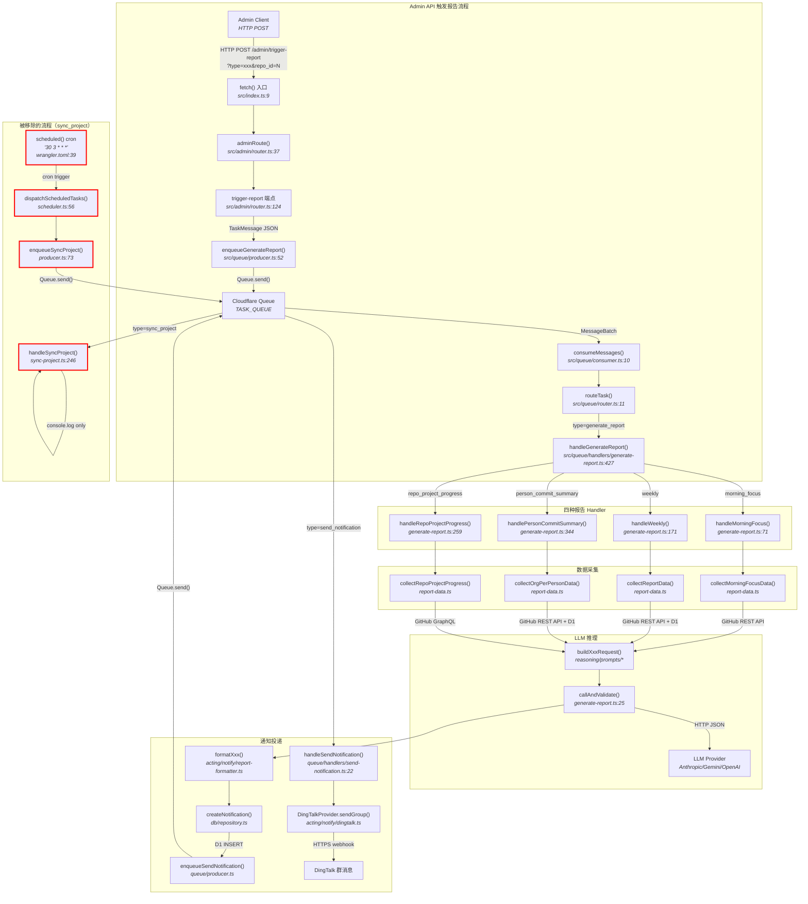

# RFC-0022: 清理 sync_project 并端到端验证日/周报有效性

## 概述

移除已废弃的 sync_project 任务管线，并通过生产 admin API 端到端验证四种报告类型（morning_focus / weekly / person_commit_summary / repo_project_progress）的 DingTalk 通知送达有效性。

## 背景

Beaver 系统早期通过 `sync_project` 定时任务（cron `30 3 * * *`）检测每个 Issue 的 `status/` 标签与 Project V2 `Status` 字段之间的不一致。该机制服务于标签与 Project V2 字段并行的过渡阶段。

随着 RFC-0013 的实施，所有生命周期元数据已完全迁移至 Project V2 字段和 native Issue Type，`status/` 标签体系已被废弃（参见 `beaver-engine` §废弃说明）。`sync_project` 的 label-vs-field 对比逻辑不再有意义，其 handler（`src/queue/handlers/sync-project.ts`）仅执行 `console.log`，不写入 D1 或 KV，对主干能力没有影响。

同时，系统目前运行四种报告类型（`morning_focus` / `weekly` / `person_commit_summary` / `repo_project_progress`），尚未进行过生产环境的端到端验证。本次借清理之机一并验证报告管线的完整性。

## 方案

### 变更策略

采用直接删除策略，移除 `sync_project` 全部代码。`TaskMessage`（定义于 `src/queue/types.ts`）为 TypeScript discriminated union，编译器会在所有 `switch (task.type)` 处自动捕获不完整的 case（`src/queue/router.ts` 的 default 分支以 `throw` 兜底），确保无遗漏引用。

### 变更清单

共 8 个层面：

1. **类型层**：`src/queue/types.ts` — 从 `TASK_TYPES` 数组移除 `"sync_project"`，从 `TaskPayloadMap` 移除 `sync_project` 键
2. **生产者层**：`src/queue/producer.ts` — 删除 `enqueueSyncProject()` 函数
3. **消费者层**：`src/queue/router.ts` — 移除 `sync_project` case 和 `handleSyncProject` import
4. **Handler 层**：删除整个 `src/queue/handlers/sync-project.ts` 文件
5. **调度层**：`src/sensing/scheduler.ts` — 移除 `"30 3 * * *": "sync_project"` 映射、`ScheduleType` 中的 `"sync_project"` 值、dispatch 分支、`enqueueSyncProject` import
6. **配置层**：`wrangler.toml` — 移除 `"30 3 * * *"` cron trigger
7. **测试层**：删除 `test/queue/handlers/sync-project.test.ts`，更新 `test/sensing/scheduler.test.ts`、`test/queue/router.test.ts`、`test/queue/producer.test.ts`、`test/index.test.ts` 中的 sync_project 引用
8. **文档层**：`README.md` — 移除 Project Sync 能力行、Queue Task Types 表中 `sync_project` 行、Scheduled Tasks 表中 Sync Project 行，更新数量引用（6→5）

### 端到端验证流程

从功能分支手动执行 `npx wrangler deploy`，依次通过生产 admin API 触发四种报告：

```text
POST /admin/trigger-report?type=morning_focus&repo_id=N
POST /admin/trigger-report?type=weekly&repo_id=N
POST /admin/trigger-report?type=person_commit_summary&repo_id=N
POST /admin/trigger-report?type=repo_project_progress&repo_id=N
```

每种报告触发后人工确认 DingTalk 群收到通知且内容有效，全部通过后再合并到 `main`。

### 数据流



**图例**：红色粗边框节点为本次移除的 `sync_project` 流程；普通节点为现有报告管线（不变）。边上标注数据格式/协议。

### 备选方案

#### 方案 A：标记 deprecated 后逐步移除

保留 `sync_project` 代码但禁用 cron trigger，标记为 deprecated，待一段时间后再清理。

**否决理由**：`sync_project` 对主干能力没有影响，不存在下游依赖或数据迁移需求，无需过渡期。直接删除更简洁，且 TypeScript 编译器保障引用完整性。

#### 方案 B：新增自动化 e2e 测试替代人工验证

编写自动化端到端测试脚本，通过 admin API 触发报告并自动验证结果。

**否决理由**：自动化同样需调用 admin API，且 DingTalk 通知送达目前无法自动化验证（无 API 可查询群消息是否已收到），人工确认是当前唯一可行的验证方式。

## 影响范围

- **Queue 系统**：任务类型从 6 种减为 5 种（`analyze_event` / `generate_report` / `send_notification` / `audit_split` / `assign_reviewer`），`TaskMessage` discriminated union 少一个分支
- **Cron 调度**：cron trigger 从 6 个减为 5 个，`ScheduleType` 联合类型同步缩减
- **Cloudflare 资源**：重新部署后 `30 3 * * *` cron trigger 从 Worker 配置中移除
- **现有报告管线**：无影响，四种报告的 handler / prompt / schema / formatter 均不涉及修改
- **D1 / KV**：无影响，`sync_project` 未写入任何持久数据

## 实施计划

### SubTask 1: 移除 sync_project 代码

- **依赖**：无
- **交付物**：
  - 删除 `src/queue/handlers/sync-project.ts`
  - 删除 `test/queue/handlers/sync-project.test.ts`
  - 从 `src/queue/types.ts` 移除 `sync_project` 相关类型
  - 从 `src/queue/router.ts` 移除 `sync_project` case 和 import
  - 从 `src/queue/producer.ts` 移除 `enqueueSyncProject` 函数
  - 从 `src/sensing/scheduler.ts` 移除 `sync_project` 映射和 dispatch 分支
  - 更新 `test/sensing/scheduler.test.ts`、`test/queue/router.test.ts`、`test/queue/producer.test.ts`、`test/index.test.ts` 中的 sync_project 引用
  - `npm test` + `typecheck` + `lint` 全绿

### SubTask 2: 清理配置和文档

- **依赖**：SubTask 1
- **交付物**：
  - 从 `wrangler.toml` 移除 `"30 3 * * *"` cron trigger
  - 更新 `README.md`：移除 Project Sync 能力行、Queue Task Types 表中 `sync_project` 行、Scheduled Tasks 表中 Sync Project 行，更新数量引用（6→5）
  - grep 确认代码库中 `sync_project` 零引用

### SubTask 3: 部署并端到端验证四种报告

- **依赖**：SubTask 2
- **交付物**：
  - 手动 `npx wrangler deploy` 从功能分支部署
  - 依次通过 admin API 触发并人工确认：
    1. `morning_focus` — DingTalk 群收到每日聚焦通知
    2. `weekly` — DingTalk 群收到周报通知
    3. `person_commit_summary` — DingTalk 群收到团队成员贡献通知
    4. `repo_project_progress` — DingTalk 群收到项目进展通知
  - 确认 Cloudflare 侧 cron trigger 从 6 降为 5

## 风险

- **编译器遗漏风险**：若存在 `sync_project` 字符串的运行时引用（非类型约束），TypeScript 编译器无法捕获。**缓解**：SubTask 2 中通过 grep 全局搜索确认零引用。
- **部署回滚风险**：从功能分支手动部署到生产，若报告验证失败需要回滚。**缓解**：本次变更仅删除代码，不修改现有报告逻辑；回滚只需从 `main` 重新部署。
- **Cron trigger 残留风险**：Cloudflare 侧 cron trigger 配置是否随 `wrangler deploy` 自动同步移除。**缓解**：SubTask 3 中验证 Cloudflare Dashboard 确认 cron 数量从 6 降为 5。

<!-- provenance
- "sync_project 检测 status/ 标签与 Project V2 Status 不一致" ← Discovery D2: src/queue/handlers/sync-project.ts 代码阅读
- "status/ 标签体系已被废弃" ← Discovery D3: beaver-engine §废弃说明
- "handler 仅执行 console.log，不写入 D1 或 KV" ← Discovery D2: sync-project.ts:280-296 代码阅读
- "对主干能力没有影响" ← QA round 4.2（用户确认）
- "admin API 不涉及 sync_project" ← Discovery D2: admin/router.ts grep 零命中 + QA round 4.1
- "cron 30 3 * * * 对应 sync_project" ← Discovery D2: wrangler.toml:39
- "11 个文件引用 sync_project" ← Discovery D2: grep 结果
- "端到端验证通过 admin API 触发" ← QA round 4.1
- "验证标准为 DingTalk 群收到通知" ← QA round 4.1
- "四种报告必须全部推送且人工确认" ← QA round 4.2
- "手动部署验证后合并" ← QA round 4.3
- "需同步清理 Cloudflare cron trigger" ← QA round 4.1
- "无历史数据需清理" ← 4.3 代码分析：handler 无 D1/KV 写入
- "DingTalk 通知无法自动化验证" ← QA round 4.5
-->
