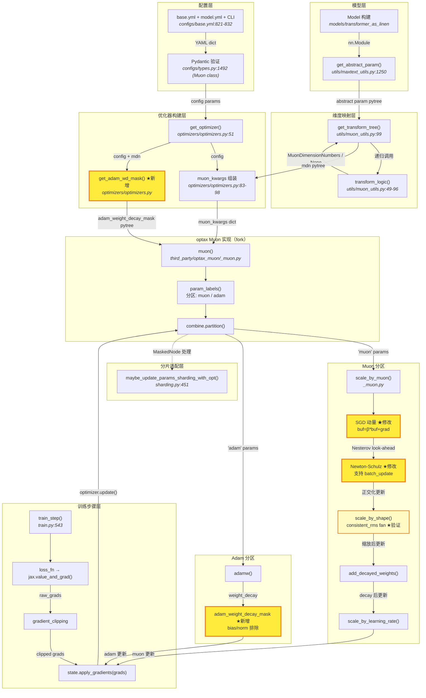

# RFC-0023: 对齐 MaxText Muon 优化器实现与 Megatron-LM 完整行为

## 概述

通过 fork optax Muon 实现并扩展 MaxText 优化器管线，消除当前 MaxText 与 Megatron-LM 之间的 4 项 Muon 优化器公式差异、功能缺失和 TODO(not-yet-wired) 项，使两者在数学上完全等价。

## 背景

MaxText 的 Muon 优化器实现基于 optax 上游 (`optax.contrib._muon`)，当前主要服务于 Ling3 系列模型在 TPU v7x 上的预训练。在与 Megatron-LM 的 Muon 实现对比中，发现以下差异：

### 高影响差异（本次实现）

1. **Nesterov 动量公式不一致**：optax 使用 EMA 式动量累积 + bias correction（`mu = β*mu + (1-β)*grad`，带 bias correction 的 Nesterov look-ahead），而 Megatron 使用经典 SGD 动量（`buf = β*buf + grad`，无 bias correction 的 Nesterov look-ahead `g = grad + β*buf`，见 `muon.py:794-797`）。训练初期有效步长存在差异。

2. **Weight Decay Masking 缺失**：Megatron 通过 `_get_param_groups`（`optimizer/__init__.py:181-189`）精确控制每个参数的 weight decay——bias 始终排除、norm 参数可配置（`--weight-decay-norm-params` flag）。embedding/output_layer 参数被排除出 Muon 路由（送入 AdamW 分区，`optimizer/__init__.py:282-287`），但默认仍施加 weight decay（`wd_mult=1.0`，因为它们是 2D tensor，不匹配 `.bias` 结尾或 1D shape 条件）。MaxText 的 optax Muon 对 Adam 分区所有参数无差别施加 `adam_weight_decay`。`muon_weight_decay_norm_params` flag 存在但标记为 TODO(not-yet-wired)。

3. **consistent_rms fan 计算不一致（根因在 split_head 维度映射）**：optax 0.2.8 的 `_scale_update_for_consistent_rms()` 公式 `sqrt(max(fan_in, fan_out)) * consistent_rms` 与 Megatron `adjust_lr_wd_for_muon`（`muon.py:280-286`）的 `sqrt(max(A, B))` **数学形式已对齐**。但 fan_in/fan_out 的**计算输入不同**：Megatron 当 `split_head=True` 时使用 split 后的子矩阵 shape（per-head shape，参见 `muon.py:1267`），MaxText 的 `muon_utils.py` 当前 `mdn((0,), (-2, -1))` 将 heads 和 head_dim 合并为 output 维度（fan_out = heads × head_dim），而非让 heads 成为 batch 维度（应为 `mdn((0,), (-1,))`，使 fan_out = head_dim）。**此差异的根因是 Issue #188（split_head 维度映射未对齐）**，修复 S5 后 fan 值自然对齐。

### 本次实现的功能缺失项

1. **muon_batch_update 未实现**：Megatron 支持将多个小权重矩阵按 shape 分组后 stack 执行 Newton-Schulz 迭代以提升效率（`muon.py:564-609`）。MaxText 标记为 TODO(not-yet-wired)。

### 已实现项（经代码审查确认）

1. ~~**bias_zero_mean_update**~~：MaxText 已通过 `routed_bias_zero_mean_update` 完整实现此功能，与 Megatron `moe_utils.py:1242-1243` 中 `get_updated_expert_bias()` 的 zero-mean 操作数学等价。实现路径：`configs/types.py:857`（config flag）→ `utils/maxtext_utils.py:1151-1172`（`update_state_param(zero_mean_update=True)` 执行 `updated - jnp.mean(updated, axis=-1, keepdims=True)`）→ `trainers/pre_train/train.py:171`（`_try_update_bias()` 调用）。Ling3（`ling3-tiny.yml:77`）和 Ling2（`ling2.yml:66`）均已启用 `routed_bias_zero_mean_update: true`。

### 已忽略项

- ~~**ns_steps 硬编码**~~：当前硬编码值已与 Megatron 对齐，不再额外修改。
- ~~**overlap_muon_comm 不存在**~~：Megatron 通过 `torch.cuda.Stream` 实现 TP all_gather 与 Newton-Schulz 计算的双缓冲重叠（`muon.py:355-356, 714-739`）。**→ 忽略此优化项。**
- ~~**skip_casting_dtype_for_param_pattern 不存在**~~：Megatron 的 `Float16Module` 封装中通过 regex 匹配跳过特定参数的 dtype 转换（`training.py:1662-1685`）。**→ 忽略此优化项。**

### 系统边界

- **关联 Issue**：Issue #188（muon_utils split_head/split_linear_fc1 对齐）尚未完成，纳入本 Task 子任务处理
- **FSDP 并行兼容性**：Muon 优化器需要处理完整权重矩阵进行 Newton-Schulz 正交化，因此必须考虑与 FSDP 并行的兼容性——在 FSDP 场景下需要先 all-gather 恢复完整参数后再执行 Muon 更新。Megatron 通过 TP all_gather（`muon.py:1032-1040`）实现此功能，MaxText/JAX 的 SPMD 分片策略需要确保类似的全参数可见性
- **当前代码结构**：
  - 优化器分发：`optimizers/optimizers.py`（构建 muon_kwargs 传入 optax）
  - 维度映射：`utils/muon_utils.py`（`transform_logic()` 将参数路径映射到 `MuonDimensionNumbers`）
  - 配置：`configs/base.yml:821-832`（Muon YAML 默认值，含 3 个 TODO(not-yet-wired)）
  - optax 实现：`optax/contrib/_muon.py`（`scale_by_muon()`, `muon()`, Newton-Schulz）
  - 训练步骤：`trainers/pre_train/train.py:543`（`train_step()` 含 MoE bias 处理）
  - 分片适配：`utils/sharding.py:451`（Muon `MaskedNode` 分片）

## 设计目标

### Goals

- 4 项 Muon 优化器差异与 Megatron-LM 实现数学等价：Nesterov 动量、Weight Decay Masking、consistent_rms fan 计算（含 split_head 维度映射对齐）、muon_batch_update
- 端到端数值验证：相同超参配置下，MaxText vs Megatron 前 1000+ 步 loss 偏差 < 1e-4（在小规模 < 10B 参数模型上验证）
- `muon_weight_decay_norm_params`、`muon_batch_update`、`muon_batch_update_size` 的 TODO(not-yet-wired) flag 接线完毕并生效
- Issue #188（muon_utils split_head/split_linear_fc1 对齐）作为子任务纳入并完成

### Non-Goals

- 不扩展 Muon 到 SFT / 蒸馏场景（当前 `train_distill.py` 已显式拒绝 Muon）
- 不做编译时间 / 内存占用优化
- 不保留反向兼容开关（直接切换为 Megatron 行为）
- 不实现 overlap_muon_comm、skip_casting_dtype（忽略）
- 不实现 ns_steps 可配置化（当前硬编码已对齐）

### Success Metrics

| 指标 | 标准 |
|---|---|
| Loss 偏差 | 相同超参、小模型、1000+ 步：\|MaxText_loss - Megatron_loss\| < 1e-4 |
| TODO 清除 | `base.yml` 中 `muon_weight_decay_norm_params`、`muon_batch_update`、`muon_batch_update_size` 的 TODO(not-yet-wired) 移除 |
| 功能完整 | 4 项差异项均有对应实现和测试覆盖 |

## 方案

### 总体策略

在 MaxText 项目内创建 optax Muon 的 local fork（`third_party/optax_muon/_muon.py`），在 fork 中实现需要修改 optax 内部的功能，MaxText 侧切换 import 指向 fork。后续成熟后向 optax 上游提交 PR。不保留反向兼容开关——直接切换为 Megatron 行为。

### 各差异项方案

#### 1. Nesterov 动量对齐（fork optax）

在 `scale_by_muon()` 中新增 `nesterov_style` 参数：

- `nesterov_style='ema'`（默认，保持 optax 现有行为）：

  ```python
  mu = beta * mu + (1 - beta) * grad       # EMA 累积
  mu_hat = beta * bc(mu, t+1) + (1-beta) * bc(grad, t)  # Nesterov + bias correction
  ```

- `nesterov_style='sgd'`（Megatron 行为，MaxText 使用）：

  ```python
  buf = beta * buf + grad                    # 经典 SGD 动量
  g = grad + beta * buf                      # Nesterov look-ahead，无 bias correction
  ```

MaxText 侧在 `optimizers.py` 传入 `nesterov_style='sgd'`。

**Megatron 参考实现**：`muon.py:790-797`（`naive_muon`）和 `muon.py:909-916`（`optimized_muon`），Nesterov 默认启用（`muon.py:323`）。

#### 2. Weight Decay Masking 对齐（fork optax + MaxText）

**fork optax**：在 `muon()` 函数中新增 `adam_weight_decay_mask` 参数，传入内部 `alias.adamw(mask=adam_weight_decay_mask)`。

**MaxText 侧**：在 `optimizers.py` 新增 `get_adam_wd_mask()` 函数，根据参数路径生成 bool pytree，对齐 Megatron `_get_param_groups`（`optimizer/__init__.py:181-189`）行为：

- `bias` → False（始终排除 decay，对应 Megatron `name.endswith(".bias")` 条件）
- `scale`/norm 参数 → `config.muon_weight_decay_norm_params`（可配置：True 时施加 decay，False 时排除。对应 Megatron `--weight-decay-norm-params` flag）
- embedding/output_layer → True（保持 weight decay，与 Megatron 行为一致：这些参数被路由到 AdamW 分区但默认仍施加 `wd_mult=1.0`）
- 其余 → True

移除 `base.yml` 中 `muon_weight_decay_norm_params` 的 TODO(not-yet-wired) 注释。

#### 3. consistent_rms fan 计算验证与对齐（依赖 S5 split_head 修复）

optax 0.2.8 的 `_get_shape_products()` 和 `_scale_update_for_consistent_rms()` 公式（`sqrt(max(fan_in, fan_out)) * consistent_rms`）与 Megatron 的 `adjust_lr_wd_for_muon`（`muon.py:280-286`）**数学形式已一致**，无需修改 fork 中的 fan 公式。

**真正的差异来源**是 `muon_utils.py` 的维度映射（S5 / Issue #188）：当前 attention 权重如 query `[embed, heads, head_dim]` 使用 `mdn((0,), (-2, -1))`，将 heads 和 head_dim 合并为 output（fan_out = heads × head_dim）。而 Megatron `split_head=True` 模式下 per-head 正交化，fan_out = head_dim。S5 修复维度映射后（如改为 `mdn((0,), (-1,))` 使 heads 成为 batch 维度），fan 值自然对齐。

本子任务降级为**验证任务**：S5 完成后，对比 MaxText 与 Megatron 在典型权重 shape 上的 fan_in/fan_out 值，确认一致性。

#### 4. muon_batch_update 实现（fork optax）

在 fork 的 `orthogonalize_via_newton_schulz()` 中实现 batch 模式：

- 将多个同 shape 的小权重矩阵 stack 为一个 batch tensor
- 一次性执行 Newton-Schulz 迭代（NS 函数已支持 leading batch dim，使用 `dim=[-2, -1]`）
- 迭代完成后 unstack

MaxText 侧移除 `muon_batch_update` 和 `muon_batch_update_size` 的 TODO(not-yet-wired) 注释，在 `muon_kwargs` 中传入这两个参数。

**Megatron 参考实现**：`muon.py:564-609`（batch grouping by shape + chunk by `batch_update_size`）和 `muon.py:1070-1177`（batch NS iteration）。当前 Ling3 训练配置 `--muon-batch-update --muon-batch-update-size 16`（`run_v3.sh:153-154`）。

### FSDP 兼容性考量

Muon 优化器的 Newton-Schulz 正交化要求操作完整的权重矩阵。在分布式并行场景下：

- **Megatron 方案**：通过 TP all_gather（`muon.py:1032-1040` 中 `do_comm` 方法）在 Newton-Schulz 前恢复完整参数，正交化后将更新 scatter 回各 rank
- **MaxText/JAX 方案**：需要确保 SPMD 分片策略在 Muon 更新时提供完整的参数视图。可能需要在 `muon_utils.py` 的维度映射中显式处理分片维度，或在 optax fork 中使用 `jax.lax.all_gather` 恢复完整矩阵

这是本次对齐工作中需要重点验证的兼容性问题。

### 数据流



**图例**：★黄色加粗边框 = 本次新增/修改 | 普通边框 = 现有不变 | 虚线 = 辅助关系

### 备选方案

1. **仅在 MaxText 侧包装，不 fork optax**：多个差异项需修改 optax 内部（`scale_by_muon` 动量公式、`muon()` 分区逻辑），纯包装会导致大量重复代码且难以维护。

2. **直接向 optax 上游提交 PR，不做 local fork**：本次修改包含 Megatron 特有行为（SGD 动量），上游可能不接受或审核周期长。先 fork 稳定后再尝试 upstream 更安全。

3. **保留反向兼容开关（EMA vs SGD 动量可选）**：增加配置复杂度且无现有用户依赖旧行为。MaxText 的 Muon 实现尚未大规模使用，直接切换到 Megatron 行为更简洁。

## 影响范围

| 模块 | 影响 |
|---|---|
| `third_party/optax_muon/` | **新增**：optax Muon local fork |
| `optimizers/optimizers.py` | 修改：import 切换 + 新增参数传入 + `get_adam_wd_mask()` |
| `configs/base.yml` | 修改：新增 config flag，移除 TODO 注释 |
| `configs/types.py` | 修改：Muon 类新增/确认字段 |
| `utils/muon_utils.py` | 修改：#188 对齐工作 |
| `tests/unit/optimizers_test.py` | 修改：扩展测试用例 |

## 实施计划

### SubTask 分解

| # | SubTask | 依赖 | 预期交付物 | 状态 |
|---|---|---|---|---|
| S1 | 创建 optax muon local fork | 无 | `third_party/optax_muon/_muon.py`，MaxText import 切换至 fork | Active |
| S2 | Nesterov 动量对齐 (SGD style) | S1 | fork `scale_by_muon()` 新增 `nesterov_style='sgd'`，MaxText 传参 | Active |
| S3 | Weight Decay Masking 对齐 | S1 | fork `muon()` 新增 `adam_weight_decay_mask`，MaxText `get_adam_wd_mask()`，config 接线 | Active |
| S4 | consistent_rms fan 计算验证 | S1, S5 | S5 完成后验证 fan_in/fan_out 值一致性；公式层面 optax 0.2.8 已对齐，**无需修改 fork** | Active |
| S5 | muon_utils split_head/split_linear_fc1 对齐 (#188) | 无 | `muon_utils.py` 修复维度映射（如 query `mdn((0,), (-2, -1))` → `mdn((0,), (-1,))`），使 heads 成为 batch 维度 | Active |
| S6 | muon_batch_update 实现 | S1 | fork Newton-Schulz batch 模式，config 接线，移除 TODO | Active |
| S7 | 集成测试 & 数值验证 | S2-S6 | 扩展 `optimizers_test.py` + 小模型 1000+ 步 MaxText vs Megatron loss < 1e-4 | Active |

### 依赖关系

```text
S1 ──→ S2, S3, S4, S6 (S1 完成后可并行)
S5 ──→ S4              (S4 验证依赖 S5 修复维度映射)
S5                     (与 S1 无依赖，可独立并行)
S7                     (依赖 S2-S6 完成)
```

### 执行顺序建议

1. **第一阶段**（基础）：S1 + S5 并行
2. **第二阶段**（核心对齐）：S2 + S3 + S4 + S6 并行（S4 需等 S5 完成）
3. **第三阶段**（验证）：S7

## 风险

| 风险 | 影响 | 缓解 |
|---|---|---|
| optax 上游更新导致 fork 冲突 | fork 与上游 diverge，增加维护成本 | 控制 fork 改动范围，定期 rebase；upstream PR 成功后删除 fork |
| SGD 动量切换影响训练稳定性 | 训练初期行为与 EMA 不同 | 小模型先行验证 1000+ 步；不保留 EMA 后备 |
| FSDP 下 Muon 需要完整权重矩阵 | 分片参数无法直接执行 Newton-Schulz | 验证 JAX SPMD 分片策略是否自动提供完整视图；必要时在 fork 中添加 all-gather |
| batch NS 实现引入精度差异 | pad/stack 操作可能影响 Newton-Schulz 收敛 | 单元测试对比 batch vs 非 batch 结果一致性 |
| 1000+ 步数值验证的 ε < 1e-4 标准可能过严 | 不同框架的浮点累积差异可能超过 1e-4 | 先在 float64 下验证数学等价性，再在 bf16 下评估实际偏差 |

<!-- provenance
- Nesterov 动量差异：Issue #189 body "#### 1. Nesterov 动量公式差异" + optax _muon.py:277-288 源码；验证 Megatron muon.py:790-797, 909-916
- Weight Decay Masking 差异：Issue #189 body "#### 2. Weight Decay Masking 差异" + optimizers.py:83-98 源码；验证 Megatron optimizer/__init__.py:181-189, 282-287
- Megatron _get_param_groups：验证 optimizer/__init__.py:181-189（4-tier WD priority cascade），embedding/output_layer 仍施加 WD（wd_mult=1.0）
- Megatron adjust_lr_wd_for_muon：验证 muon.py:280-286，函数仅调整 LR（不调整 WD），split_head 时使用 post-split shape
- Megatron moe_utils.py：验证 moe_utils.py:1241-1243 get_updated_expert_bias() zero-mean 操作
- Megatron muon_batch_update：验证 muon.py:564-609 batch grouping + muon.py:1070-1177 batch NS iteration
- Megatron skip_casting_dtype：验证 training.py:1662-1685 + utils.py:595-676 record/recover param dtype
- Megatron overlap_muon_comm：验证 muon.py:355-356 Stream 创建 + muon.py:714-739 double-buffering overlap
- consistent_rms fan 计算：验证 muon.py:280-286 + optax _muon.py _get_shape_products()
- muon_weight_decay_norm_params TODO：configs/base.yml:828
- configs/types.py:1492 Muon class：MaxText 源码 src/MaxText/configs/types.py:1492 Pydantic Muon 配置类定义
- utils/maxtext_utils.py:1250 get_abstract_param：MaxText 源码 src/MaxText/utils/maxtext_utils.py:1250 参数 shape 提取
- utils/sharding.py:451 maybe_update_params_sharding_with_opt：MaxText 源码 src/MaxText/utils/sharding.py:451 Muon MaskedNode 分片适配
- transform_logic 维度映射：muon_utils.py:49-96 源码
- optax muon partition 机制：optax _muon.py:427-455 源码
- train_step 流程：train.py:543-655 源码
- FSDP 兼容性：PR #142 review comment "由于 Muon 优化器的处理完整权重矩阵, 所以要考虑与 FSDP 并行的兼容性"
- [代码审查] bias_zero_mean_update 已实现：MaxText 源码 routed_bias_zero_mean_update (types.py:857, maxtext_utils.py:1151-1172, train.py:171, ling3-tiny.yml:77, ling2.yml:66)
- [代码审查] consistent_rms fan 公式已对齐：optax 0.2.8 venv 源码 _muon.py:149-156 _scale_update_for_consistent_rms() 使用 sqrt(max(fan_in, fan_out))，与 Megatron 数学形式一致
- [代码审查] fan 值差异根因是 split_head 维度映射：muon_utils.py:92 mdn((0,), (-2, -1)) 将 heads*head_dim 合并为 output，而 Megatron split_head=True 模式 per-head 正交化使 fan_out=head_dim
- [代码审查] optax 版本：项目 venv 使用 optax 0.2.8（.venv/lib/python3.12/site-packages/optax/contrib/_muon.py），已有 consistent_rms、scale_by_shape、_get_shape_products 支持
-->
