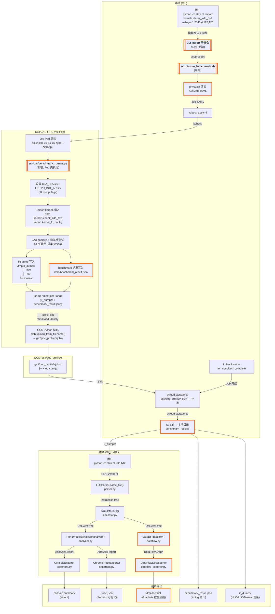

# RFC-0024: 支持导入 Kernel 并自动化 Benchmark 与 LLO 下载

## 概述

为 Strix 新增 `import` CLI 子命令，将 `kernels/` 目录中的 Pallas kernel 提交到 TPU v7x 集群上编译、执行微基准测试、导出全量 IR dumps（HLO/LLO/Mosaic），并通过 GCS 上传下载到本地，供后续 Strix 静态分析使用。

## 背景

### 技术现状

Strix 是一个纯 Python 静态分析工具（零第三方依赖），接受 post-finalize LLO 文本文件作为输入，通过模拟 VPU/DMA 双轨执行产生性能分析报告（console summary + trace.json）。

当前 Strix 仅处理已有的 LLO 文件，缺乏从 kernel 源码到 LLO dump 的自动化流水线。用户需要手动：

1. 编写 K8s Job 来编译和运行 kernel
2. 配置正确的 XLA_FLAGS 和 LIBTPU_INIT_ARGS 以导出 IR
3. 从 Pod 中提取 dump 文件（曾尝试 kubectl exec/port-forward，均有限制）
4. 手动运行 Strix 分析

### 已有参考实现

KDA LLO Dump Workflow 已验证了「K8s Job + GCS SDK 上传 + gcloud 下载」的架构模式，解决了 kubectl exec pipe 截断（~3.5MB 限制）、port-forward 极慢（~1KB/s）、GCS FUSE 权限等问题。本方案复用该架构。

### 系统边界

- 复用现有 GKE 集群、K8s Service Account（`gcs-account`）、GCS bucket（`gs://poc_profile/`）
- 不涉及集群的创建、销毁或配置管理
- TPU 节点池假设已存在

### 关键约束与依赖

- Strix 核心包保持零第三方依赖，新功能依赖通过 `pyproject.toml` extras 管理
- Pod 通过 Workload Identity 访问 GCS，需要 `roles/storage.objectCreator` 权限
- IR dump flags 参考 KDA Dump Workflow 已验证的配置

## 设计目标

### Goals

1. **参数化配置**：支持通过 CLI 参数指定 kernel 的 shape、chunk_size、TPU 类型和拓扑
2. **零 K8s 知识使用门槛**：用户只需 CLI 命令，无需了解 kubectl、Job YAML、GCS 等底层细节
3. **完整分析输出**：端到端流程产出 benchmark 统计数据、全量 IR dumps（HLO/LLO/Mosaic）以及 Strix 的 console summary + trace.json
4. **端到端流程跑通**：`import` → benchmark → 下载 → Strix 分析 全链路可成功执行

### Non-Goals

1. **多 kernel 并发 benchmark**：不支持同时提交多个 kernel
2. **Web UI**：仅 CLI 交互
3. **历史对比 / 回归检测**：不做 benchmark 结果的历史比较
4. **集群管理**：不处理 TPU 集群的创建、销毁或配置

### Success Metrics

- 端到端流程可成功执行，从 `import` 到分析输出
- 用户仅需 CLI 命令，无需直接操作 kubectl / GCS

## 方案

### 整体架构

采用 KDA Dump 验证过的架构模式：CLI（Python argparse）→ shell 脚本编排 → K8s Job → GCS 中转 → 本地下载。

```text
CLI (python -m strix.cli import)
  │
  ├─ subprocess: scripts/run_benchmark.sh
  │     ├─ envsubst → K8s Job YAML
  │     ├─ kubectl apply → Job Pod (TPU v7x)
  │     ├─ kubectl wait
  │     ├─ gcloud storage cp (GCS → 本地)
  │     └─ tar xzf → benchmark_results/
  │
  └─ strix.cli analyze-bundles (见下方 §Bundle-Source 分析)
```

### CLI 接口设计

**新增 `import` 子命令**（Step 1）：

```bash
python -m strix.cli import kernels.chunk_kda_fwd \
  --shape 1,2048,4,128,128 \
  --chunk-size 64 \
  --tpu-type v7x \
  --tpu-topology 2x2x1
```

**保留旧模式兼容**：

```bash
# 现有用法继续工作
python -m strix.cli path/to/post-finalize-llo.txt
```

**`analyze-bundles` 子命令**（Step 2）：

```bash
# 基本用法：分析 final_bundles 文件中的 Pallas 源码 → VLIW Bundle 对应关系
python -m strix.cli analyze-bundles path/to/final_bundles.txt

# JSON 输出
python -m strix.cli analyze-bundles path/to/final_bundles.txt --json output.json

# 按行号过滤
python -m strix.cli analyze-bundles path/to/final_bundles.txt --line 684

# 关联本地源码（loc() 中是 TPU Pod 路径，需映射到本地）
python -m strix.cli analyze-bundles path/to/final_bundles.txt \
  --source-root /local/path/to/project/
```

### Kernel 约定

Kernels 放在 `kernels/` 目录，每个 kernel 一个 Python 文件，遵循统一入口约定：

```python
# kernels/chunk_kda_fwd.py

def kernel_fn(...):
    """Pallas kernel 函数"""
    ...

config = {
    "default_shape": (1, 2048, 4, 128, 128),
    "default_chunk_size": 64,
    ...
}
```

每个 kernel 文件导出：

- `kernel_fn`：kernel 入口函数
- `config`：默认配置字典

### K8s Job 模板

`scripts/benchmark_job.yaml`：K8s Job YAML 模板，通过 `envsubst` 渲染以下变量：

- `$JOB_NAME`：`strix-benchmark-{kernel_name}-{timestamp}`
- `$BRANCH`：当前 git 分支
- `$SHAPE`：kernel shape 参数
- `$CHUNK_SIZE`：chunk 大小
- `$KERNEL_MODULE`：kernel 模块路径

Job Pod 配置：

- 使用 K8s SA `gcs-account`（Workload Identity）
- TPU v7x, 2x2x1 拓扑（可通过参数调整）
- 安装依赖：`pip install uv && uv sync --extra tpu`

### Pod 内执行流程

`scripts/benchmark_runner.py`：

1. 设置 IR dump 环境变量：

   ```text
   XLA_FLAGS="--xla_dump_hlo_as_text --xla_dump_to=/tmp/ir_dumps/hlo"
   LIBTPU_INIT_ARGS="
     --xla_enable_custom_call_region_trace=true
     --xla_xprof_register_llo_debug_info=true
     --xla_jf_dump_to=/tmp/ir_dumps/llo
     --xla_jf_dump_hlo_text=true
     --xla_jf_dump_llo_text=true
     --xla_jf_emit_annotations=true
     --xla_mosaic_dump_to=/tmp/ir_dumps/mosaic
     --xla_mosaic_enable_llo_source_annotations=true"
   ```

2. `import jax`（触发 libtpu 读取 dump flags）
3. 动态导入 kernel 模块（`importlib`）
4. JAX compile + 微基准测试（多次运行，采集 timing 统计）
5. IR dump 自动写入 `/tmp/ir_dumps/{hlo,llo,mosaic}/`
6. Benchmark 结果写入 `/tmp/benchmark_result.json`
7. `tar czf` 打包 ir_dumps/ + benchmark_result.json
8. 通过 GCS Python SDK（Workload Identity）上传到 `gs://poc_profile/<job_name>/`

### Shell 编排脚本

`scripts/run_benchmark.sh`：

1. 解析 CLI 参数（--shape, --chunk-size, --kernel 等）
2. 生成 JOB_NAME = `strix-benchmark-{kernel}-{timestamp}`
3. `envsubst` 渲染 Job YAML
4. `kubectl apply -f` 部署 Job
5. `kubectl wait --for=condition=complete` 等待完成
6. `gcloud storage cp gs://poc_profile/<job_name>/ ./` 下载
7. `tar xzf` 解压到本地目录
8. 清理 K8s Job 资源

### Job 命名策略

格式：`strix-benchmark-{kernel_name}-{YYYYMMDD-HHMMSS}`

示例：`strix-benchmark-chunk-kda-fwd-20260430-143022`

此名称同时用作：

- K8s Job name
- GCS 路径前缀：`gs://poc_profile/strix-benchmark-chunk-kda-fwd-20260430-143022/`
- 本地下载目录名

### GCS 权限

复用现有配置：

- K8s SA：`gcs-account`（namespace: `default`）
- Workload Identity 映射到 GCP principal：`principal://iam.googleapis.com/projects/654018381842/locations/global/workloadIdentityPools/poc-tpu-partner.svc.id.goog/subject/ns/default/sa/gcs-account`
- 权限：`roles/storage.objectCreator` on `gs://poc_profile/`

### 数据流



**图例**：橙色加粗边框 = 本次新增/修改的节点；普通边框 = 现有不变的组件。

### Bundle-Source 分析

#### 背景

`*-final_bundles.txt` 是 LLO 编译器最终输出的 VLIW bundle 列表。每行一个 bundle（一个时钟周期），格式为：

```text
<address> <control_flags>: <nesting> { <instr1> ;; <instr2> ;; ... } <comments>
```

每条指令可能携带 `loc()` 注解，指向原始 Pallas Python 源码位置：

```text
0x5d : { %s147 = sshll.u32 ... /* loc("kernel.py":684:10 to :34) */  ;;
         %s158 = sshll.u32 ... /* loc("kernel.py":690:10 to :34) */ }
```

关键特征：

- 一个 bundle 内多条指令以 `;;` 分隔，每条可能有**不同的** `loc()` 注解
- 同一 Pallas 表达式的 LLO 指令可能散布在**多个不连续**的 bundle 中（VLIW 调度重排）
- `loc()` 中的路径是 TPU Pod 内路径（如 `/workspace/src/.../kernel.py`），非本地路径
- 映射的最小粒度为 **(bundle_address, slot_index)**，而非 bundle 级别

#### 数据模型

```python
# strix/bundle_domain.py

@dataclass
class SourceLoc:
    file: str           # 原始完整路径 (TPU Pod 路径)
    start_line: int
    start_col: int
    end_line: int       # 跨行时不同于 start_line
    end_col: int

@dataclass
class BundleInstruction:
    """Bundle 内的单条 VLIW slot 指令"""
    opcode: str                  # e.g. "sshll.u32", "dma.hbm_to_vmem"
    raw_text: str                # 完整原始文本
    outputs: List[str]           # SSA outputs, e.g. ["%s30_s17"]
    loc: Optional[SourceLoc]     # 来自 /* loc(...) */ 注解

@dataclass
class Bundle:
    """一个 VLIW Bundle (一个时钟周期)"""
    address: int                 # 十六进制地址
    control_flags: List[str]     # ["LH"], ["LB", "CT"], etc.
    nesting_depth: int           # > 的个数, 0 = top level
    instructions: List[BundleInstruction]
    comments: List[str]          # entry/exit bundle, region markers
    is_empty: bool               # {} NOP bundle

@dataclass
class BundleProgram:
    """解析后的完整 bundle 程序"""
    bundles: List[Bundle]
    source_index: Dict[SourceLoc, List[Tuple[int, int]]]
    # SourceLoc → [(bundle_address, slot_index), ...] 倒排索引
```

#### 解析逻辑

```python
# strix/bundle_parser.py

class BundleParser:
    def parse_file(self, path: str) -> BundleProgram:
        """入口：读取文件，跳过 header (控制标志说明)，逐行解析"""

    def _parse_bundle_line(self, line: str) -> Optional[Bundle]:
        """解析单行 bundle:
        1. 提取地址 (hex)
        2. 提取控制标志 (LH/LB/LE/PB/PF/CT)
        3. 计算嵌套深度 (> 的个数)
        4. 提取 { ... } 内容，按 ;; 分割为指令
        5. 提取 } 之后的注释
        """

    def _parse_instruction(self, text: str) -> BundleInstruction:
        """解析单条 slot 指令"""

    def _parse_loc(self, loc_str: str) -> SourceLoc:
        """解析两种 loc 格式:
        - loc("file":L1:C1 to :C2)      → 单行
        - loc("file":L1:C1 to L2:C2)    → 跨行
        """

    def _build_source_index(self, bundles) -> Dict:
        """遍历所有 bundle 的所有 slot，构建倒排索引"""
```

特殊情况处理：

- 空 bundle `{}`
- 多行 bundle（BoundsCheck 的 `shalt.err` 跨行注释，含 `hlo:` 行）
- 非 loc 注释（`/* materialized constant */`, region markers）

#### 输出格式

**Console 输出**（按源码行号排序）：

```text
=== Bundle-Source Mapping ===
File: kernel.py

  L587:14-42
    14 instrs / 8 bundles (0x11..0x1a, non-contiguous)
    sld×2  sshll.u32×1  sadd.s32×1  scmp×1  smin.u32×1  sand.u32×1  ssub.s32×1

  L665:12-669:13
    48 instrs / 40 bundles (0x08, 0x1b..0x5a)
    sor.u32×8  vsyncadd.remote×8  sshrl.u32×8  sand.u32×8  sshll.u32×8  sadd.s32×8

Summary: 87 source locations, 5289 bundles, 3682 annotated instrs
```

当提供 `--source-root` 时，额外展示对应 Pallas 源码行（通过路径后缀匹配本地文件）：

```text
  L684:10-34
    > gate = pl.load(gate_ref, ...)
    14 instrs / 11 bundles (0x5d..0x68)
    ...
```

**JSON 输出**：

```json
{
  "total_bundles": 5289,
  "annotated_instructions": 3682,
  "mappings": [
    {
      "loc": {
        "file": "/workspace/.../kernel.py",
        "start_line": 684, "start_col": 10,
        "end_line": 684, "end_col": 34
      },
      "slots": [
        {"bundle": "0x5d", "slot": 2},
        {"bundle": "0x62", "slot": 0}
      ],
      "opcodes": {"scalar_lea.hbm": 1, "scalar_lea.vmem": 2, "dma.hbm_to_vmem": 1}
    }
  ]
}
```

### SSA 数据流分析

#### 背景

Strix 的 `PerformanceAnalyzer` 产出的是聚合指标（bottleneck 分类、stall ratio、arithmetic intensity），Chrome trace exporter 按时间线展示 VPU/DMA/Stall 事件，但两者都没有展示**数据如何在硬件单元之间流动**——例如哪块数据被 DMA 从 HBM 搬到 VMEM，然后被 VPU 计算，再被 DMA 写回。

为 Strix 新增数据流分析能力，从模拟后的 OpEvent 树中提取 SSA def-use 依赖关系，生成 Graphviz DOT 文件，可视化 kernel 中所有指令间的数据依赖和硬件分派。

#### 数据模型

从 OpEvent 树提取的轻量图结构：

```python
# strix/dataflow.py

@dataclass
class DFNode:
    """数据流图中的一个节点 = 一次指令执行"""
    id: int                        # 唯一标识
    name: str                      # 操作名, e.g. "vmatmul", "enqueue_dma"
    stream: OpStream               # VPU / DMA / Control
    kind: OpKind                   # LEAF / BLOCK / STALL / LOOP
    start_ns: int
    end_ns: int
    flops: int
    bytes: int
    ssa_outputs: List[str]         # 该事件定义的 SSA 变量
    ssa_inputs: List[str]          # 该事件使用的 SSA 变量
    attributes: Dict[str, Any]
    loop_depth: int                # 循环嵌套深度
    parent_loop_id: Optional[int]  # 所属循环的 id

@dataclass
class DFEdge:
    """SSA 依赖边"""
    src: int       # 源节点 id (producer)
    dst: int       # 目标节点 id (consumer)
    variable: str  # SSA 变量名, e.g. "%token_1"

@dataclass
class DataFlowGraph:
    nodes: List[DFNode]
    edges: List[DFEdge]
    loops: Dict[int, List[int]]  # loop_id -> [child node ids]
```

提取逻辑：

1. 遍历 OpEvent 树，对每个叶/块/Stall 节点创建 DFNode
2. 从 `ev.attributes["ssa_inputs"]` 和 `ev.attributes["ssa_outputs"]` 读取 SSA 信息（需在 `simulator.py` 的 `_schedule_event` 中持久化）
3. 构建 `variable → producer_node_id` 映射
4. 对每个 consumer 节点的每个 input，创建去重后的 DFEdge

#### DOT 生成策略

**时间分区布局**：将 makespan 切分为 `min(100, num_nodes)` 个等宽时间桶，同一桶内的节点用 `rank=same` 约束对齐，`rankdir=LR` 使时间从左到右。

**硬件泳道**：用 `subgraph cluster_vpu` 和 `subgraph cluster_dma` 将节点分到两个区域。

**循环表达**：`scf.for` 循环体用 `subgraph cluster_loop_N` 包裹，label 标注 trip count。

**节点样式**：

| stream | shape | fillcolor | 示例 |
|--------|-------|-----------|------|
| VPU compute | box | lightblue | vmatmul, vadd |
| DMA | box | lightyellow | enqueue_dma |
| STALL | box | salmon | STALL, DMA_STALL |

**边样式**：

- 同 stream 内：实线黑色
- 跨 stream（VPU↔DMA）：**粗红色虚线**，label = SSA 变量名 — 突出数据流的硬件边界跨越

#### CLI 集成

```bash
# 新增 --dataflow-output flag
python -m strix.cli path/to/post-finalize-llo.txt \
  --default-sld-value 128 \
  --dataflow-output dataflow.dot

# 渲染
dot -Tsvg dataflow.dot -o dataflow.svg
```

作为现有 CLI 的新 flag，不引入新子命令。

#### 实现状态

已实现并提交 PR：[primatrix/strix#2](https://github.com/primatrix/strix/pull/2)

- 24 个测试（单元 + 集成），全部通过
- 在 fused-moe kernel 上验证：8,419 节点、779 条跨硬件边

### 示例 Kernel: fuseMoE

#### 来源

移植自 `primatrix/sglang-jax` 仓库 `feat/hybrid-moe-prefill` 分支的 fused expert-parallel MoE Pallas kernel（`python/sgl_jax/srt/kernels/fused_moe/v1/kernel.py`，~3600 行），作为 Strix import 流水线的**第一个分析示例**。

选择该 kernel 的原因：

1. **复杂度高**：单个 `pallas_call` 融合了 All-to-All scatter/gather、双缓冲权重加载、三缓冲累加暂存、动态 token 路由、多种量化格式（FP8/INT8/FP4），是 Strix 静态分析能力的极端压力测试
2. **分支新增优化**：`feat/hybrid-moe-prefill` 分支新增了 batch scatter 优化（当 `expert_buffer_count >= local_num_experts` 时，用单次 `fori_loop` 替代逐 expert 的 barrier 同步），适合用 Strix 对比分析优化前后的指令调度差异
3. **已有 benchmark 基线**：sglang-jax 中有完整的 benchmark 配置和 tuned block configs，可直接复用参数

#### Kernel 配置

fuseMoE 的 shape 参数由模型架构决定。以下为 Strix 分析使用的默认配置（对应 Qwen3-MoE-128E 模型）：

| 参数 | 值 | 说明 |
|------|------|------|
| `num_tokens` | 1024 | token 数量（decode 场景取 EP 设备数 × batch_size） |
| `num_experts` | 128 | 专家数量 |
| `top_k` | 8 | 每个 token 选择的专家数 |
| `hidden_size` | 4096 | 隐藏层维度 |
| `intermediate_size` | 2048 | FFN 中间层维度 |
| `dtype` | `bfloat16` | 计算精度 |
| `weight_dtype` | `bfloat16` | 权重精度（也支持 float8_e4m3fn） |
| `act_fn` | `silu` | 激活函数 |
| `ep_size` | 8 | Expert Parallelism 设备数 |

#### Kernel 包装文件

`kernels/fused_moe.py` 遵循 Strix kernel 约定，封装 sglang-jax 的 `fused_ep_moe` 入口：

```python
# kernels/fused_moe.py
"""Fused Expert-Parallel MoE kernel — ported from primatrix/sglang-jax feat/hybrid-moe-prefill."""

import jax
import jax.numpy as jnp
import numpy as np

from sgl_jax.srt.kernels.fused_moe.v1.kernel import (
    fused_ep_moe,
    FusedMoEBlockConfig,
)

config = {
    "default_shape": {
        "num_tokens": 1024,
        "num_experts": 128,
        "top_k": 8,
        "hidden_size": 4096,
        "intermediate_size": 2048,
    },
    "dtype": "bfloat16",
    "weight_dtype": "bfloat16",
    "act_fn": "silu",
    "ep_size": 8,
    "tpu_type": "v7x",
    "tpu_topology": "2x2x1",
    "description": "Fused EP MoE kernel with batch scatter optimization (Qwen3-MoE-128E config)",
}


def kernel_fn(
    num_tokens=1024,
    num_experts=128,
    top_k=8,
    hidden_size=4096,
    intermediate_size=2048,
    dtype=jnp.bfloat16,
    weight_dtype=jnp.bfloat16,
    act_fn="silu",
    ep_size=8,
    block_config=None,
):
    """构造输入并调用 fused_ep_moe，返回 JAX 可编译的闭包。"""
    devices = jax.devices()[:ep_size]
    mesh = jax.sharding.Mesh(
        np.array(devices).reshape(1, -1),
        axis_names=("data", "tensor"),
    )

    key = jax.random.key(42)
    k1, k2, k3, k4, k5 = jax.random.split(key, 5)

    tokens = jax.random.normal(k1, (num_tokens, hidden_size), dtype=dtype)
    w1 = jax.random.normal(k2, (num_experts, hidden_size, intermediate_size), dtype=weight_dtype)
    w2 = jax.random.normal(k3, (num_experts, intermediate_size, hidden_size), dtype=weight_dtype)
    w3 = jax.random.normal(k4, (num_experts, hidden_size, intermediate_size), dtype=weight_dtype)

    topk_weights = jnp.ones((num_tokens, top_k), dtype=jnp.float32) / top_k
    topk_ids = jax.random.randint(k5, (num_tokens, top_k), 0, num_experts)

    def run():
        return fused_ep_moe(
            mesh=mesh,
            tokens=tokens,
            w1=w1, w2=w2, w3=w3,
            topk_weights=topk_weights,
            topk_ids=topk_ids,
            top_k=top_k,
            act_fn=act_fn,
            block_config=block_config,
            tp_axis_name="tensor",
        )

    return run
```

#### 对齐约束

从 `validate_fused_moe_block_config` 提取的硬件对齐要求（Strix 分析 LLO 时需理解的 tiling 边界）：

- `hidden_size` 和 `intermediate_size` 须为 128 的倍数
- `num_tokens` 和 `num_experts` 须被 `ep_size` 整除
- BF16 下 `t_packing = 2`，`bd1`/`bd2` 须为 256 的倍数
- 量化模式下 `bd1c` 须为 `quant_block_k × t_packing` 的倍数

#### 预期 Strix 分析产出

对 fuseMoE kernel 的 LLO dump 运行 Strix 全链路分析，预期产出：

| 产出 | 内容 |
|------|------|
| Console summary | VPU/DMA 利用率、stall ratio、arithmetic intensity、bottleneck 分类 |
| trace.json | Perfetto 可视化：双缓冲权重加载的 DMA/VPU 重叠、A2A scatter/gather 时序 |
| Bundle-Source mapping | `loc()` 注解映射回 `kernel.py` 源码行，识别热点函数（`dynamic_ffn1`、`run_down_slices`） |
| dataflow.dot | SSA 数据流图：8000+ 节点、700+ 跨硬件边（已在 strix#2 验证） |

### 备选方案

#### 纯 Python K8s SDK（kubernetes client）

使用 Python `kubernetes` 包直接创建和监控 Job，替代 shell + kubectl。

**否决理由**：K8s Job + shell 更轻量，复用 KDA Dump 已验证的经验，无需引入额外的 Python 依赖，调试更直观（kubectl 命令可直接复制粘贴）。

#### SkyPilot 编排

使用项目中已有的 `exec-remote` skill 通过 SkyPilot 管理 TPU 资源。

**否决理由**：已有 GKE 集群已配置好，SkyPilot 增加一层抽象反而增加调试复杂度，且 SkyPilot 主要用于集群生命周期管理，本场景不需要。

## 影响范围

### 新增文件

| 文件 | 作用 |
|------|------|
| `pyproject.toml` | 项目包管理配置，extras: `[tpu]` |
| `__main__.py` | 支持 `python -m strix` 调用 |
| `kernels/` 目录 | Kernel 源码目录（含 `fused_moe.py` 示例） |
| `scripts/benchmark_job.yaml` | K8s Job YAML 模板 |
| `scripts/run_benchmark.sh` | 本地编排脚本 |
| `scripts/benchmark_runner.py` | Pod 内 benchmark 执行脚本 |
| `strix/bundle_domain.py` | Bundle 分析数据类: SourceLoc, BundleInstruction, Bundle, BundleProgram |
| `strix/bundle_parser.py` | BundleParser: 解析 `*-final_bundles.txt` |
| `strix/bundle_exporter.py` | BundleConsoleExporter + BundleJsonExporter |
| `strix/dataflow.py` | 数据流分析: DFNode, DFEdge, DataFlowGraph + `extract_dataflow()` |
| `strix/dataflow_exporter.py` | DataFlowDotExporter: DataFlowGraph → Graphviz DOT |

### 修改文件

| 文件 | 改动 |
|------|------|
| `cli.py` | 重构为 subcommand 模式，新增 `import` + `analyze-bundles` 子命令，保留旧模式兼容；新增 `--dataflow-output` flag |

### 修改文件（数据流分析）

| 文件 | 改动 |
|------|------|
| `simulator.py` | `_schedule_event` / `_schedule_enqueue_dma` / `_schedule_dma_done` 中持久化 SSA inputs/outputs 到 `ev.attributes` |

### 不变文件

Strix 核心模块（parser.py, simulator.py, analyzer.py, exporters.py, domain.py, op_events.py, hardware.py, value_resolver.py, cost_model.py）不做改动。

## 实施计划

| # | SubTask | 交付物 | 依赖 |
|---|---------|--------|------|
| S1 | 建立项目基础设施 | `pyproject.toml`、`__main__.py`、`kernels/` 目录结构、kernel 约定文档 | 无 |
| S2 | 实现 `import` CLI 子命令 | `cli.py` 重构为 subcommand 模式（import + 旧模式兼容）、参数解析 | S1 |
| S3 | 实现 K8s Job 模板与 shell 编排 | `scripts/benchmark_job.yaml`、`scripts/run_benchmark.sh` | S1 |
| S4 | 实现 Pod 内 benchmark runner | `scripts/benchmark_runner.py`（kernel 导入、JAX 编译、微基准测试、IR dump、GCS 上传） | S1 |
| S5 | 端到端集成与测试 | 集成 CLI → shell → K8s → GCS → 本地下载的完整链路、手动集成测试文档 | S2, S3, S4 |
| S6 | 移植 fuseMoE kernel | `kernels/fused_moe.py`：从 `primatrix/sglang-jax` `feat/hybrid-moe-prefill` 分支移植 fused EP MoE kernel 包装，作为第一个端到端分析示例 | S1 |
| S7 | 实现 Bundle 数据模型与解析器 | `strix/bundle_domain.py`（SourceLoc, BundleInstruction, Bundle, BundleProgram）、`strix/bundle_parser.py`（BundleParser 解析 `*-final_bundles.txt`、构建 source 倒排索引） | 无 |
| S8 | 实现 Bundle 分析输出 | `strix/bundle_exporter.py`（Console 表格 + JSON 输出）、`cli.py` 新增 `analyze-bundles` 子命令 | S2, S7 |
| S9 | SSA 信息持久化 + 数据流提取 | `simulator.py` 持久化 SSA、`strix/dataflow.py`（DFNode/DFEdge/DataFlowGraph + extract_dataflow） | 无 |
| S10 | 数据流 DOT 导出 + CLI 集成 | `strix/dataflow_exporter.py`（DataFlowDotExporter）、`cli.py` 新增 `--dataflow-output` flag | S9 |

### 测试策略

1. **单元测试**：CLI 参数解析、Job YAML 渲染、配置验证
2. **Kernel 约定验证**：验证 kernel 文件的导入、签名检查
3. **手动集成测试**：在真实 TPU 集群上运行完整流程

## 风险

| 风险 | 影响 | 缓解措施 |
|------|------|----------|
| Kernel shape 不兼容 | 部分 kernel 在特定 shape 下编译失败 | KDA Dump 已踩过此坑（B>1 时 shape mismatch），在文档中记录已知限制 |
| GCS 权限配置 | Pod 上传失败 | 复用已验证的 gcs-account SA 和 Workload Identity 配置 |
| IR dump 文件量大（~1GB） | 上传/下载耗时 | tar 压缩后传输；全量 LLO 文件是设计需求 |
| CLI 子命令重构影响现有用户 | 旧命令行用法失效 | 保留无子命令模式的向后兼容 |

<!-- provenance
- Strix 架构和模块信息：来自代码阅读（cli.py, parser.py, simulator.py, analyzer.py, exporters.py）
- KDA Dump Workflow 参考：来自用户提供的 Issue #198 描述
- GCS 权限和 Workload Identity 配置：来自 KDA Dump Workflow 文档
- IR dump flags：来自 KDA Dump Workflow 中已验证的配置
- kubectl exec/port-forward 限制：来自 KDA Dump Workflow 的踩坑记录
- Bundle-Source 分析设计：来自 *-final_bundles.txt 实际文件格式分析（ir_dumps/llo/ 目录中 fused-moe kernel 的 final_bundles 文件）
- loc() 注解格式：来自 LLO 编译器输出，通过 --xla_mosaic_enable_llo_source_annotations=true 启用
- VLIW 打包特征（单 bundle 多 loc、非连续分布）：来自 final_bundles.txt 文件实际观察
- SSA 数据流分析设计：来自 docs/plans/2026-05-01-dataflow-analysis-design.md 设计文档，实现已提交 primatrix/strix#2
- fuseMoE kernel 实现细节：来自 primatrix/sglang-jax feat/hybrid-moe-prefill 分支代码阅读（python/sgl_jax/srt/kernels/fused_moe/v1/kernel.py，~3600 行）
- fuseMoE batch scatter 优化：来自 feat/hybrid-moe-prefill 分支新增代码（start_a2a_scatter_batch、wait_a2a_scatter_send_batch）
- fuseMoE 对齐约束：来自 validate_fused_moe_block_config 函数
- fuseMoE benchmark 参数：来自 benchmark/moe/bench_fused_moe.py 和 tuned_block_configs.py
- 数据流分析验证数据（8419 节点、779 跨硬件边）：来自 primatrix/strix#2 PR 实际运行结果
-->
