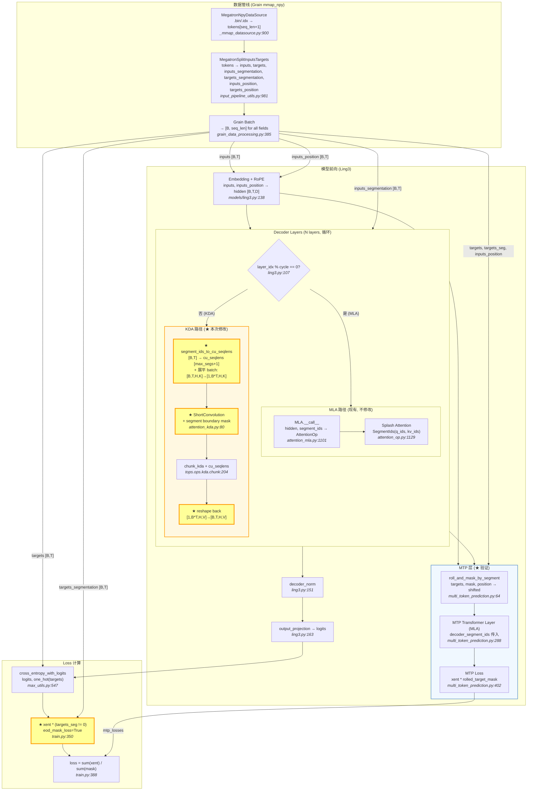

# RFC-0025: 支持 Attention Varlen 功能并对齐 Loss

## 概述

为 Ling3 模型的 KDA (Kimi Delta Attention) 层添加 packing (变长序列) 支持，通过 `decoder_segment_ids` → `cu_seqlens` 转换集成 tops Pallas 内核的 varlen 能力；同时对齐 Grain mmap_npy 数据管线和 Loss 计算逻辑，使 MaxText 在相同数据上的训练 loss 与 Megatron-LM 参考实现一致。

## 背景

### 技术现状

Ling3 是一个混合架构模型：每 `inhomogeneous_layer_cycle_interval` 层中，最后一层使用 MLA (Multi-Latent Attention)，其余层使用 KDA (Kimi Delta Attention)。MLA 通过 `AttentionOp` + Splash Attention 已完整支持 packing（利用 `SegmentIds` 原生接口），但 KDA 层显式抛出 `NotImplementedError("KDA does not yet support packed sequences.")`（`attention_kda.py:357`），导致 Ling3 无法进行 packing 训练。

### Megatron 参考实现

`primatrix/Megatron-LM` 的 `feat/upgrade-fla-and-kda-safe-gate` 分支已实现完整的 KDA packing 支持：

- **边界检测**：在 `pretrain_gpt.py:_build_packed_seq_params()` 中扫描 EOD token 构建 `cu_seqlens`（累积序列长度）
- **数据格式**：THD (Token-Head-Dim) packed layout，整个 micro-batch 展平为 `[1, B*T]`
- **KDA 内核**：FLA `chunk_kda` 原生接受 `cu_seqlens`，在序列边界重置循环状态
- **Conv1d**：通过 `causal_conv1d_fn` 的 `seq_idx` 参数在边界处重置卷积状态
- **Loss**：`loss_mask[labels == pad_token_id] = 0.0`，`loss = sum(loss * mask) / sum(mask)`

### 差距分析

| 维度 | MaxText 现状 | 需要的改动 |
|------|-------------|-----------|
| KDA packing | `NotImplementedError` | 集成 cu_seqlens 支持 |
| KDA 内核 (tops) | `feature/varlen-chunk-kda-support` 分支已有 fwd+bwd cu_seqlens | MaxText wrapper 传递 cu_seqlens |
| ShortConvolution | 跨文档边界泄漏 | segment 边界 mask |
| 数据管线 | `MegatronSplitInputsTargets` 已有 segment_ids | 确保 `eod_mask_loss=True` 生效 |
| Loss 计算 | `xent * (targets_segmentation != 0)` | 审计对齐 |
| MTP | `roll_and_mask_by_segment` 已有 | 验证 packing 下正确性 |

## 方案

### 1. segment_ids → cu_seqlens 转换

在 `KimiDeltaAttention.__call__` 内部实现转换，封装在 KDA 层中。

**算法**：利用 segment_ids 的单调递增特性（从 1 开始，0=padding），通过边界检测 + `jnp.searchsorted` 计算 cu_seqlens：

```python
def segment_ids_to_cu_seqlens(segment_ids: jnp.ndarray, max_segs: int) -> jnp.ndarray:
    """Convert [B, T] segment_ids to padded cu_seqlens [max_segs + 1].

    Segment IDs must be monotonically increasing from 1; 0 = padding.
    Output follows FLA convention: cu_seqlens[i] = end of segment i,
    padded to fixed length for JIT compatibility.

    Args:
        segment_ids: [B, T] int32 segment IDs.
        max_segs: Maximum number of segments (config.max_kda_segments).

    Returns:
        cu_seqlens: [max_segs + 1] int32 in FLA convention [0, n1, n1+n2, ...].
            Phantom segments beyond actual count have zero length (all equal n_real).

    Examples:
        [1,1,2,2,0,0], max_segs=4 → [0, 2, 4, 4, 4]
        [1,1,1,2,2,2], max_segs=4 → [0, 3, 6, 6, 6]
        [1,1,1,1,0,0], max_segs=4 → [0, 4, 4, 4, 4]
        [1,2,3,4],     max_segs=4 → [0, 1, 2, 3, 4]
    """
    B, T = segment_ids.shape
    BT = B * T
    flat = segment_ids.reshape(-1)  # [B*T]

    # Detect boundaries (where segment value changes), excluding padding (0)
    is_boundary = jnp.concatenate([jnp.ones(1, dtype=jnp.bool_), flat[1:] != flat[:-1]])
    is_boundary = is_boundary & (flat != 0)  # padding positions are never segment starts
    seg_idx = jnp.cumsum(is_boundary)  # [B*T], 1-indexed segment index

    # Number of real segments and real tokens
    n_segs = jnp.sum(is_boundary)
    n_real = jnp.sum(flat != 0).astype(jnp.int32)

    # Find start position of each segment via searchsorted
    query = jnp.arange(1, max_segs + 1, dtype=jnp.int32)
    starts = jnp.searchsorted(seg_idx, query, side='left')  # [max_segs]

    # Convert start positions to end positions (FLA cumulative convention)
    # end_of_seg[i] = start_of_seg[i+1] for interior segments
    # end_of_seg[n_segs-1] = n_real (end of last real segment)
    # phantom segments: end = n_real (zero-length)
    ends_from_starts = jnp.concatenate([starts[1:], jnp.array([BT], dtype=jnp.int32)])
    ends = jnp.where(query < n_segs, ends_from_starts, n_real)

    cu_seqlens = jnp.concatenate([jnp.zeros(1, dtype=jnp.int32), ends])
    return cu_seqlens  # [max_segs + 1], fixed shape
```

**约束**：`max_segs`（即 `config.max_kda_segments`）**必须是** micro-batch 中实际 segment 数量的严格上限。若 `n_segs > max_segs`，溢出的 segments 会被合并到最后一个 slot 中，导致跨文档注意力泄漏。实现时应添加运行时校验：

```python
jax.debug.callback(
    lambda n, m: None if n <= m else warnings.warn(f"n_segs({n}) > max_segs({m}), attention leakage!"),
    n_segs, max_segs,
)
```

**权衡**：padded cu_seqlens 导致 tops 内核处理 `max_segs - n_actual` 个零长度 phantom segments，`_align_seqs` 分配的 `T_new ≈ T + max_segs × chunk_size`。对于 `max_segs=128, chunk_size=64, seq_len=8192`，`T_new ≈ 16320`（~2× overhead）。实际中文档长度 ≫ chunk_size 时 overhead 远小于 2×。

### 2. Batch 维度展平

tops KDA 内核要求 `B=1`（packed layout）。MLA 通过 `jax.vmap` 处理 `B > 1`，但 KDA 的 `cu_seqlens` 在不同 batch 元素间长度不同，无法 vmap。

**方案**：采用与 Megatron 完全一致的展平策略——将 `[B, T, H, K]` reshape 为 `[1, B*T, H, K]`，构造跨 batch 元素的 `cu_seqlens`，单次内核调用后 reshape 回 `[B, T, H, K]`。

```python
# In KimiDeltaAttention.__call__:
if decoder_segment_ids is not None:
    B, T = decoder_segment_ids.shape
    cu_seqlens = segment_ids_to_cu_seqlens(decoder_segment_ids, cfg.max_kda_segments)

    # Flatten batch for all tensors
    q = q.reshape(1, B * T, *q.shape[2:])
    k = k.reshape(1, B * T, *k.shape[2:])
    v = v.reshape(1, B * T, *v.shape[2:])
    g = g.reshape(1, B * T, *g.shape[2:])
    beta = beta.reshape(1, B * T, *beta.shape[2:])
else:
    cu_seqlens = None
```

### 3. ShortConvolution segment 边界 mask

当前 `ShortConvolution.__call__` 使用 `jnp.pad` 做 causal padding，跨文档边界会泄漏前一个文档的信息。

**方案**：增加 `segment_ids` 参数，对每个 kernel position 检查源位置与目标位置是否属于同一 segment，不同则置零：

```python
def __call__(self, x: jnp.ndarray, segment_ids: jnp.ndarray | None = None) -> jnp.ndarray:
    B, T, F = x.shape
    K = self.kernel_size
    x_padded = jnp.pad(x, [(0, 0), (K - 1, 0), (0, 0)])

    if segment_ids is not None:
        # Left-pad segment_ids with 0 (padding sentinel)
        seg_padded = jnp.pad(segment_ids, [(0, 0), (K - 1, 0)], constant_values=0)

    output = jnp.zeros((B, T, F), dtype=x.dtype)
    for k in range(K):
        offset = K - 1 - k
        x_slice = x_padded[:, offset:offset + T, :]

        if segment_ids is not None:
            seg_src = seg_padded[:, offset:offset + T]       # [B, T]
            same_seg = (seg_src == segment_ids)               # [B, T]
            x_slice = x_slice * same_seg[:, :, jnp.newaxis]  # zero cross-boundary

        output = output + x_slice * self.kernel[k]
    return output.astype(self.dtype)
```

Megatron 通过 `causal_conv1d_fn` 的 `seq_idx` 参数实现相同功能。MaxText 使用 segment_ids mask 是 JAX/TPU 上的等价实现。

### 4. KDA kernels wrapper 层更新

`maxtext.kernels.kda.__init__.py` 和 `pallas.py` 增加 `cu_seqlens` 参数透传至 `tops.ops.kda.chunk_kda`：

```python
# kernels/kda/__init__.py
def chunk_kda(q, k, v, g, beta, ..., cu_seqlens=None):
    return pallas_chunk_kda(q, k, v, g, beta, ..., cu_seqlens=cu_seqlens)

# kernels/kda/pallas.py
def pallas_chunk_kda(q, k, v, g, beta, ..., cu_seqlens=None):
    o, final_state = tops_chunk_kda(q, k, v, g, beta, ..., cu_seqlens=cu_seqlens)
    return o, final_state
```

**依赖**：`tops` 库须升级至 `feature/varlen-chunk-kda-support` 分支版本。

### 5. KimiDeltaAttention 完整 packing 流程

移除 `NotImplementedError`，整合上述 1-4：

```python
def __call__(self, hidden_states, decoder_segment_ids=None, ...):
    cfg = self.config
    B, T, _ = hidden_states.shape

    # --- QKV projection ---
    q, k, v = self.q_proj(hidden_states), self.k_proj(hidden_states), self.v_proj(hidden_states)

    # --- Short convolution with segment boundary mask ---
    if self.q_conv is not None:
        q_flat, k_flat, v_flat = [t.reshape(B, T, -1) for t in (q, k, v)]
        q_flat = self.q_conv(q_flat, segment_ids=decoder_segment_ids)
        k_flat = self.k_conv(k_flat, segment_ids=decoder_segment_ids)
        v_flat = self.v_conv(v_flat, segment_ids=decoder_segment_ids)
        q, k, v = [t.reshape(B, T, H, D) for t in (q_flat, k_flat, v_flat)]

    # --- Activations, L2 norm, gate/beta projections (unchanged) ---
    ...

    # --- Batch flatten + cu_seqlens ---
    if decoder_segment_ids is not None:
        cu_seqlens = segment_ids_to_cu_seqlens(decoder_segment_ids, cfg.max_kda_segments)
        q, k, v, g, beta = [t.reshape(1, B * T, *t.shape[2:]) for t in (q, k, v, g, beta)]
    else:
        cu_seqlens = None

    # --- KDA kernel ---
    o, _ = chunk_kda(q, k, v, g, beta, ..., cu_seqlens=cu_seqlens)

    # --- Unflatten ---
    if decoder_segment_ids is not None:
        o = o.reshape(B, T, *o.shape[2:])

    # --- Output gated norm + output projection (unchanged) ---
    ...
```

### 6. 数据管线对齐

**目标配置**：`eod_mask_loss=True`（需在用户 YAML 中显式设置，代码默认值为 `False`），`reset_attention_mask=True`（默认值）。

验证 `MegatronSplitInputsTargets`（`input_pipeline_utils.py:981`）：

- `inputs_segmentation`：EOD token 保留前一个 segment 的 ID，新 segment 从 EOD 后开始 → 正确
- `targets_segmentation`：`inputs == eod_id` 的位置设为 0 → 排除 EOD 位置的 loss → 与 Megatron `loss_mask[data == eod_token] = 0.0` 一致
- `inputs_position`：在 EOD 后重置为 0 → 与 Megatron `reset_position_ids=True` 一致

**注意**：MaxText `mmap_npy` 模式不使用 `ShiftData`，因此 `eod_mask_loss` 的语义由 `MegatronSplitInputsTargets` 完整控制（不会被 ShiftData 覆盖）。

### 7. Loss 计算对齐

MaxText Loss（`train.py:350-388`）：

```python
xent = xent * (data["targets_segmentation"] != 0)
loss = sum(xent) / (sum(targets_segmentation != 0) + EPS)
```

Megatron Loss（`pretrain_gpt.py:159-224`）：

```python
loss = sum(losses * loss_mask) / sum(loss_mask)
```

两者在单 step（无 GA）时等价。对于 GA，MaxText 的 `loss_fn` 有两条路径（`train.py:399-402`）：当 `calculate_per_token_loss=True` 时返回 per-token 平均 loss，当 `False` 时返回 raw sum（由外层 GA 逻辑除以 microbatch 数）。设为 `False` 可与 Megatron 的 per-microbatch 平均对齐。

### 8. MTP 层验证

MTP 层（`multi_token_prediction.py`）：

- `roll_and_mask_by_segment`（line 64）：正确处理 segment 边界，跨边界位置置零
- MTP transformer layer 始终使用 MLA（`layer_idx >= num_decoder_layers`），已支持 packing
- MTP loss 使用 `rolled_target_mask`（从 `targets_segmentation` 经 `roll_and_mask_by_segment` 派生）

需验证：多轮 rolling 后 `rolled_segment_ids` 的正确性（`roll_and_mask` 是否正确传播 segment 边界）。

### 数据流



**图例**：★ 高亮 = 本次新增/修改 | 普通 = 现有不变

| 边 | 数据格式 | 协议 |
|----|----------|------|
| DS → MSIT | `tokens: int32[seq_len+1]` | Megatron binary |
| MSIT → BATCH | 6× `int32[seq_len]` | NumPy array |
| BATCH → Model | `int32[B, seq_len]` | JAX array |
| → Splash | `SegmentIds(q=[T], kv=[T])` | vmap peeled |
| ★→ chunk_kda | `cu_seqlens: int32[max_segs+1]`; tensors: `bf16[1, B*T, H, K]` | packed layout |
| → Loss | `float32[B, T]` xent + `int32[B, T]` mask | per-token CE + binary mask |

### 备选方案

#### Alt1: 修改 tops 内核直接接受 segment_ids（TODO）

让 `tops.ops.kda.chunk_kda` 直接接受 `segment_ids` 而非 `cu_seqlens`，在内核内部完成边界检测和状态重置，避免 MaxText 层的 segment_ids → cu_seqlens 转换开销和 padded cu_seqlens 的 phantom segment overhead。

**当前不采用原因**：需要修改 tops Pallas 内核的内部逻辑（包括 `_align_seqs`、`chunk_local_cumsum_vector`、`kda_fwd_intra` 等），工作量大，且 `cu_seqlens` 是 FLA 生态的标准接口。

**作为 TODO**：后续优化方向，可在内核层面直接消费 segment_ids，消除转换开销。

#### Alt2: 按文档拆分处理

将 packed 序列拆分为独立文档，每个文档单独调用 KDA 内核。

**否决原因**：

- 丢失 packing 的核心优势（并行处理多个文档）
- 变长文档需要 padding，引入额外浪费
- 多次内核调用的启动开销

#### Alt3: 数据管线产出 cu_seqlens

在 `MegatronSplitInputsTargets` 中预计算 `cu_seqlens`，作为 batch 的一部分传入模型。

**否决原因**：

- `cu_seqlens` 是变长数组，与 Grain 固定形状批处理冲突
- 需要 padding + `n_segments` 元数据，增加数据管线复杂度
- KDA 层内部计算更灵活，不需要修改数据管线接口

## 影响范围

| 模块 | 影响 | 文件 |
|------|------|------|
| KDA 层 | 新增 packing 支持 | `layers/attention_kda.py` |
| KDA kernels | 增加 cu_seqlens 参数传递 | `kernels/kda/__init__.py`, `kernels/kda/pallas.py` |
| Ling3 模型 | 无代码改动（KDA 层透明升级） | `models/ling3.py` |
| MTP | 无代码改动（验证正确性） | `layers/multi_token_prediction.py` |
| 数据管线 | 确认配置 `eod_mask_loss=True` | `input_pipeline/input_pipeline_utils.py` |
| Loss | 审计确认一致性 | `trainers/pre_train/train.py` |
| 配置 | 新增 `max_kda_segments`；packing 训练需显式设置 `eod_mask_loss: true` | `configs/types.py`, `configs/base.yml`, 用户 YAML |
| 依赖 | tops 升级至 varlen 分支 | `pyproject.toml` / `requirements.txt` |

### `max_kda_segments` 设置指南

`max_kda_segments` 直接决定 padded `cu_seqlens` 的长度，从而影响 tops 内核的实际计算量（`T_new ≈ T + max_segs × chunk_size`）。设置建议：

| 数据特征 | 推荐 `max_kda_segments` | overhead 估算 |
|----------|------------------------|---------------|
| 长文档为主（avg doc len ≫ seq_len） | 4–8 | < 10% |
| 中等文档（avg doc len ≈ seq_len / 4） | 8–16 | 10–25% |
| 短文档密集 packing（avg doc len ≈ 256–512） | 16–32 | 25–50% |
| 极短文档（avg doc len < 128） | 32–64 | 50–100%，考虑是否值得 packing |

**经验法则**：`max_kda_segments ≈ ceil(B × seq_len / min_doc_len)`，其中 `min_doc_len` 是数据集中最短文档的长度。宁可略大（多几个 phantom segments 的 overhead 可控），不可过小（否则触发注意力泄漏）。建议先用实际数据的 segment 分布统计来确定合适的值。

## 实施计划

| # | SubTask | 依赖 | 预期交付物 |
|---|---------|------|-----------|
| A1 | `segment_ids_to_cu_seqlens` 工具函数 | 无 | `attention_kda.py` 新增函数 + 单元测试 |
| A2 | `ShortConvolution` segment 边界 mask | 无 | `ShortConvolution.__call__` 增加 `segment_ids` 参数 + 单元测试 |
| A3 | KDA kernels wrapper 传递 cu_seqlens | 无 | `kernels/kda/__init__.py` + `pallas.py` 增加 `cu_seqlens` 参数 |
| B1 | `KimiDeltaAttention` packing 集成 | A1, A2, A3 | 移除 `NotImplementedError`，实现完整 packing 流程 + 单元测试 |
| C1 | 数据管线 eod_mask_loss 对齐 | 无 | 验证/修复 `MegatronSplitInputsTargets` 的 EOD masking |
| C2 | Loss 计算逻辑审计 | C1 | 审计 `train.py:loss_fn`，确保 `targets_segmentation` masking 与 Megatron 一致 |
| D1 | Ling3 模型 packing 集成 | B1 | 验证 Ling3 KDA 层正确接收并传递 `segment_ids` |
| D2 | MTP 层 packing 验证 | D1 | 验证 `roll_and_mask_by_segment` 和 MTP loss 在 packing 下正确 |
| E1 | 端到端 Loss 对齐测试 | D1, D2, C2 | MaxText vs Megatron 在相同数据上的 loss 对比测试脚本 |

并行策略：A1、A2、A3、C1 可并行执行；B1 等待 A1-A3 完成；C2 等待 C1；D1、D2 顺序执行；E1 在所有其他任务完成后执行。

## 风险

| 风险 | 影响 | 应对 |
|------|------|------|
| padded cu_seqlens 的 phantom segments 导致内存/计算 overhead | `T_new` 可能达 2×，增加 HBM 使用和计算量 | 配置合理的 `max_kda_segments`（按实际数据特征选择），后续优化内核直接支持 segment_ids |
| batch flatten 影响 sharding annotations | 展平/恢复 batch 后 logical axes 可能丢失 | 在 flatten/unflatten 前后显式 reshard |
| tops varlen branch 与 main 不兼容 | 分支合并后 API 可能变化 | 编写适配层隔离 tops API 调用 |
| segment_ids_to_cu_seqlens 在 JIT 中的编译开销 | `jnp.searchsorted` 在 XLA 中可能低效 | Profile 确认可接受；若不可接受则回退到 host callback |
| 数值精度差异 | MaxText (JAX bf16) vs Megatron (PyTorch bf16) 在相同数据上可能有精度差异 | Loss 对齐标准允许数值精度级别的差异（相对误差 < 1%） |

<!-- provenance
- KDA 不支持 packing: attention_kda.py:357 (代码直接确认)
- tops varlen fwd 支持: pallas-kernel/tops/ops/kda/chunk_fwd.py:348-362 (代码直接确认)
- tops varlen bwd 支持: pallas-kernel feature/varlen-chunk-kda-support 分支 chunk.py diff (代码直接确认)
- Megatron _build_packed_seq_params: primatrix/Megatron-LM pretrain_gpt.py:227-273 (代码直接确认)
- Megatron causal_conv1d_fn + seq_idx: primatrix/Megatron-LM megatron/core/ssm/kda.py:487-508 (代码直接确认)
- MLA Splash SegmentIds: attention_op.py:1406-1414 (代码直接确认)
- MegatronSplitInputsTargets 逻辑: input_pipeline_utils.py:981-1083 (代码直接确认)
- Loss 计算逻辑: train.py:331-402 (代码直接确认)
- eod_mask_loss 默认值为 False: configs/types.py:1236 (代码直接确认)
- roll_and_mask_by_segment: multi_token_prediction.py:64-112 (代码直接确认)
- MTP layer_idx 确保 MLA: multi_token_prediction.py:179 (代码直接确认)
-->
